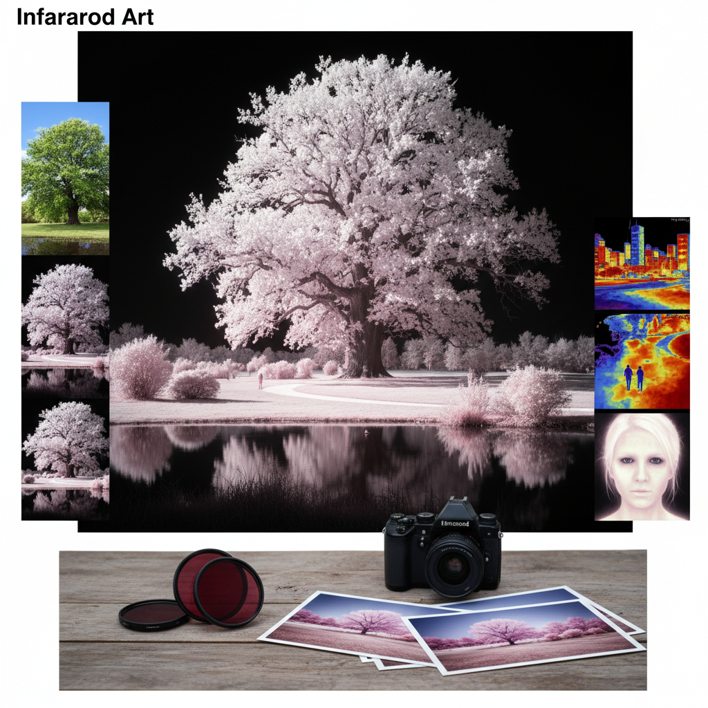

# Infrared Art 红外线艺术

> "Infrared photography reveals a world invisible to human eyes — a world where green leaves glow white as snow, where blue skies turn black as night, where human skin becomes luminous and ethereal. It is not fantasy but reality seen through a different window of the electromagnetic spectrum, proving that the world contains far more beauty than our limited vision can perceive." — Unknown

## 概述

红外线艺术（Infrared Art）是利用红外线摄影、红外线感应或红外线可视化技术进行创作的艺术形式——通过捕捉人眼不可见的红外辐射，创造出超现实的、梦幻般的视觉效果。红外线艺术最常见的形式是红外摄影，其中植物呈现白色或粉色，天空变为深黑色，创造出独特的超现实景观。

红外线艺术的实践包括：1）红外摄影——使用红外滤镜或改装相机拍摄；2）红外风景——红外线下的超现实风景；3）红外肖像——红外线下的人物肖像；4）热成像艺术——利用热红外成像的艺术创作；5）红外视频——红外线拍摄的视频作品；6）红外装置——利用红外感应的互动装置；7）假色红外——将红外数据映射为彩色的创作。

## 核心特征

| 特征 | 描述 |
|------|------|
| 不可见 | 捕捉不可见光谱 |
| 超现实 | 超现实的视觉效果 |
| 反转 | 明暗关系的反转 |
| 科技 | 依赖特殊设备 |
| 梦幻 | 梦幻般的氛围 |
| 发现 | 揭示隐藏的世界 |

## 视觉特征

- **白色植物**：植物呈现白色或粉色
- **黑色天空**：天空变为深黑色
- **发光皮肤**：人物皮肤的发光效果
- **高对比**：强烈的明暗对比
- **梦幻**：梦幻般的整体氛围
- **颗粒**：独特的颗粒质感

## 代表作品

| 作品 | 艺术家 | 年代 | 意义 |
|------|--------|------|------|
| *Infrared landscapes* | Richard Mosse | 2012 | 红外纪实摄影 |
| *Wood Effect* | Robert Wood | 1910s | 早期红外摄影 |
| *Infrared portraits* | Various | 当代 | 红外肖像摄影 |
| *Thermal art* | Various | 当代 | 热成像艺术 |
| *False color IR* | Various | 当代 | 假色红外创作 |

## 历史时间线

| 时期 | 事件 |
|------|------|
| 1910年代 | Robert Wood的早期红外摄影实验 |
| 1930年代 | 红外胶片的商业化 |
| 1960-70年代 | 红外摄影在艺术和音乐中的流行 |
| 2000年代 | 数码红外摄影的普及 |
| 当代 | Richard Mosse等人的红外纪实艺术 |

## 中国语境

红外线艺术在中国主要以红外摄影的形式存在。中国的一些摄影爱好者和艺术家探索红外摄影——利用改装的数码相机或红外滤镜拍摄中国的风景和建筑。中国的园林和古建筑在红外摄影下呈现出独特的美感——白色的树叶与深色的天空形成强烈对比，创造出如同仙境般的效果。中国的一些当代艺术家将红外技术作为创作工具——探索可见与不可见、表面与本质的主题。中国的科技艺术领域也在探索热成像和红外感应的艺术应用——创造互动装置和沉浸式体验。中国的一些摄影社区和论坛有专门的红外摄影板块——分享技术经验和作品。

## AI生成概念图

## 与其他风格的关系

- **Photography** → 摄影艺术
- **UV Art** → 紫外线艺术
- **Surrealism** → 超现实主义
- **Science Art** → 科学艺术
- **Digital Art** → 数字艺术
- **Experimental Photography** → 实验摄影

---

*浮光艺志 | Chronicle of Artistry*
