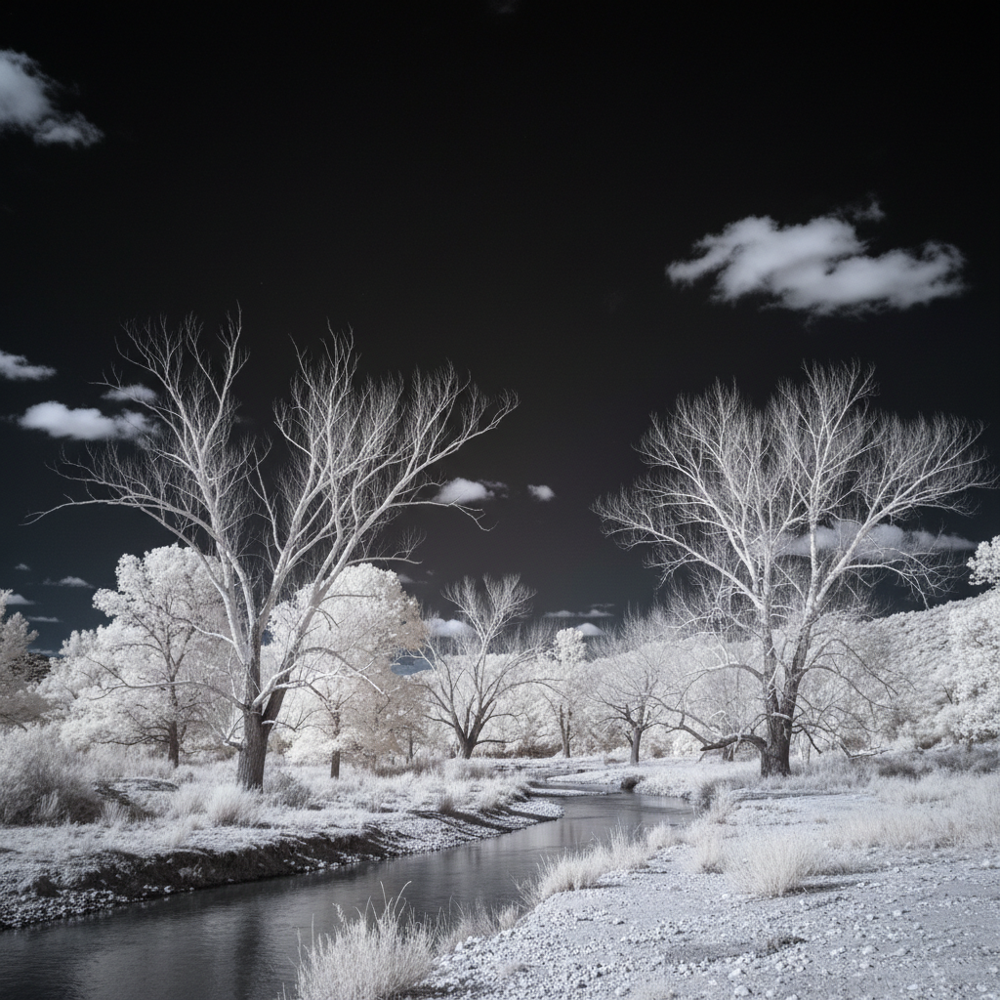

# Infrared Photography 红外摄影

> **时期：** 1910年代–至今  
> **关键词：** 不可见光谱、白色植被、暗黑天空、梦幻景观、科学与艺术

## 概述

Infrared Photography（红外摄影）使用对红外光敏感的胶片或改装数码相机，捕捉人眼不可见的近红外光谱。最显著的效果是"伍德效应"——绿色植物反射大量红外线而呈现白色或粉色，蓝天因红外线散射少而变得深黑。这种"看见不可见"的能力创造出超现实的梦幻景观。

## 风格特征

- **白色植被**：叶绿素强烈反射红外线
- **暗黑天空**：天空呈现深黑或深色
- **皮肤发光**：人体皮肤呈现瓷白效果
- **高对比**：极端的明暗对比
- **梦幻氛围**：超现实的异世界感

## 代表人物与作品

- 罗伯特·伍德（红外摄影先驱，1910）
- 理查德·莫斯《Infra》（刚果红外纪实）
- 西蒙·马斯登（红外建筑摄影）
- 皮埃尔-路易·费里耶（红外风景）

## 概念图

