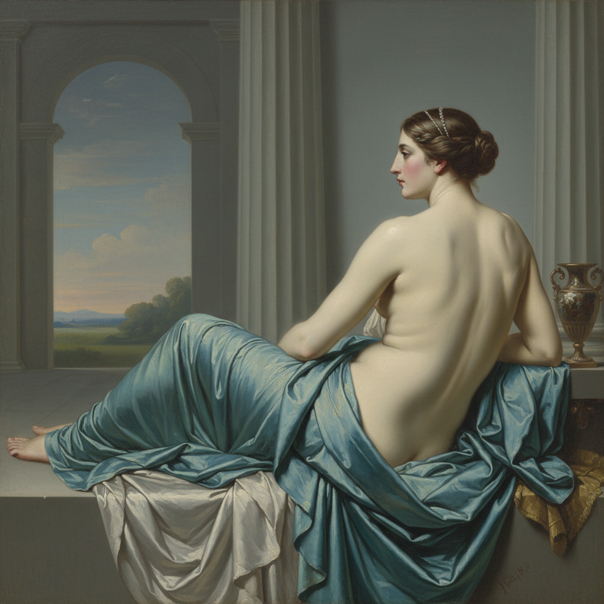

# Jean-Auguste-Dominique Ingres 安格尔

> "Drawing is the probity of art." — Jean-Auguste-Dominique Ingres

## 概述

让-奥古斯特-多米尼克·安格尔（Jean-Auguste-Dominique Ingres，1780–1867）是法国新古典主义绑画的最后一位伟大代表，以极其精确的线条和理想化的人体闻名。他与德拉克洛瓦的对立——线条vs色彩、理性vs激情——定义了19世纪法国艺术的核心辩论。

## 核心特征

| 特征 | 描述 |
|------|------|
| 线条至上 | 精确、流畅、完美的轮廓线 |
| 光滑表面 | 看不见笔触的瓷器般质感 |
| 理想化人体 | 为美感而扭曲解剖学 |
| 东方主义 | 土耳其浴室和后宫幻想 |
| 肖像精确 | 铅笔肖像的超凡技巧 |
| 古典题材 | 希腊罗马神话与历史 |

## 代表作品

| 作品 | 年代 | 意义 |
|------|------|------|
| *La Grande Odalisque* | 1814 | 多了三节脊椎的美——为美而变形 |
| *The Turkish Bath* | 1862 | 82岁的东方幻想 |
| *The Vow of Louis XIII* | 1824 | 拉斐尔的现代继承者 |
| *Portrait of Madame Moitessier* | 1856 | 12年完成的肖像 |

## AI生成概念图

## 与其他风格的关系

- **Neoclassicism** → 新古典主义的最后守护者
- **Delacroix** → 终身对手（线条vs色彩）
- **David** → 老师大卫的继承者
- **Picasso** → 毕加索深受其线条影响
