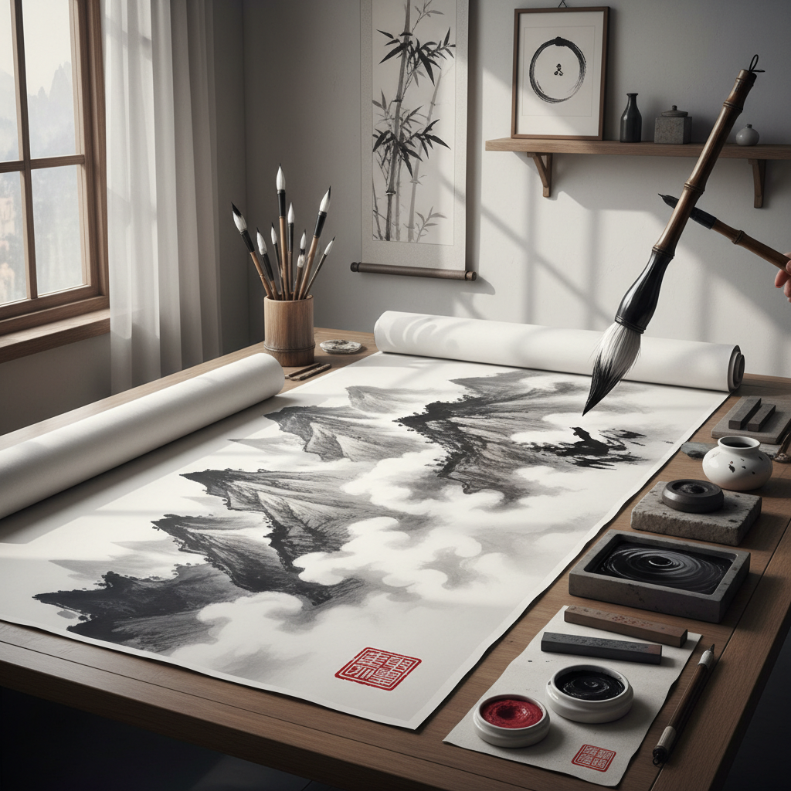

# Ink Wash Art 水墨艺术

> "Ink wash is the art of the single breath — one stroke, one moment, one gesture that cannot be corrected or concealed. The brush touches paper and the ink flows where water leads it, creating gradations from deepest black to palest gray in a single movement. It is painting with time itself, for the speed of the brush, the wetness of the paper, the density of the ink all record the exact instant of creation." — Unknown

## 概述

水墨艺术（Ink Wash Art）是以墨和水为主要媒介，在宣纸或绢上进行绑画创作的艺术形式——通过控制墨的浓淡、水的多少和笔的速度，创造出从浓黑到淡灰的丰富层次变化。水墨画是东亚（中国、日本、韩国）最重要的传统绑画形式，也是世界艺术中独特的表现体系。

水墨艺术的实践包括：1）山水画——水墨山水风景画；2）花鸟画——水墨花卉和鸟类绑画；3）人物画——水墨人物绑画；4）书法——以墨书写的文字艺术；5）泼墨——大面积泼洒墨汁的技法；6）工笔水墨——精细的水墨绑画；7）当代水墨——将传统水墨与当代艺术理念结合的创作。

## 核心特征

| 特征 | 描述 |
|------|------|
| 墨色 | 墨分五色的层次 |
| 留白 | 以空白表达空间 |
| 气韵 | 追求气韵生动 |
| 即兴 | 不可修改的即兴性 |
| 书画 | 书法与绑画一体 |
| 意境 | 重意境轻写实 |

## 视觉特征

- **黑白灰**：从浓墨到淡墨的层次
- **留白**：大面积的空白
- **笔触**：可见的毛笔笔触
- **渗透**：墨在宣纸上的渗透效果
- **飞白**：枯笔的飞白效果
- **题款**：诗文题款和印章

## 代表作品

| 作品 | 艺术家 | 年代 | 意义 |
|------|--------|------|------|
| *早春图* | 郭熙 | 1072 | 北宋山水画经典 |
| *六柿图* | 牧溪 | 13世纪 | 禅画经典 |
| *泼墨仙人图* | 梁楷 | 13世纪 | 泼墨技法典范 |
| *松风阁* | 黄庭坚 | 1102 | 书法经典 |
| *荷花* | 张大千 | 20世纪 | 现代泼墨 |

## 历史时间线

| 时期 | 事件 |
|------|------|
| 魏晋 | 水墨画的萌芽 |
| 唐代 | 王维开创水墨山水 |
| 宋代 | 水墨画的黄金时代 |
| 元明清 | 文人画传统的发展 |
| 当代 | 当代水墨的全球化 |

## 中国语境

水墨艺术是中国文化最核心的艺术形式之一——中国是水墨画的发源地和最重要的传承国。中国的水墨传统有一千多年的连续发展历史——从唐代王维的"诗中有画，画中有诗"到当代实验水墨，形成了世界上最丰富的水墨艺术体系。中国的水墨画不仅是绑画技法，更是一种哲学和生活方式——"墨分五色"体现了中国人对简约之美的追求。中国当代水墨艺术正在经历重要的转型——一些艺术家在保持水墨精神的同时探索新的表现形式和主题。中国的水墨教育从儿童书法开始——几乎每个中国人都有接触毛笔和墨的经历。中国的水墨艺术在国际艺术市场上越来越受到重视——被视为与西方油画传统平行的另一个伟大绑画体系。

## AI生成概念图

## 与其他风格的关系

- **Calligraphy** → 书法艺术
- **Sumi-e** → 日本水墨画
- **Literati Painting** → 文人画
- **Zen Art** → 禅画
- **Landscape Painting** → 山水画
- **Contemporary Ink** → 当代水墨

---

*浮光艺志 | Chronicle of Artistry*
