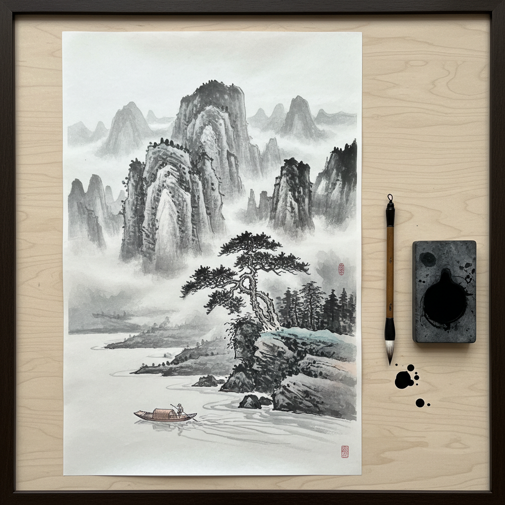

# Ink Wash Painting 水墨画

> "In ink wash painting, the spirit resonates with the movement of life." — Xie He (谢赫)

## 概述

水墨画（Ink Wash Painting / Sumi-e）是东亚传统绘画的核心形式，使用墨和水在宣纸或绢上作画。通过墨的浓淡干湿变化，水墨画以最简约的材料表达最丰富的意境——"墨分五色"（焦、浓、重、淡、清）是水墨画的核心美学原则。

水墨画追求的不是对象的外在形似，而是内在的"气韵生动"——通过笔墨的节奏和留白的空间，传达画家对自然和生命的感悟。

## 核心特征

| 特征 | 描述 |
|------|------|
| 墨为主 | 以墨为主要媒介，色彩为辅 |
| 留白 | 空白即是画面的一部分 |
| 气韵 | 追求气韵生动而非形似 |
| 笔法 | 书法性的用笔——提按顿挫 |
| 写意 | 重意境而非写实 |
| 一次性 | 宣纸不可修改——一笔定形 |

## 视觉特征

- **墨色**：从浓黑到淡灰的丰富层次
- **留白**：大面积的空白——云、水、空气
- **线条**：书法性的线条——有骨有肉
- **渗透**：墨在宣纸上的自然渗透
- **构图**：散点透视——移步换景
- **题跋**：诗书画印的统一

## 代表作品

| 作品 | 艺术家 | 年代 | 意义 |
|------|--------|------|------|
| *潇湘图* | 董源 | 10世纪 | 南方山水画的开创 |
| *六柿图* | 牧溪 | 13世纪 | 禅画的极简——影响日本 |
| *富春山居图* | 黄公望 | 1350 | 文人画的巅峰 |
| *墨葡萄图* | 徐渭 | 16世纪 | 大写意的先驱 |
| *虾* | 齐白石 | 20世纪 | 水墨的现代性 |
| *泼墨山水* | 张大千 | 1960s-70s | 水墨的抽象化 |

## 历史时间线

| 时期 | 事件 |
|------|------|
| 东晋 | 顾恺之——早期水墨人物画 |
| 唐代 | 王维——水墨山水的开创 |
| 宋代 | 水墨山水画的黄金时代 |
| 元代 | 文人画——笔墨自觉 |
| 明清 | 写意花鸟——徐渭、八大山人 |
| 20世纪初 | 中西融合——徐悲鸿、林风眠 |
| 1980s-至今 | 实验水墨——当代水墨的多元探索 |

## 中国语境

水墨画是中国文化的核心视觉语言——它不仅是一种绘画技法，更是一种哲学态度和生命观。从文人画的"逸笔草草，不求形似"到当代实验水墨的跨界探索，水墨画始终在传统与创新之间寻找平衡。当代中国的"新水墨"运动试图在全球当代艺术语境中重新定位水墨的价值。

## AI生成概念图

## 与其他风格的关系

- **Calligraphy Art** → 书法是水墨画的基础——书画同源
- **Watercolor Art** → 水彩与水墨共享水媒介的特性
- **Minimalism** → 水墨的留白与极简精神相通
- **Abstract Expressionism** → 抽象表现主义受东方水墨影响
- **Zen Art** → 禅画是水墨画的重要分支
- **Landscape Art** → 山水画是水墨画的核心题材

---

*浮光艺志 | Chronicle of Artistry*
