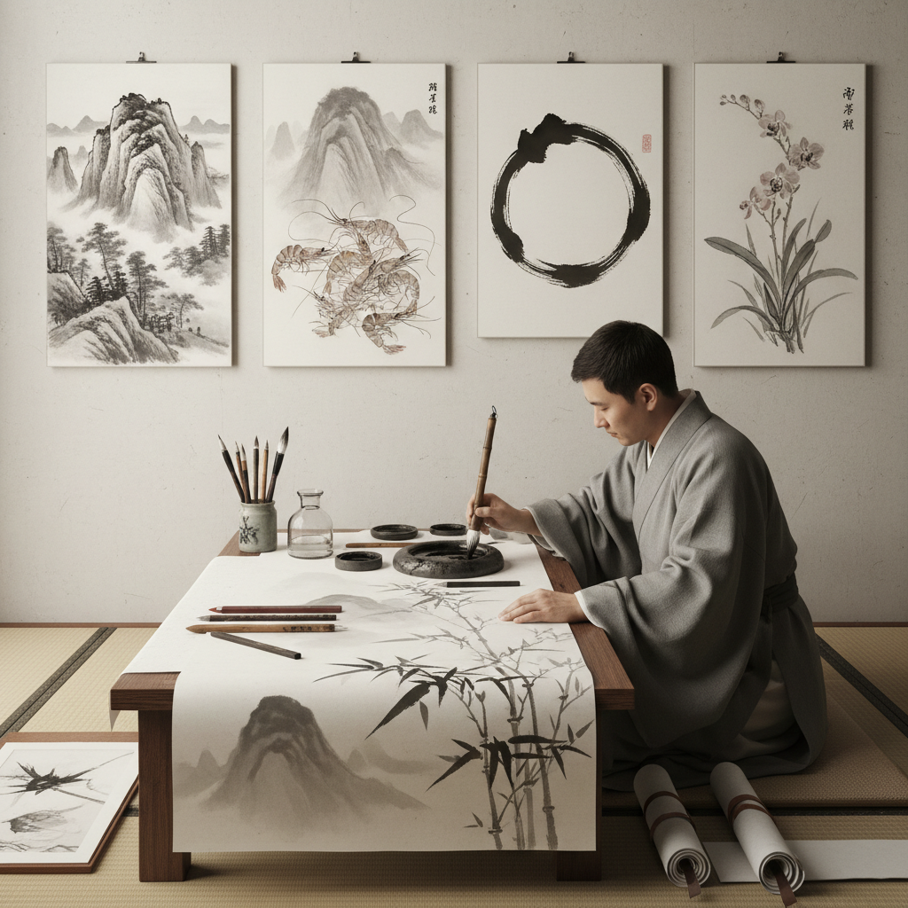

# Ink Wash 水墨画

> "Ink wash is the art of absence — what is left unpainted speaks as loudly as what is painted, and in the gradation from black to white lies an entire universe of expression." — Unknown

## 概述

水墨画（Ink Wash Painting）是东亚传统绘画的核心形式——使用墨（碳黑与胶的混合物）和水在宣纸或绢上创作，通过控制墨的浓淡、水的多少和笔的运动来表现形象和意境。水墨画的核心理念是"墨分五色"——焦、浓、重、淡、清，仅用黑白灰的变化就能表现丰富的色彩感和空间感。

水墨画强调"写意"——不追求照相式的再现，而追求对象的精神和气韵。"留白"是水墨画的重要美学——空白不是空无，而是云、水、光、气的暗示。笔法（用笔的方式）和墨法（用墨的方式）是水墨画的两大技术支柱。

## 核心特征

| 特征 | 描述 |
|------|------|
| 墨 | 以墨为主要媒介 |
| 水 | 水控制浓淡变化 |
| 留白 | 留白的美学 |
| 写意 | 追求意境和气韵 |
| 笔法 | 丰富的笔法体系 |
| 宣纸 | 宣纸的渗透效果 |

## 视觉特征

- **黑白**：黑白灰的层次
- **留白**：大面积的留白
- **渗透**：墨在纸上的渗透
- **笔触**：可见的笔触
- **空灵**：空灵的意境
- **简约**：以少胜多

## 代表作品

| 作品 | 艺术家 | 年代 | 意义 |
|------|--------|------|------|
| *潇湘图* | 董源 | 五代 | 水墨山水的经典 |
| *六柿图* | 牧溪 | 南宋 | 禅意水墨 |
| *富春山居图* | 黄公望 | 元代 | 文人画巅峰 |
| *松林图屏风* | 長谷川等伯 | 1595 | 日本水墨 |
| *虾* | 齐白石 | 20世纪 | 近代写意水墨 |

## 历史时间线

| 时期 | 事件 |
|------|------|
| 唐代 | 水墨画的确立（王维） |
| 五代宋 | 水墨山水的黄金时代 |
| 元代 | 文人画的兴盛 |
| 明清 | 水墨画的多元发展 |
| 近代 | 齐白石、黄宾虹的革新 |
| 当代 | 当代水墨的全球化 |

## 中国语境

水墨画是中国绘画的核心——中国是水墨画的发源地和最重要的传承地。从唐代王维提出"水墨为上"到当代的"新水墨"运动，水墨画贯穿了中国艺术史的千年。中国的水墨画传统包括：山水画、花鸟画、人物画三大门类。当代中国的水墨艺术正在经历深刻的变革——徐冰、谷文达、刘丹等艺术家将水墨带入当代语境。中国各大美术学院都设有中国画（水墨）专业。水墨画也是中国文化输出的重要载体。

## AI生成概念图

## 与其他风格的关系

- **Calligraphy** → 书法
- **Sumi-e** → 日本水墨
- **Literati Painting** → 文人画
- **Landscape Painting** → 山水画
- **Zen Art** → 禅画
- **Watercolor** → 水彩

---

*浮光艺志 | Chronicle of Artistry*
