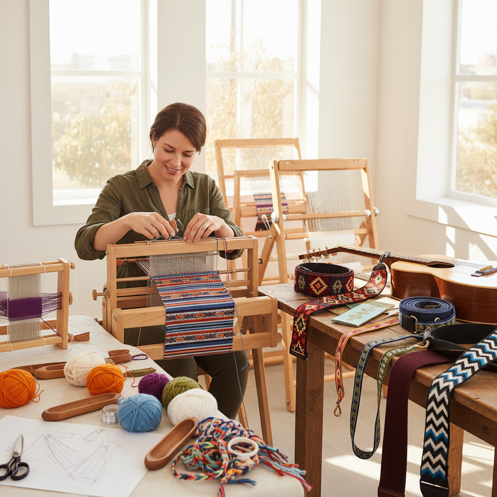

# Inkle Weaving Art 窄带织艺术

> "Inkle weaving is weaving distilled to its essence — a simple frame loom, a handful of heddles, and the weaver's fingers picking up and dropping warp threads to create patterns. The inkle loom is perhaps the most portable and accessible of all looms, yet in skilled hands it produces bands of remarkable beauty: bold geometric patterns, delicate pick-up designs, and sturdy functional straps that have served humanity for millennia." — Unknown

## 概述

窄带织艺术（Inkle Weaving Art）是使用窄带织机（inkle loom）织造窄幅织带的纺织艺术——inkle织机是一种简单的框架式织机，专门用于织造窄幅的带子、绳带和装饰条。窄带织以其设备简单、便于学习和携带而著称，是最容易入门的织布技法之一。

窄带织艺术的实践包括：1）基础窄带织——条纹和简单图案的织带；2）拾花窄带织——通过手工拾取经线创造图案；3）经面窄带织——经线完全覆盖纬线的织带；4）双面窄带织——正反面不同图案；5）功能性织带——背带、腰带、吉他带等；6）当代窄带织——将传统技法与现代设计结合的创作。

## 核心特征

| 特征 | 描述 |
|------|------|
| 简单 | 设备极其简单 |
| 便携 | 织机小巧便携 |
| 入门 | 最易入门的织布 |
| 窄幅 | 专织窄幅织带 |
| 经面 | 经线主导的织物 |
| 实用 | 强大的实用功能 |

## 视觉特征

- **条纹**：经线色彩的条纹效果
- **几何**：拾花产生的几何图案
- **色彩**：多色经线的丰富搭配
- **密实**：经线密集的厚实织带
- **边缘**：整齐的织带边缘
- **功能**：实用的带状形态

## 代表作品

| 作品 | 艺术家/文化 | 年代 | 意义 |
|------|-------------|------|------|
| *Andean backstrap bands* | 安第斯 | 古代至今 | 南美织带传统 |
| *African kente strips* | 西非 | 古代至今 | 非洲窄带织 |
| *Medieval garters* | 中世纪欧洲 | 中世纪 | 欧洲织带 |
| *Scandinavian bands* | 北欧 | 古代至今 | 北欧织带传统 |
| *Contemporary inkle* | 当代 | 当代 | 当代窄带织 |

## 历史时间线

| 时期 | 事件 |
|------|------|
| 史前 | 最早的窄带织造 |
| 古代 | 各文明的织带传统 |
| 中世纪 | 欧洲织带行会 |
| 工业革命 | 机械织带取代手工 |
| 当代 | 手工窄带织的复兴 |

## 中国语境

窄带织艺术在中国有丰富的传统形式。中国古代的"织带"技术有数千年的历史——从商周时期的丝织带到明清的各种功能性织带。中国少数民族的织带传统极其丰富——如苗族的花带、藏族的邦典（围裙织带）、壮族的壮锦带等。中国传统的"腰机"（backstrap loom）是最古老的窄带织工具之一——至今在一些少数民族地区仍在使用。中国的非物质文化遗产中，多种织带技艺被列入保护名录——如土家族织锦、苗族织带等。中国当代的手工织布爱好者中，inkle织机作为入门级织布工具正在流行——因为价格低廉、操作简单。中国的一些手工工作室将窄带织作为纺织艺术的入门课程——让更多人体验手工织布的乐趣。

## AI生成概念图

## 与其他风格的关系

- **Tablet Weaving** → 卡片织艺术
- **Backstrap Weaving** → 腰机织
- **Tapestry Weaving** → 挂毯织
- **Textile Art** → 纺织艺术
- **Folk Art** → 民间艺术
- **Pattern Design** → 图案设计

---

*浮光艺志 | Chronicle of Artistry*
