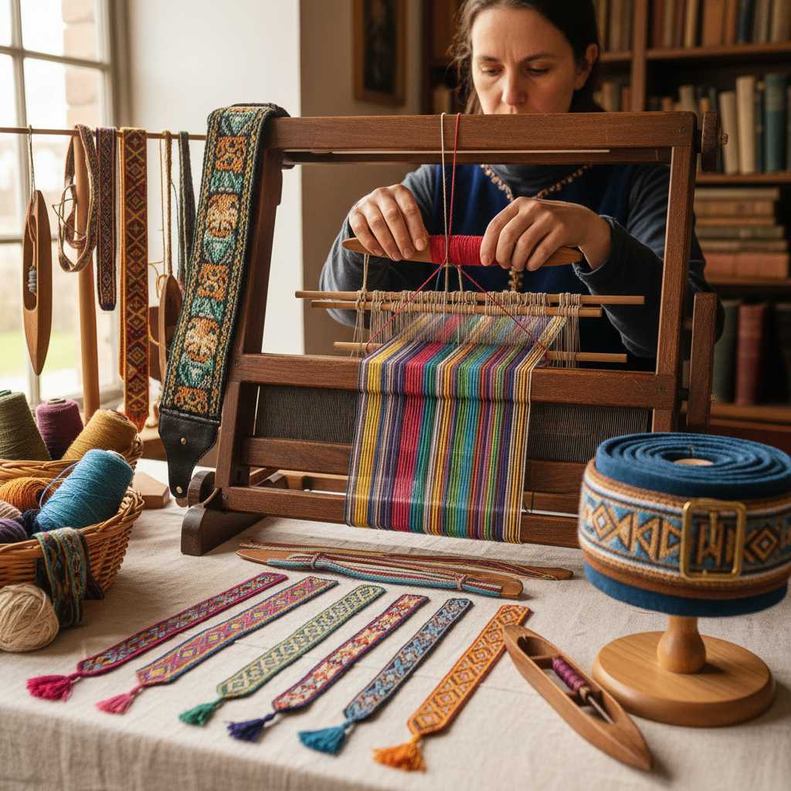

# Inkle Weaving 窄带织机编织

> "Inkle weaving is simplicity perfected — a small frame, a handful of heddles, and the weaver's patience produce bands of color and pattern that have adorned garments and bound books for centuries." — Unknown

## 概述

窄带织机编织（Inkle Weaving）是使用窄带织机（inkle loom）编织窄幅带状织物的技法。Inkle loom是一种简单的框架式织机——经线在一系列木钉之间来回缠绕，通过绳环（heddles）控制经线的升降来形成开口。织工用手指或小梭子将纬线穿过开口，逐渐编织出窄带。

Inkle weaving的特点是：设备简单便宜、学习门槛低、但可以创造出精美的图案。织出的带子通常宽度在1-4英寸之间，适合制作腰带、书签、吉他背带、包带、装饰边等。Inkle weaving是许多编织爱好者的入门选择——它不需要大型织机，桌面上就可以操作。

## 核心特征

| 特征 | 描述 |
|------|------|
| 窄带 | 编织窄幅带状织物 |
| 简单 | 设备简单便宜 |
| 经面 | 经线主导的图案 |
| 便携 | 相对便携的织机 |
| 入门 | 编织的入门选择 |
| 多用 | 用途广泛 |

## 视觉特征

- **条纹**：经向的条纹图案
- **色彩**：多色的经线配色
- **窄带**：窄而长的带状
- **密实**：密实的织物
- **图案**：可创造pick-up图案
- **整齐**：整齐的边缘

## 代表作品

| 作品 | 艺术家 | 年代 | 意义 |
|------|--------|------|------|
| *Medieval inkle bands* | 匿名 | 中世纪 | 中世纪窄带 |
| *Inkle-woven bookmarks* | Various | 传统 | 编织书签 |
| *Guitar straps* | Various | 当代 | 吉他背带 |
| *Contemporary inkle art* | Various | 当代 | 当代窄带艺术 |
| *Pick-up pattern bands* | Various | 当代 | 提花窄带 |

## 历史时间线

| 时期 | 事件 |
|------|------|
| 中世纪 | 欧洲窄带编织的传统 |
| 16-17世纪 | Inkle一词的出现 |
| 19世纪 | 工业化对手工窄带的冲击 |
| 20世纪 | Inkle loom的标准化设计 |
| 当代 | Inkle weaving作为爱好的普及 |
| 当代 | 在线社区和教程的繁荣 |

## 中国语境

窄带织机编织在中国的手工编织爱好者群体中正在获得关注。中国传统的"织带"工艺（如中国结的编织带、少数民族的腰带等）与Inkle weaving有相似之处。当代中国的一些手工工作坊引入了Inkle loom作为编织入门工具。中国的电商平台上可以购买到Inkle loom和相关材料。一些中国的编织爱好者在社交媒体上分享Inkle weaving作品和教程。

## AI生成概念图

## 与其他风格的关系

- **Tablet Weaving** → 织带
- **Backstrap Weaving** → 腰机编织
- **Weaving** → 编织
- **Braiding** → 编绳
- **Textile Art** → 纺织艺术
- **Rigid Heddle** → 刚性综框编织

---

*浮光艺志 | Chronicle of Artistry*
