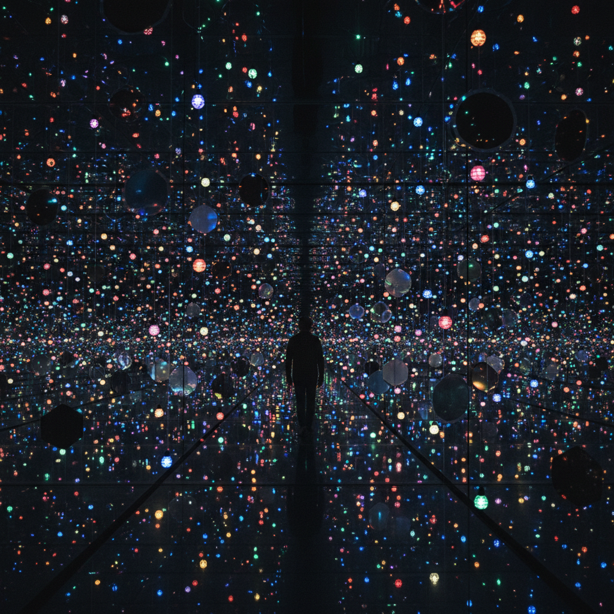

# Installation Art 装置艺术



> **"走进艺术——不是看它，是被它包围、改变、重塑。"**

## 概述

| 维度 | 描述 |
|------|------|
| 时期 | 1960s–至今 |
| 别名 | Installation Art, 装置艺术, 环境艺术, Immersive Art |
| 核心色彩 | 无固定——取决于材料和概念 |
| 关键元素 | 空间占据、观者参与、多感官体验、场域特定 |
| 代表人物 | Yayoi Kusama, Olafur Eliasson, Ai Weiwei, teamLab, James Turrell |
| 关联风格 | Conceptual Art, Land Art, Arte Povera, New Media Art, Fluxus |

---

## 历史脉络

| 年份 | 事件 |
|------|------|
| 1958 | Allan Kaprow "Happenings"——装置的前身 |
| 1960s | Minimalism雕塑开始占据空间 |
| 1966 | Kusama "Infinity Mirror Room"——沉浸式装置先驱 |
| 1970s | 装置艺术成为独立类别 |
| 1990s | 大型美术馆开始为装置设计空间 |
| 2001 | Olafur Eliasson "The Weather Project"——泰特涡轮大厅 |
| 2010s | teamLab——数字沉浸式装置全球现象 |

### 核心哲学

装置艺术的精神是**"艺术不是挂在墙上的物品——是你走进去的世界"**：
- "观者不是旁观者——是参与者、是作品的一部分"
- "空间本身就是媒介——墙壁、地板、天花板、空气"
- "装置是临时的——体验是永恒的"
- "打破画框——打破底座——打破美术馆的白盒子"
- "每个人的体验都不同——这就是装置的民主"

---

## 视觉语法

### 空间系统

```
空间类型：
  白盒子 — 画廊/美术馆内的中性空间
  场域特定 — 为特定地点创作
  公共空间 — 城市、自然、建筑
  虚拟空间 — 数字、VR、AR

媒介：
  物理 — 雕塑、建筑、日常物品
  光 — 投影、LED、霓虹、自然光
  声音 — 环境音、音乐、噪音
  数字 — 互动、生成、实时
  自然 — 水、植物、土壤、空气

规则：
  - 必须占据三维空间
  - 观者必须"进入"作品
  - 时间是维度之一
  - 可以是永久的或临时的
```

### 标志性元素

| 类别 | 元素 |
|------|------|
| 空间 | 沉浸、包围、迷宫、无限 |
| 感官 | 视觉+听觉+触觉+嗅觉+体感 |
| 互动 | 观者触发、身体参与、社交体验 |
| 规模 | 从房间到建筑到城市 |
| 时间 | 临时性、变化、过程 |
| 态度 | 体验优先、反商品化、民主 |

---

## 与千禧怀旧/当代的关系

### teamLab——装置艺术的流行化
- teamLab = 数字装置 + 沉浸体验 + 社交媒体
- "Instagram时代的装置艺术——可拍照 = 可传播"
- 全球巡展模式 = 装置艺术的商业化

### Kusama——从前卫到流行
- 无限镜屋 = 最被拍照的当代艺术
- "Kusama证明了装置可以既前卫又大众"

---

## 设计应用

| 场景 | 应用方式 |
|------|----------|
| 商业 | 品牌快闪+沉浸式体验店 |
| 文旅 | 沉浸式展览+光影秀 |
| 数字 | VR/AR体验+互动装置 |
| 建筑 | 公共艺术+空间设计 |

---

## 相关风格

← [Conceptual Art 概念艺术](conceptual-art.md) | [New Media Art 新媒体艺术](new-media-art.md) →

↑ [返回千禧怀旧目录](README.md) | [返回总目录](../README.md)
