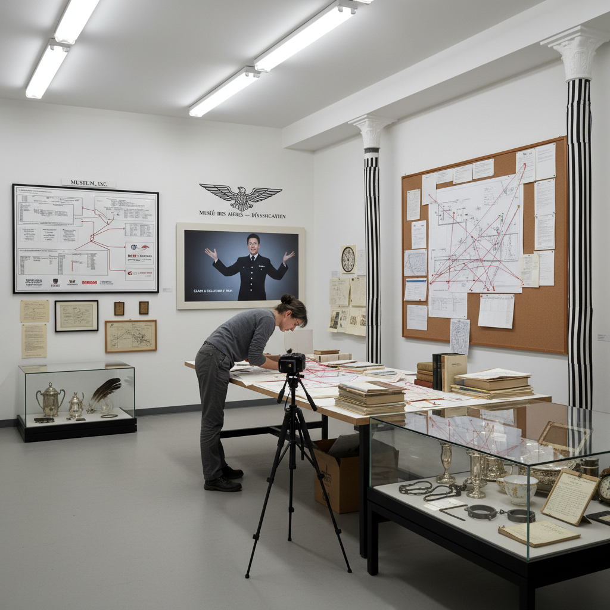

# Institutional Critique Art 体制批判艺术

> "Institutional critique turns the museum inside out — making visible the invisible systems of power, money, and ideology that determine what gets shown, who gets celebrated, and what counts as art, the artist becoming an investigator who follows the money, maps the networks, and reveals that the white cube is never neutral but always a stage managed by interests that prefer to remain unseen." — Unknown

## 概述

体制批判（Institutional Critique）是一种以艺术机构本身（博物馆、画廊、艺术市场、批评体系等）作为批判对象和创作材料的艺术实践。体制批判艺术家揭示和质疑艺术机构中隐藏的权力结构、经济利益、意识形态偏见和排斥机制——将通常被视为"中性"的展示空间和制度框架暴露为充满政治性的场域。

体制批判通常被分为三代：第一代（1960-70年代）包括马塞尔·布达埃尔（Marcel Broodthaers）、汉斯·哈克（Hans Haacke）和丹尼尔·布伦（Daniel Buren），他们直接揭露博物馆的权力结构和赞助关系；第二代（1980-90年代）包括安德里亚·弗雷泽（Andrea Fraser）和弗雷德·威尔逊（Fred Wilson），他们更深入地分析机构的话语生产和身份政治；第三代（2000年代至今）则关注全球化艺术系统、双年展体制和数字平台。

## 核心特征

| 特征 | 描述 |
|------|------|
| 批判 | 对艺术机构的批判 |
| 揭露 | 揭露隐藏的权力 |
| 自反 | 艺术的自我反思 |
| 调查 | 调查式的方法 |
| 政治 | 政治性的立场 |
| 语境 | 关注展示语境 |

## 视觉特征

- **文本**：大量的文本和文档
- **档案**：档案式的呈现
- **表演**：表演性的导览
- **干预**：对展示空间的干预
- **图表**：关系图和数据可视化
- **挪用**：对机构语言的挪用

## 代表作品

| 作品 | 艺术家 | 年代 | 意义 |
|------|--------|------|------|
| *Shapolsky et al.* | Hans Haacke | 1971 | 哈克的房地产调查 |
| *Museum Highlights: A Gallery Talk* | Andrea Fraser | 1989 | 弗雷泽的导览表演 |
| *Mining the Museum* | Fred Wilson | 1992 | 威尔逊的博物馆挖掘 |
| *Musée d'Art Moderne* | Marcel Broodthaers | 1968-72 | 布达埃尔的虚构博物馆 |
| *Photo-Souvenirs* | Daniel Buren | 1960年代起 | 布伦的条纹干预 |

## 历史时间线

| 时期 | 事件 |
|------|------|
| 1968-72 | 布达埃尔的虚构博物馆 |
| 1971 | 哈克的古根海姆事件 |
| 1980-90年代 | 第二代体制批判 |
| 1992 | 威尔逊的"挖掘博物馆" |
| 2000年代 | 第三代全球化批判 |

## 中国语境

体制批判在中国当代艺术中有独特的发展。中国的艺术体制（官方美术馆系统、学院体系、市场体系）与西方有很大不同，因此中国的体制批判也有不同的对象和方法。中国的一些艺术家（如艾未未、汪建伟等）对中国的文化体制进行批判性反思。中国的"替代空间"运动（如北京的箭厂空间、广州的维他命空间等）本身就是对官方体制的一种回应。中国当代艺术中对"双年展体制"和"全球艺术市场"的反思也属于体制批判的范畴。

## AI生成概念图

## 与其他风格的关系

- **Conceptual Art** → 概念艺术
- **Site-Specific Art** → 场域特定艺术
- **Political Art** → 政治艺术
- **Appropriation Art** → 挪用艺术
- **Relational Aesthetics** → 关系美学
- **Social Practice** → 社会实践艺术

---

*浮光艺志 | Chronicle of Artistry*
