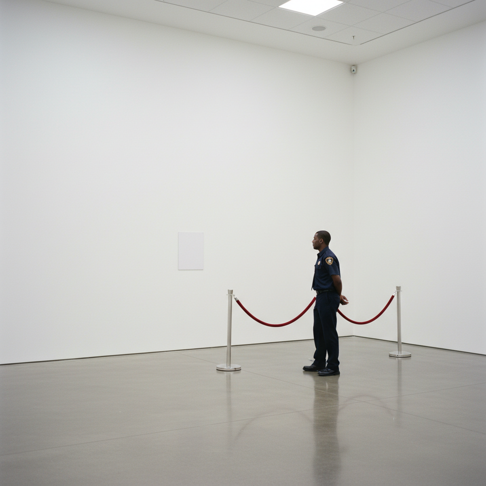

# Institutional Critique 制度批评

> "Can an institution critique itself?" — Andrea Fraser

## 概述

制度批评（Institutional Critique）是1960年代末兴起、1980-90年代成熟的艺术实践，以艺术体制本身——博物馆、画廊、拍卖行、批评话语、艺术教育——作为批评和创作的对象。它追问：谁决定什么是艺术？博物馆如何建构权力？画廊的白墙如何影响我们的观看？

制度批评不是从外部攻击体制，而是从内部揭示体制运作的隐藏机制——艺术家利用体制的资源来批评体制本身。

## 核心特征

| 特征 | 描述 |
|------|------|
| 体制即对象 | 博物馆、画廊、市场是作品的主题 |
| 内部批评 | 从体制内部揭示其运作机制 |
| 去神秘化 | 揭示艺术世界的权力结构和经济利益 |
| 自反性 | 艺术家反思自己在体制中的位置 |
| 文本性 | 大量使用文字、档案、数据 |
| 表演性 | 通过行为揭示体制的隐藏规则 |

## 视觉特征

- **形式**：文本、档案、导览、表演、干预
- **空间**：博物馆/画廊空间本身成为作品
- **材料**：机构文件、标签、墙面文字
- **色彩**：机构的白色、文件的米色
- **呈现**：看似"正常"的展览元素被异化
- **文档**：照片、视频记录制度运作

## 代表作品

| 作品 | 艺术家 | 年代 | 意义 |
|------|--------|------|------|
| *Museum Highlights: A Gallery Talk* | Andrea Fraser | 1989 | 伪装成导览员揭示博物馆话语 |
| *Condensation Cube* | Hans Haacke | 1963-65 | 物理系统隐喻社会系统 |
| *MoMA Poll* | Hans Haacke | 1970 | 在MoMA内部进行政治投票 |
| *Mining the Museum* | Fred Wilson | 1992 | 重新布展揭示博物馆的种族盲点 |
| *Untitled (Official Welcome)* | Andrea Fraser | 2001 | 模仿开幕致辞揭示权力话语 |
| *One and Three Chairs* | Joseph Kosuth | 1965 | 质疑再现和定义的体制（先驱） |

## 历史时间线

| 时期 | 事件 |
|------|------|
| 1960s末 | 第一代：Haacke、Buren、Asher开始质疑画廊空间 |
| 1970 | Haacke的MoMA Poll——在博物馆内部进行政治干预 |
| 1976 | Brian O'Doherty发表"Inside the White Cube" |
| 1980s | 第二代：Fraser、Wilson——更系统的制度分析 |
| 1989 | Fraser的Museum Highlights——制度批评的经典 |
| 1992 | Wilson的Mining the Museum——种族与博物馆政治 |
| 2000s | 第三代：制度批评被体制吸收——"制度化的制度批评" |

## 子类型

| 子类型 | 特征 |
|--------|------|
| 空间批评 | Buren、Asher——揭示画廊空间的意识形态 |
| 系统批评 | Haacke——揭示艺术市场和政治的关联 |
| 表演批评 | Fraser——通过角色扮演揭示话语权力 |
| 档案批评 | Wilson——重新组织档案揭示被压抑的历史 |
| 自我批评 | Fraser——艺术家反思自己的共谋性 |

## 中国语境

制度批评在中国语境下有特殊的复杂性。中国的艺术体制（官方美协系统、798商业画廊、国际双年展）与西方不同，制度批评的对象和方法也需要本土化。艾未未的实践（如记录四川地震遇难学生名单）可视为一种广义的制度批评。更日常的层面，中国独立艺术空间对商业画廊系统的替代性实验也是制度批评的实践。

## 争议与遗产

- **悖论**：制度批评依赖体制才能存在——批评者也是共谋者
- **被吸收**：博物馆开始主动邀请制度批评艺术家——批评被"驯化"
- **Fraser的自问**：2005年Fraser问"制度批评还有可能吗？"
- **遗产**：使艺术世界的权力结构成为可讨论的话题
- **当代回响**：#MeToo在艺术界的揭露、去殖民化运动、NFT对画廊系统的挑战

## AI生成概念图

## 与其他风格的关系

- **Conceptual Art** → 概念艺术的去物质化为制度批评铺路
- **Minimalism** → 极简主义对展示空间的关注是制度批评的起点
- **Relational Aesthetics** → 关系美学共享对艺术体制的反思
- **Post-Internet** → 后网络艺术质疑数字时代的新体制
- **Social Practice** → 社会实践艺术继承了制度批评的政治关怀
- **Appropriation** → 挪用艺术共享对"原创性"体制的质疑

---

*浮光艺志 | Chronicle of Artistry*
