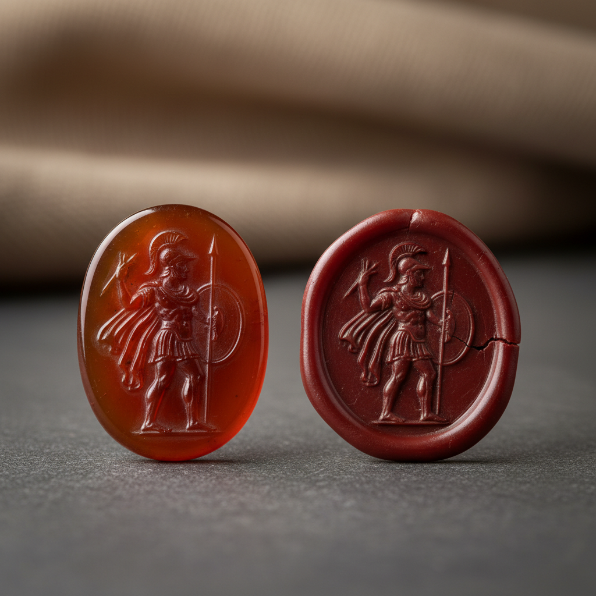

# Intaglio Art 凹雕宝石艺术

> "Intaglio is cameo's mirror image — where cameo carves in relief, intaglio cuts into the stone, creating a sunken design that reveals itself only when pressed into wax or held at an angle to catch raking light. For millennia, intaglio gems served as personal seals, each one a unique signature carved into cornelian, jasper, or rock crystal. The art demands absolute mastery of negative space: the carver must think in reverse, cutting away to create an image that exists as absence." — Unknown

## 概述

凹雕宝石艺术（Intaglio Art）是在宝石或硬石表面雕刻凹入图案的传统工艺——与浮雕宝石（cameo）相反，凹雕将图案刻入石材内部，形成凹陷的图案。凹雕宝石最初作为印章使用（按压在蜡或泥上产生凸起的印记），是人类最古老的个人身份标识之一。

凹雕宝石艺术的实践包括：1）印章雕刻——用于蜡封的凹雕印章；2）宝石凹雕——在各种宝石上的凹雕装饰；3）水晶凹雕——在水晶上的凹雕；4）玛瑙凹雕——在玛瑙上的凹雕；5）肖像凹雕——凹刻的肖像图案；6）纹章凹雕——家族纹章的凹雕；7）当代凹雕——将传统技法与现代设计结合的创作。

## 核心特征

| 特征 | 描述 |
|------|------|
| 凹刻 | 向内凹刻的图案 |
| 印章 | 印章的功能传统 |
| 反向 | 需要反向思维 |
| 微型 | 极小尺度的雕刻 |
| 古老 | 数千年的历史 |
| 身份 | 个人身份的标识 |

## 视觉特征

- **凹陷**：向内凹刻的图案
- **光影**：侧光下的光影效果
- **精细**：极其精细的雕刻
- **透明**：透明石材中的深度
- **反转**：印出后的正像效果
- **微型**：微型雕刻的精致

## 代表作品

| 作品 | 艺术家/文化 | 年代 | 意义 |
|------|-------------|------|------|
| *Mesopotamian cylinder seals* | 美索不达米亚 | 公元前3000年 | 最早的凹雕印章 |
| *Greek intaglio gems* | 古希腊 | 公元前5-3世纪 | 希腊凹雕宝石 |
| *Roman signet rings* | 古罗马 | 公元前1世纪-公元3世纪 | 罗马印章戒指 |
| *Renaissance intaglios* | 意大利 | 15-16世纪 | 文艺复兴凹雕 |
| *Contemporary intaglio gems* | 当代 | 当代 | 当代凹雕宝石 |

## 历史时间线

| 时期 | 事件 |
|------|------|
| 公元前3000年 | 美索不达米亚圆筒印章 |
| 公元前5世纪 | 古希腊凹雕的黄金时代 |
| 古罗马 | 凹雕印章戒指的普及 |
| 文艺复兴 | 凹雕艺术的复兴 |
| 当代 | 凹雕的艺术收藏和创新 |

## 中国语境

凹雕宝石艺术在中国有独特的对应传统。中国的印章文化是世界上最发达的凹雕传统之一——篆刻艺术将文字凹刻在石材上用于钤印。中国的玉玺和官印是凹雕的重要应用——从秦始皇的传国玉玺到各级官印都是凹雕。中国的篆刻艺术将凹雕提升为独立的艺术形式——不仅是实用的印章，更是书法和雕刻的结合。中国当代的篆刻家继续发展凹雕传统——将传统篆刻与现代设计结合。中国的一些宝石雕刻师也开始探索西方凹雕宝石技法——将其与中国传统印章美学结合。

## AI生成概念图

## 与其他风格的关系

- **Cameo Carving** → 浮雕宝石
- **Seal Carving** → 篆刻
- **Gem Cutting** → 宝石切割
- **Glyptics** → 宝石雕刻
- **Classical Art** → 古典艺术
- **Jewelry** → 珠宝艺术

---

*浮光艺志 | Chronicle of Artistry*
