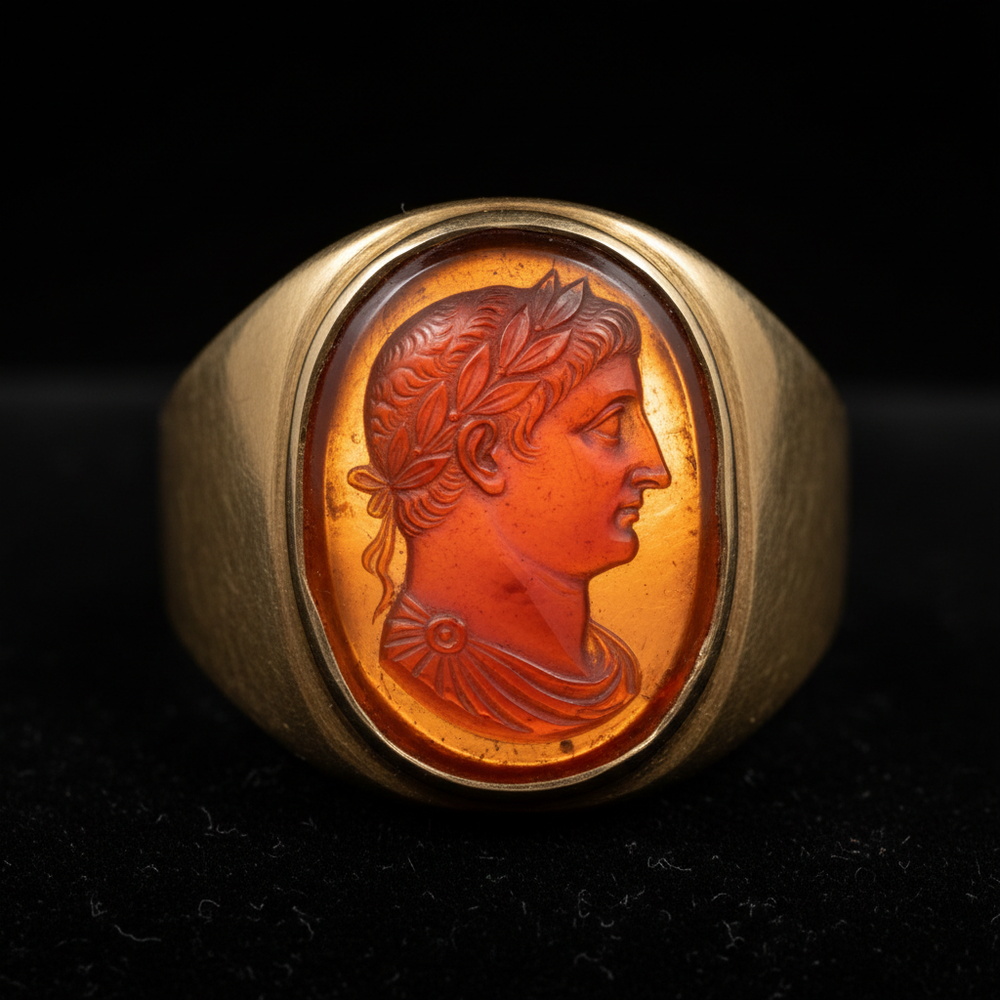

# Intaglio Gem Art 凹雕宝石艺术

> "Intaglio is sculpture in reverse — the image is carved into the surface of a gemstone so that it sits below the plane rather than rising above it. When pressed into wax, the sunken design produces a raised impression, making intaglio gems the original printing plates, personal signatures carved in stone that authenticated documents and sealed letters for millennia." — Unknown

## 概述

凹雕宝石艺术（Intaglio Gem Art）是一种在宝石或半宝石表面雕刻凹入图案的传统宝石雕刻技法——与浮雕（cameo）相反，凹雕的图案低于宝石表面，当压入蜡或粘土时会产生凸起的印记。凹雕宝石是人类最古老的个人印章和身份标识形式之一，从美索不达米亚的滚筒印章到古罗马的戒指印章，承载了数千年的历史。

凹雕宝石艺术的实践包括：1）选石——选择适合雕刻的宝石（玛瑙、红玉髓、水晶等）；2）设计——设计反向的图案（印出后为正向）；3）粗雕——用金刚石工具进行初步雕刻；4）细雕——精细的细节雕刻；5）抛光——打磨凹雕表面；6）镶嵌——将凹雕宝石镶嵌在戒指或吊坠中；7）当代凹雕——将传统技法与现代设计结合的创作。

## 核心特征

| 特征 | 描述 |
|------|------|
| 凹入 | 图案低于表面 |
| 印章 | 可用作印章 |
| 反向 | 需要反向设计 |
| 宝石 | 在宝石上雕刻 |
| 古老 | 数千年的传统 |
| 微型 | 极其微小的雕刻 |

## 视觉特征

- **凹入**：低于表面的图案
- **精细**：极其精细的雕刻
- **透光**：半透明宝石的透光效果
- **微型**：微型的精密雕刻
- **古典**：古典的图案主题
- **光影**：凹槽中的光影变化

## 代表作品

| 作品 | 艺术家/文化 | 年代 | 意义 |
|------|-------------|------|------|
| *Mesopotamian cylinder seals* | 美索不达米亚 | 公元前3500年 | 最早的凹雕印章 |
| *Greek intaglio gems* | 古希腊 | 古代 | 希腊凹雕宝石 |
| *Roman signet rings* | 古罗马 | 古代 | 罗马印章戒指 |
| *Medici gem collection* | 意大利 | 文艺复兴 | 美第奇宝石收藏 |
| *Contemporary gem engraving* | 国际 | 当代 | 当代宝石雕刻 |

## 历史时间线

| 时期 | 事件 |
|------|------|
| 公元前3500年 | 美索不达米亚滚筒印章 |
| 古代 | 希腊和罗马凹雕的黄金时代 |
| 中世纪 | 凹雕印章的持续使用 |
| 文艺复兴 | 古典凹雕的收藏和复兴 |
| 当代 | 凹雕宝石的艺术化发展 |

## 中国语境

凹雕宝石在中国有独特的对应传统。中国古代的玉玺和印章虽然多为阳刻（凸起），但也有阴刻（凹入）的传统——与西方凹雕宝石有相似之处。中国的篆刻艺术中，阴刻（白文）是重要的刻法——在石材上刻出凹入的文字。中国当代的宝石雕刻师开始学习西方凹雕技法——将其与中国传统玉雕结合。中国的印章文化与西方凹雕印章有文化对话的可能——两者都是个人身份和权威的象征。中国的珠宝教育中，宝石雕刻作为一种高级技法——在一些专业课程中有所教授。中国的文玩市场中，精美的印章和宝石雕刻作品有广泛的收藏群体。

## AI生成概念图

## 与其他风格的关系

- **Cameo** → 浮雕宝石
- **Seal Carving** → 篆刻
- **Gem Cutting** → 宝石切割
- **Jewelry** → 珠宝艺术
- **Miniature Art** → 微型艺术
- **Glyptics** → 宝石雕刻

---

*浮光艺志 | Chronicle of Artistry*
