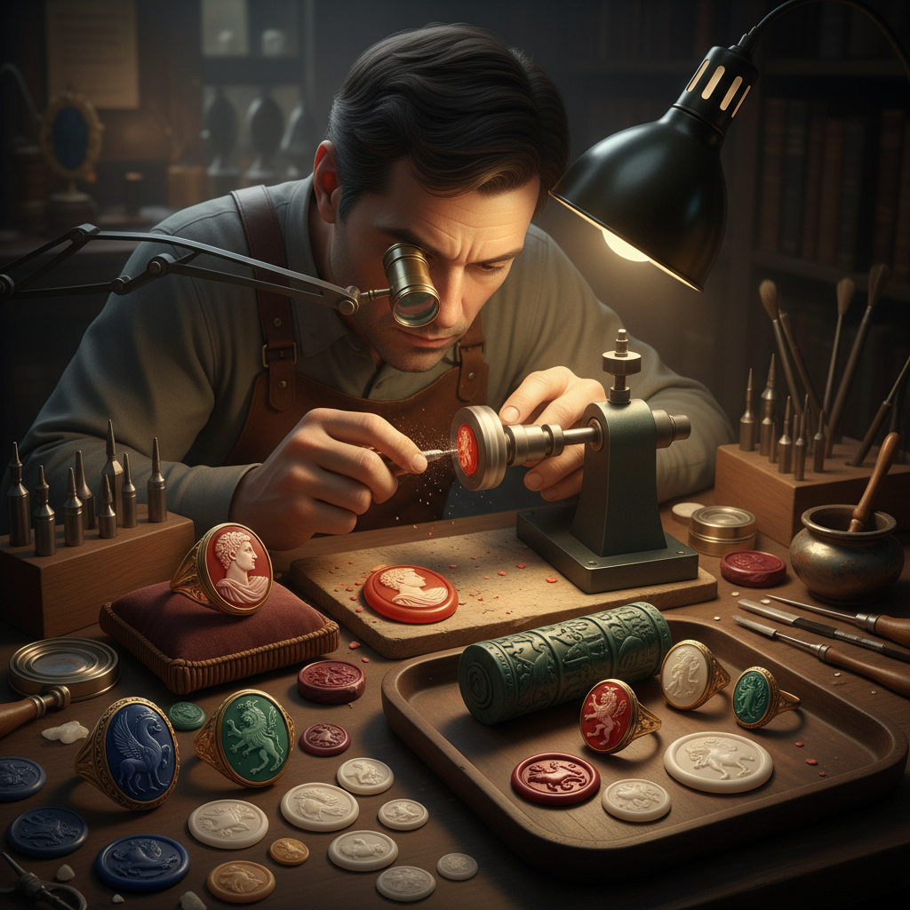

# Intaglio Gem 凹雕宝石

> "Intaglio is sculpture in reverse — the artist carves into the stone's heart, creating images that exist as absence, revealed only when pressed into wax or caught by raking light." — Unknown

## 概述

凹雕宝石（Intaglio Gem）是在宝石或硬石表面雕刻凹陷图案的工艺——与Cameo（浮雕）相反，Intaglio的图案是刻入石头内部的。Intaglio宝石最重要的功能是作为印章（seal）——将雕刻面压入蜡或泥中，产生凸起的正像印记。

Intaglio是人类最古老的宝石雕刻形式之一——从美索不达米亚的滚筒印章（cylinder seals）到古希腊罗马的宝石印章，Intaglio在古代世界有着极其重要的地位。它既是身份标识（个人印章），也是艺术品（微型雕刻）。Intaglio使用的材料包括：红玉髓（carnelian）、缟玛瑙（sardonyx）、碧玉（jasper）、青金石（lapis lazuli）等硬石。雕刻工具是旋转的金刚石或碳化硅磨头。

## 核心特征

| 特征 | 描述 |
|------|------|
| 凹雕 | 凹陷的雕刻 |
| 印章 | 可作为印章使用 |
| 微型 | 微型雕刻艺术 |
| 硬石 | 在硬石上雕刻 |
| 古老 | 极其古老的艺术 |
| 精密 | 极其精密的工艺 |

## 视觉特征

- **凹陷**：凹陷的图案
- **微型**：极小的尺寸
- **精密**：极精密的细节
- **透明**：半透明石材的光效
- **反转**：压印后的正像
- **光影**：侧光下的光影效果

## 代表作品

| 作品 | 艺术家 | 年代 | 意义 |
|------|--------|------|------|
| *Mesopotamian cylinder seals* | 匿名 | 公元前3000年 | 美索不达米亚滚筒印章 |
| *Ring of Polycrates* | 匿名 | 公元前6世纪 | 波利克拉特斯之戒 |
| *Seal of Nero* | 匿名 | 公元1世纪 | 尼禄印章 |
| *Medici gem collection* | Various | 文艺复兴 | 美第奇宝石收藏 |
| *Contemporary intaglio seals* | Various | 当代 | 当代凹雕印章 |

## 历史时间线

| 时期 | 事件 |
|------|------|
| 公元前4000年 | 美索不达米亚滚筒印章 |
| 公元前3000年 | 埃及圣甲虫印章 |
| 古希腊 | 希腊宝石雕刻的鼎盛 |
| 古罗马 | 罗马印章戒指的普及 |
| 文艺复兴 | 古典宝石的收藏热 |
| 当代 | Intaglio作为收藏和艺术 |

## 中国语境

凹雕宝石在中国有着独特的对应——中国的印章文化（篆刻）与西方的Intaglio有着相似的功能和精神。中国的篆刻使用的是软石（寿山石、青田石、巴林石等），而西方Intaglio使用硬石。中国的古董收藏界对西方古典Intaglio宝石有所了解和收藏。中国的一些宝石雕刻师也尝试在硬石上进行凹雕创作。中国的印章文化和西方的Intaglio传统在"以刻入石中的图案作为身份标识"这一核心概念上高度一致。

## AI生成概念图

## 与其他风格的关系

- **Cameo** → 浮雕宝石
- **Seal Carving** → 篆刻
- **Gem Cutting** → 宝石切割
- **Glyptics** → 宝石雕刻术
- **Sigillography** → 印章学
- **Jewelry Making** → 首饰制作

---

*浮光艺志 | Chronicle of Artistry*
