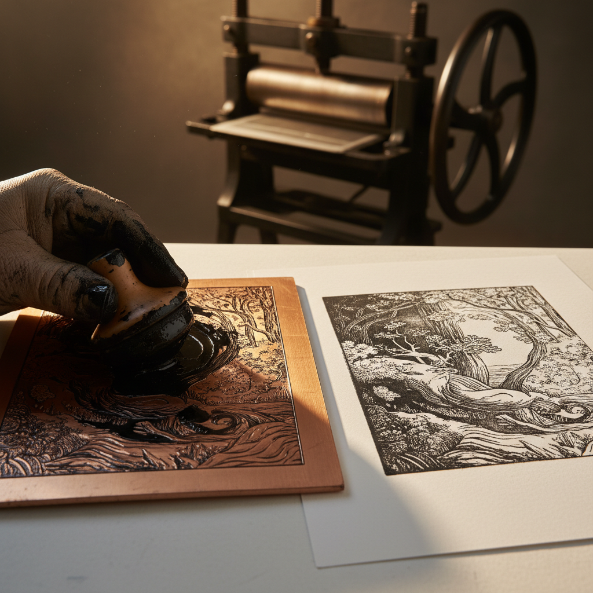

# Intaglio 凹版印刷

> "Intaglio is the art of depth — the image lives below the surface, waiting to be revealed by ink and pressure." — Unknown

## 概述

凹版印刷（Intaglio，意大利语"雕刻"）是所有凹版版画技法的总称——包括蚀刻（etching）、干刻（drypoint）、飞尘法（aquatint）、美柔汀（mezzotint）和雕版（engraving）等。与凸版印刷相反，凹版是将墨填入刻在金属板上的凹线和凹面中，再通过高压将墨转印到纸上。凹版印刷以其无与伦比的线条精细度和丰富的色调层次成为最具表现力的版画家族。

凹版的哲学在于：深度创造丰富——越深的线条承载越多的墨，产生越浓的黑色，而浅浅的划痕则创造最微妙的灰色。

## 核心特征

| 特征 | 描述 |
|------|------|
| 凹面 | 图像刻在金属板的凹面 |
| 高压 | 需要高压印刷机 |
| 精细 | 极其精细的线条和色调 |
| 金属板 | 通常使用铜板或锌板 |
| 多技法 | 包含多种不同技法 |
| 板痕 | 印刷品有特征性的板痕 |

## 视觉特征

- **精细**：极其精细的线条
- **层次**：从纯白到纯黑的完整色调
- **板痕**：纸上的压痕边框
- **质感**：不同技法的独特质感
- **深度**：墨色的深度和丰富
- **纸质**：优质纸张的触感

## 代表作品

| 作品 | 艺术家 | 年代 | 意义 |
|------|--------|------|------|
| *Melencolia I* | Albrecht Dürer | 1514 | 雕版的巅峰 |
| *Hundred Guilder Print* | Rembrandt | 1649 | 蚀刻的光影革命 |
| *Los Desastres de la Guerra* | Goya | 1810-20 | 飞尘法的社会批判 |
| *Mezzotints* | John Martin | 1820s-30s | 美柔汀的戏剧性 |
| *Drypoints* | Mary Cassatt | 1890s | 干刻的柔和线条 |
| *Contemporary intaglio* | Various | 2000s+ | 当代凹版实验 |

## 历史时间线

| 时期 | 事件 |
|------|------|
| 15世纪 | 雕版的发明 |
| 16世纪 | 蚀刻的发展 |
| 17世纪 | 美柔汀和飞尘法的发明 |
| 18-19世纪 | 凹版印刷的黄金时代 |
| 20世纪 | 现代艺术家的凹版实验 |
| 当代 | 凹版作为当代艺术媒介 |

## 中国语境

凹版印刷在中国的版画教育体系中占有重要地位——中国美术学院的版画系通常设有铜版画（凹版）工作室。中国当代凹版画家在技法创新和观念表达上都有独特贡献。中国的凹版版画在国际版画双年展中有重要地位。与中国传统的凸版木刻不同，凹版为中国版画带来了新的表现可能。

## AI生成概念图

## 与其他风格的关系

- **Etching** → 蚀刻是凹版的主要技法之一
- **Engraving** → 雕版是最早的凹版技法
- **Mezzotint** → 美柔汀是凹版的面积技法
- **Aquatint** → 飞尘法创造色调面积
- **Drypoint** → 干刻是最直接的凹版技法
- **Printmaking** → 版画是凹版的上位类别

---

*浮光艺志 | Chronicle of Artistry*
