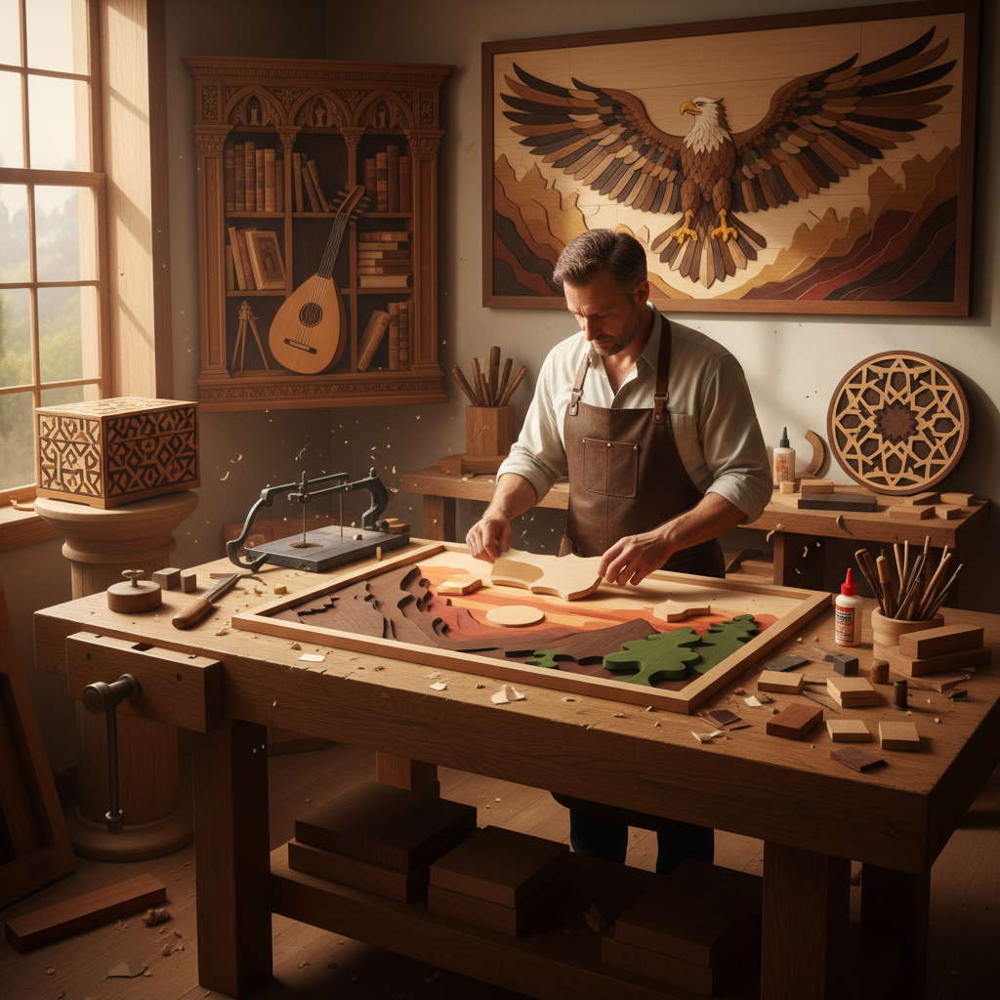

# Intarsia Art 木镶嵌艺术

> "Intarsia is painting with wood — each piece chosen not for pigment but for grain, color, and figure. The intarsia master sees in a plank of walnut the shadow of a mountain, in a sliver of holly the gleam of snow, in the flame of mahogany the warmth of sunset. No two pieces are alike, for wood is a living record of seasons and storms, and the intarsia picture carries within it the memory of forests." — Unknown

## 概述

木镶嵌艺术（Intarsia Art）是一种使用不同颜色和纹理的木材片段拼接组合成图案或画面的木工装饰艺术——通过精确切割和拼合不同种类的木材，利用木材天然的色彩差异和纹理变化来创造图像效果。与marquetry（薄木片镶嵌）不同，intarsia使用较厚的木块，通过不同高度和角度的组合创造三维浮雕效果。

木镶嵌艺术的实践包括：1）平面镶嵌——将不同木材拼接成平面图案；2）浮雕镶嵌——利用木块厚度差异创造立体效果；3）建筑装饰——教堂和宫殿的木镶嵌装饰；4）家具装饰——家具表面的木镶嵌图案；5）独立艺术品——作为独立挂画的木镶嵌作品；6）几何图案——伊斯兰风格的几何木镶嵌；7）当代木镶嵌——将传统技法与现代设计结合的创作。

## 核心特征

| 特征 | 描述 |
|------|------|
| 天然 | 利用木材天然色彩 |
| 立体 | 三维浮雕效果 |
| 精密 | 极其精密的切割拼合 |
| 温暖 | 木材的温暖质感 |
| 持久 | 不褪色的天然色彩 |
| 独特 | 每件作品独一无二 |

## 视觉特征

- **色彩**：木材天然的色彩变化
- **纹理**：不同木材的纹理对比
- **层次**：不同厚度的立体层次
- **拼接**：精密的拼接线条
- **光影**：立体表面的光影效果
- **温暖**：整体温暖的木质色调

## 代表作品

| 作品 | 艺术家/文化 | 年代 | 意义 |
|------|-------------|------|------|
| *Studiolo of Federico* | 意大利文艺复兴 | 1476 | 乌尔比诺公爵书房 |
| *Santa Maria in Organo* | Fra Giovanni da Verona | 1494-1499 | 教堂木镶嵌 |
| *Islamic geometric intarsia* | 伊斯兰传统 | 中世纪 | 几何木镶嵌 |
| *Japanese yosegi-zaiku* | 日本传统 | 江户时代 | 箱根寄木细工 |
| *Contemporary intarsia* | Various | 当代 | 当代木镶嵌艺术 |

## 历史时间线

| 时期 | 事件 |
|------|------|
| 古代 | 早期木镶嵌的出现 |
| 中世纪 | 伊斯兰几何木镶嵌发展 |
| 文艺复兴 | 意大利intarsia的黄金时代 |
| 17-18世纪 | 欧洲宫廷木镶嵌 |
| 当代 | 木镶嵌的艺术复兴 |

## 中国语境

木镶嵌艺术在中国有独特的传统形式。中国传统家具中的"百宝嵌"技法将各种材料（包括不同木材）镶嵌在家具表面——创造精美的装饰效果。中国的红木家具制作中，不同木材的搭配和拼接也体现了木镶嵌的理念。中国的一些地区有传统的木拼花工艺——如苏州的红木小件中就有精美的木镶嵌装饰。日本的箱根寄木细工（yosegi-zaiku）是东亚木镶嵌的代表——这种技法也影响了中国当代的木工艺术家。中国当代的一些木工艺术家开始探索intarsia技法——将中国传统图案与西方intarsia技法相结合。中国的木工爱好者社区中，intarsia是一个越来越受欢迎的方向。

## AI生成概念图

## 与其他风格的关系

- **Marquetry** → 薄木片镶嵌
- **Woodworking** → 木工艺术
- **Mosaic** → 马赛克艺术
- **Parquetry** → 拼花地板
- **Relief Sculpture** → 浮雕
- **Decorative Art** → 装饰艺术

---

*浮光艺志 | Chronicle of Artistry*
