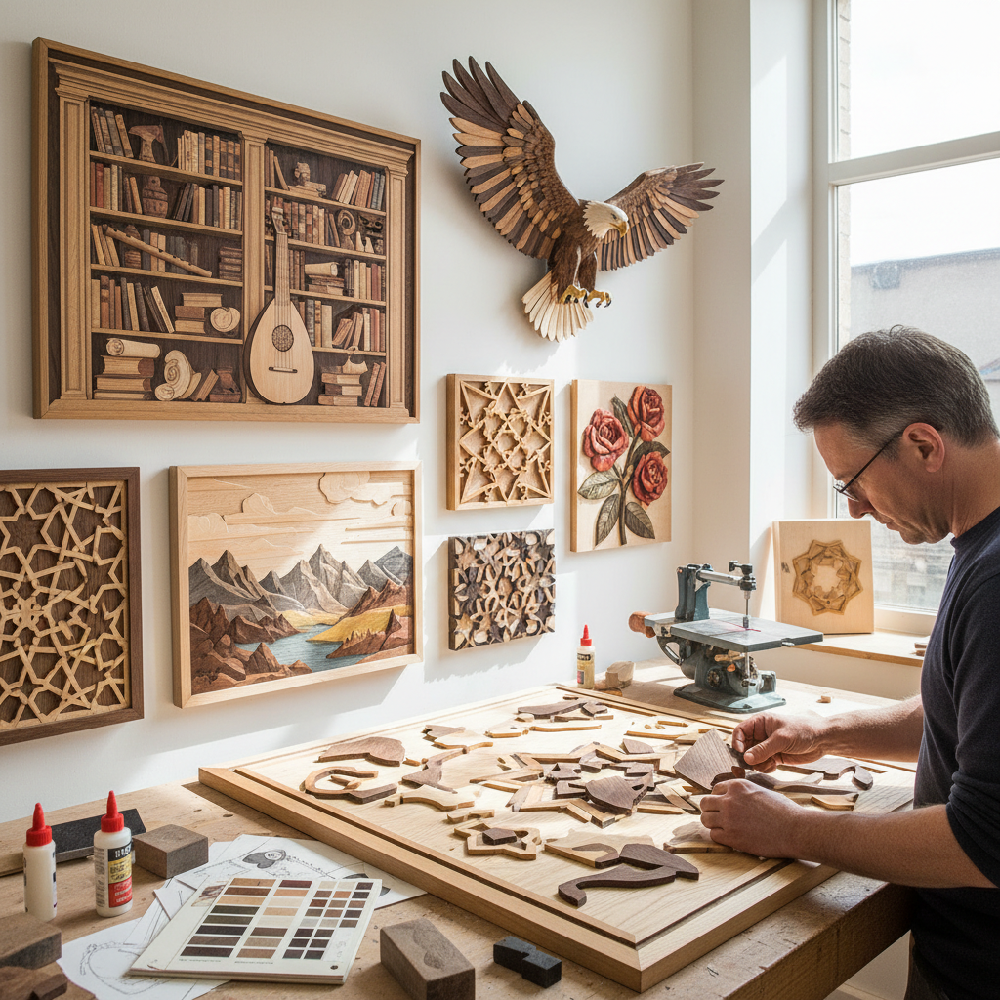

# Intarsia Woodwork 木镶嵌

> "Intarsia is painting with wood — pieces of different species selected for their natural color and grain, cut to precise shapes and fitted together like a jigsaw puzzle to create pictures where the medium itself provides all the color, each piece chosen because nature grew exactly the right shade in exactly the right pattern." — Unknown

## 概述

木镶嵌（Intarsia）是一种使用不同颜色和纹理的天然木材，将其切割成精确的形状并拼合在一起，利用木材本身的天然色彩和纹理创造图案和图像的木工艺术。与Marquetry（薄片镶嵌）不同，Intarsia使用较厚的木块（通常3-6mm或更厚），并且通过不同厚度的木块创造立体浮雕效果。

Intarsia的历史可以追溯到古埃及，但在文艺复兴时期的意大利达到鼎盛——意大利的"intarsia"工匠创造了令人惊叹的错视画（trompe l'oeil）效果，用木材模拟书架、乐器、建筑透视等。当代Intarsia主要有两种形式：传统的平面镶嵌（用于家具和建筑装饰）和现代的立体Intarsia（用于壁挂艺术，通过木块的不同厚度和角度创造三维效果）。

## 核心特征

| 特征 | 描述 |
|------|------|
| 天然色 | 利用木材天然色彩 |
| 拼合 | 精确切割和拼合 |
| 立体 | 可创造立体效果 |
| 纹理 | 利用木纹纹理 |
| 精确 | 极其精确的切割 |
| 自然 | 完全自然的色彩 |

## 视觉特征

- **木色**：天然木材的丰富色彩
- **纹理**：木纹的自然纹理
- **立体**：厚度变化的立体感
- **温暖**：木材的温暖质感
- **精密**：精密的拼合接缝
- **自然**：完全自然的美感

## 代表作品

| 作品 | 艺术家 | 年代 | 意义 |
|------|--------|------|------|
| *Italian Renaissance intarsia* | 意大利工匠 | 15-16世纪 | 文艺复兴木镶嵌 |
| *Studiolo panels* | Various | 文艺复兴 | 书房装饰面板 |
| *Contemporary 3D intarsia* | Various | 当代 | 当代立体木镶嵌 |
| *Wildlife intarsia* | Various | 当代 | 野生动物木镶嵌 |
| *Architectural intarsia* | Various | 传统-当代 | 建筑装饰木镶嵌 |

## 历史时间线

| 时期 | 事件 |
|------|------|
| 古埃及 | 木镶嵌的早期实践 |
| 文艺复兴 | 意大利木镶嵌的鼎盛 |
| 17-18世纪 | 木镶嵌在欧洲家具中的应用 |
| 20世纪 | 立体Intarsia的发展 |
| 当代 | 木镶嵌的艺术化创新 |

## 中国语境

木镶嵌在中国有相关的传统——中国传统家具中的"百宝嵌"（将各种材料镶嵌在木器表面）和"木嵌"技法与Intarsia有相似之处。中国的红木家具传统中有精美的木镶嵌装饰。当代中国的木工爱好者通过网络学习西方Intarsia技法。中国的一些木工工作室开设Intarsia课程。中国的传统建筑装饰（如花窗、隔扇）中也有木材拼合的美学。

## AI生成概念图

## 与其他风格的关系

- **Marquetry** → 薄片镶嵌
- **Wood Carving** → 木雕
- **Mosaic** → 马赛克
- **Woodworking** → 木工
- **Inlay** → 镶嵌工艺
- **Relief Sculpture** → 浮雕

---

*浮光艺志 | Chronicle of Artistry*
