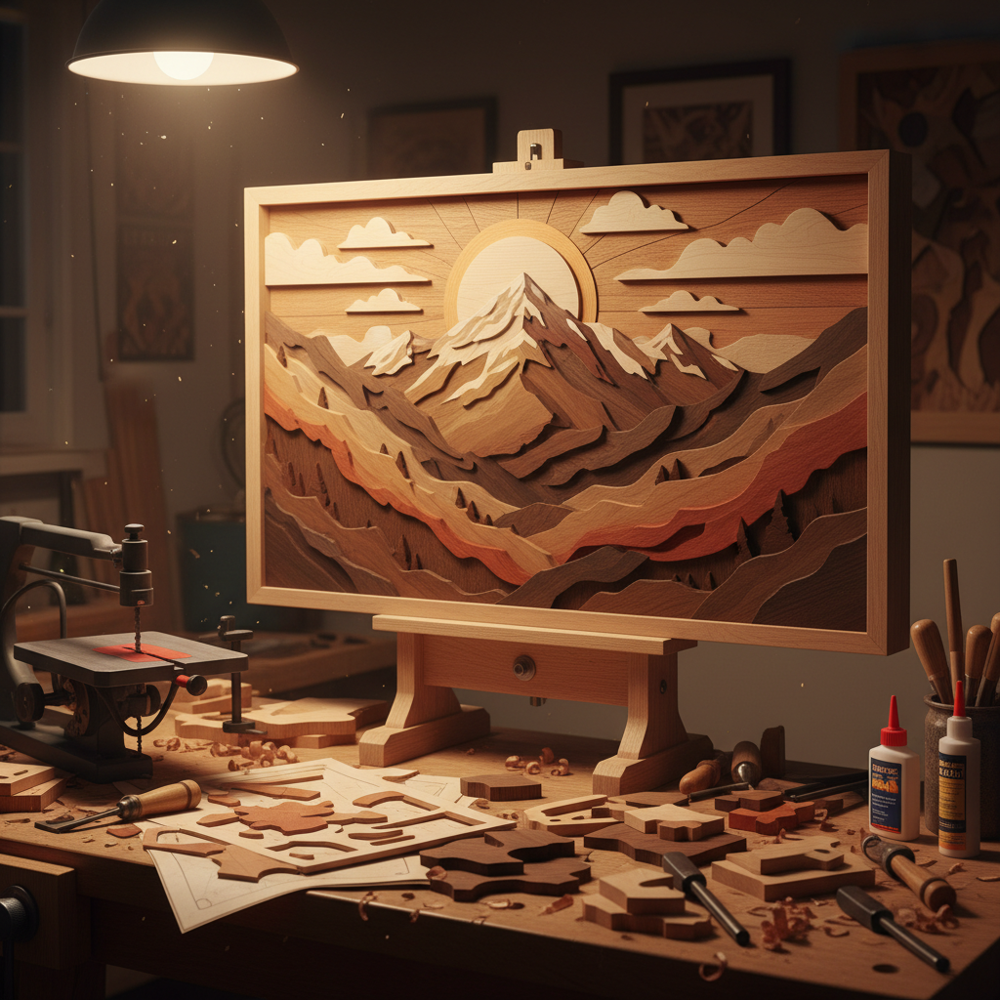

# Intarsia 木镶嵌画

> "Intarsia is painting with wood — each species a different hue, each grain a brushstroke shaped by nature." — Unknown

## 概述

木镶嵌画（Intarsia）是将不同颜色和纹理的木材切割成形状，拼合镶嵌在一起形成图案或画面的木工艺术。与Marquetry（薄片镶嵌）不同，Intarsia使用较厚的木块，通过不同木材的天然色差和纹理来"绘画"——不使用任何染料或颜料。每种木材都有自己独特的颜色——从浅色的枫木、桦木到深色的胡桃木、乌木，自然界提供了丰富的"调色板"。

Intarsia的哲学在于：以自然之色绘自然之形——不添加人工色彩，完全依靠木材本身的天然美来表现图像。

## 核心特征

| 特征 | 描述 |
|------|------|
| 厚块 | 使用较厚的木块 |
| 天然色 | 利用木材天然色差 |
| 拼合 | 不同木材的拼合 |
| 立体 | 可有浮雕效果 |
| 无染 | 不使用染料 |
| 纹理 | 利用木纹纹理 |

## 视觉特征

- **色差**：不同木材的天然色差
- **纹理**：木纹的自然纹理
- **温暖**：木材的温暖质感
- **立体**：不同厚度的立体感
- **自然**：自然的色彩过渡
- **精密**：精密的拼合接缝

## 代表作品

| 作品 | 艺术家 | 年代 | 意义 |
|------|--------|------|------|
| *Studiolo of Federico* | Various | 1470s | 乌尔比诺公爵书房 |
| *Santa Maria in Organo* | Fra Giovanni da Verona | 1490s | 教堂木镶嵌 |
| *Italian Renaissance panels* | Various | 15-16世纪 | 文艺复兴木镶嵌 |
| *Judy Gale Roberts wildlife* | Judy Gale Roberts | 当代 | 当代Intarsia先驱 |
| *Contemporary intarsia art* | Various | 当代 | 当代木镶嵌画 |

## 历史时间线

| 时期 | 事件 |
|------|------|
| 古埃及 | 最早的木镶嵌 |
| 14世纪 | 意大利Intarsia的兴起 |
| 15世纪 | 文艺复兴时期的巅峰 |
| 16-17世纪 | 透视法Intarsia |
| 19世纪 | 工业化后的衰落 |
| 当代 | 作为木工艺术的复兴 |

## 中国语境

中国有悠久的木镶嵌传统——明清家具中的"百宝嵌"就是将各种材料（包括不同木材）镶嵌在木器表面的工艺。中国传统的木雕和木镶嵌主要集中在家具装饰领域。当代中国的木工爱好者社区中，Intarsia作为一种创意木工形式越来越受欢迎，许多人制作动物、风景等主题的木镶嵌画作为家居装饰。

## AI生成概念图

## 与其他风格的关系

- **Marquetry** → 薄片木镶嵌
- **Woodworking** → 木工艺
- **Mosaic** → 马赛克（类似的拼合）
- **Pietra Dura** → 石材镶嵌
- **Parquetry** → 几何木镶嵌
- **Relief Sculpture** → 浮雕（立体效果）

---

*浮光艺志 | Chronicle of Artistry*
