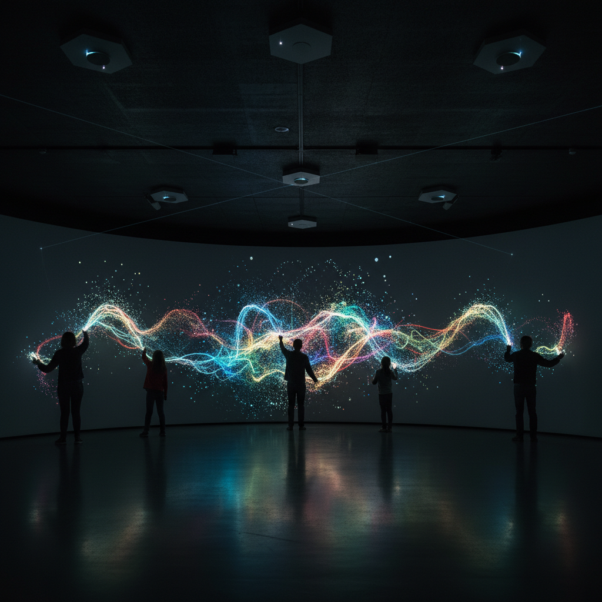

# Interactive Art 互动艺术

> "The viewer is no longer a viewer but a participant." — Nam June Paik

## 概述

互动艺术（Interactive Art）是需要观众主动参与才能完成的艺术形式——作品不是静态的展示，而是一个等待激活的系统。观众的触摸、移动、声音、数据或存在本身成为作品的输入，作品实时响应并产生变化。互动艺术将观众从被动的接收者转变为主动的共同创作者。

互动艺术的核心理念是：没有观众的参与，作品就不完整——它只是一个等待被激活的潜能。

## 核心特征

| 特征 | 描述 |
|------|------|
| 参与性 | 需要观众主动参与 |
| 响应性 | 实时响应观众的输入 |
| 系统性 | 作品是一个交互系统 |
| 不确定性 | 每次互动的结果不同 |
| 技术性 | 通常依赖传感器和计算 |
| 共创性 | 观众是共同创作者 |

## 视觉特征

- **动态**：随互动实时变化
- **界面**：可见或隐藏的交互界面
- **反馈**：即时的视觉/听觉反馈
- **空间**：互动发生的物理空间
- **投影**：常使用投影作为输出
- **身体**：观众身体的运动和姿态

## 代表作品

| 作品 | 艺术家 | 年代 | 意义 |
|------|--------|------|------|
| *Legible City* | Jeffrey Shaw | 1989 | 骑自行车穿越文字城市 |
| *Body Movies* | Rafael Lozano-Hemmer | 2001 | 观众的影子激活投影 |
| *Rain Room* | Random International | 2012 | 雨中不被淋湿——传感器控制 |
| *teamLab works* | teamLab | 2010s+ | 触摸改变数字花朵 |
| *Pulse Room* | Rafael Lozano-Hemmer | 2006 | 心跳控制灯泡闪烁 |
| *Deep Walls* | Scott Snibbe | 2003 | 影子被记录和回放 |

## 历史时间线

| 时期 | 事件 |
|------|------|
| 1920s | 达达和超现实主义的观众参与实验 |
| 1960s | 动态艺术和参与式艺术 |
| 1970s | 早期计算机互动艺术 |
| 1989 | Jeffrey Shaw的Legible City |
| 1990s | 互联网艺术——在线互动 |
| 2000s | 传感器技术的成熟——物理互动 |
| 2010s-至今 | AI驱动的智能互动体验 |

## 中国语境

互动艺术在中国近年来快速发展——从teamLab在中国的多个展览到本土的互动艺术工作室，从商业互动装置到美术馆的互动展览。中国的互动艺术常与传统文化元素结合——如互动水墨、互动书法、互动剪纸等。中国的科技公司和新媒体艺术家在互动技术方面有活跃的探索。

## AI生成概念图

## 与其他风格的关系

- **Digital Art** → 数字技术是互动艺术的基础
- **Installation Art** → 互动装置是装置艺术的重要分支
- **Kinetic Art** → 动态艺术是互动艺术的先驱
- **Immersive Art** → 沉浸式艺术常使用互动技术
- **Net Art** → 网络艺术是在线互动的形式
- **Generative Art** → 生成艺术可以由互动触发

---

*浮光艺志 | Chronicle of Artistry*
