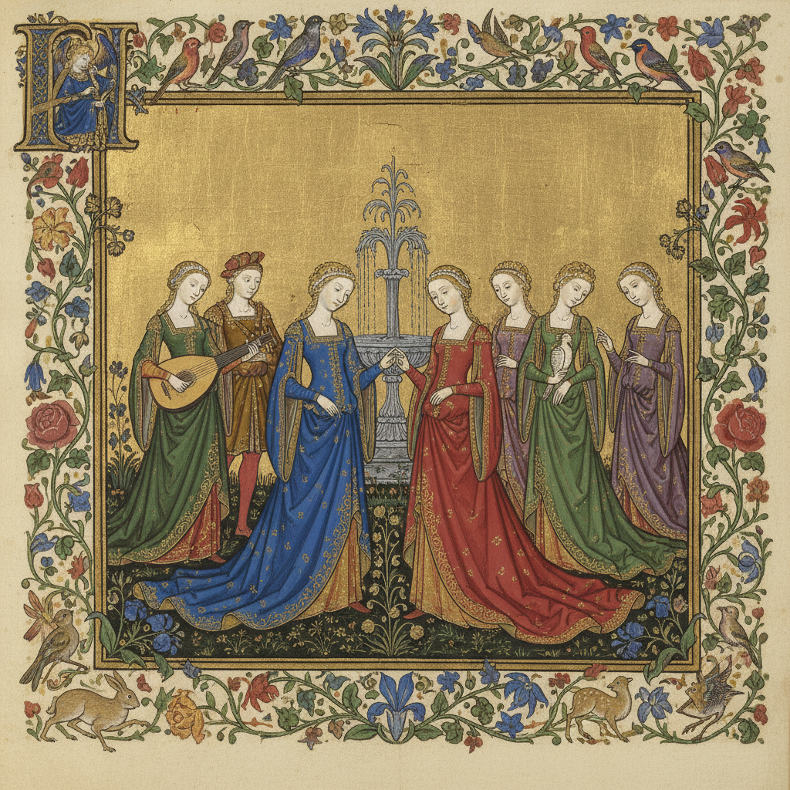

# International Gothic Painting 国际哥特式绘画

> **时期：** 1375年–1425年  
> **关键词：** 宫廷优雅、跨国风格、细密画、自然观察、贵族赞助

## 概述

International Gothic（国际哥特式）是14世纪末至15世纪初横跨欧洲宫廷的统一艺术风格——从巴黎到布拉格，从伦敦到米兰，贵族赞助人追求同样的优雅：纤细的人物、华丽的服饰、精致的自然细节和金色的神圣光芒。林堡兄弟的《贝里公爵的豪华时祷书》是其巅峰——将宫廷生活和自然观察融为一体的珠宝般艺术。

## 风格特征

- **优雅线条**：纤细流畅的人物轮廓
- **华丽服饰**：精确描绘的织锦和珠宝
- **自然细节**：花卉、动物、风景的精密观察
- **金色装饰**：大量使用金箔和金粉
- **叙事连续**：多场景的故事展开

## 代表人物与作品

- 林堡兄弟《贝里公爵的豪华时祷书》
- 真蒂莱·达·法布里亚诺《三博士来朝》
- 洛伦佐·莫纳科 佛罗伦萨祭坛画
- 斯特凡·洛赫纳 科隆圣母

## 概念图

