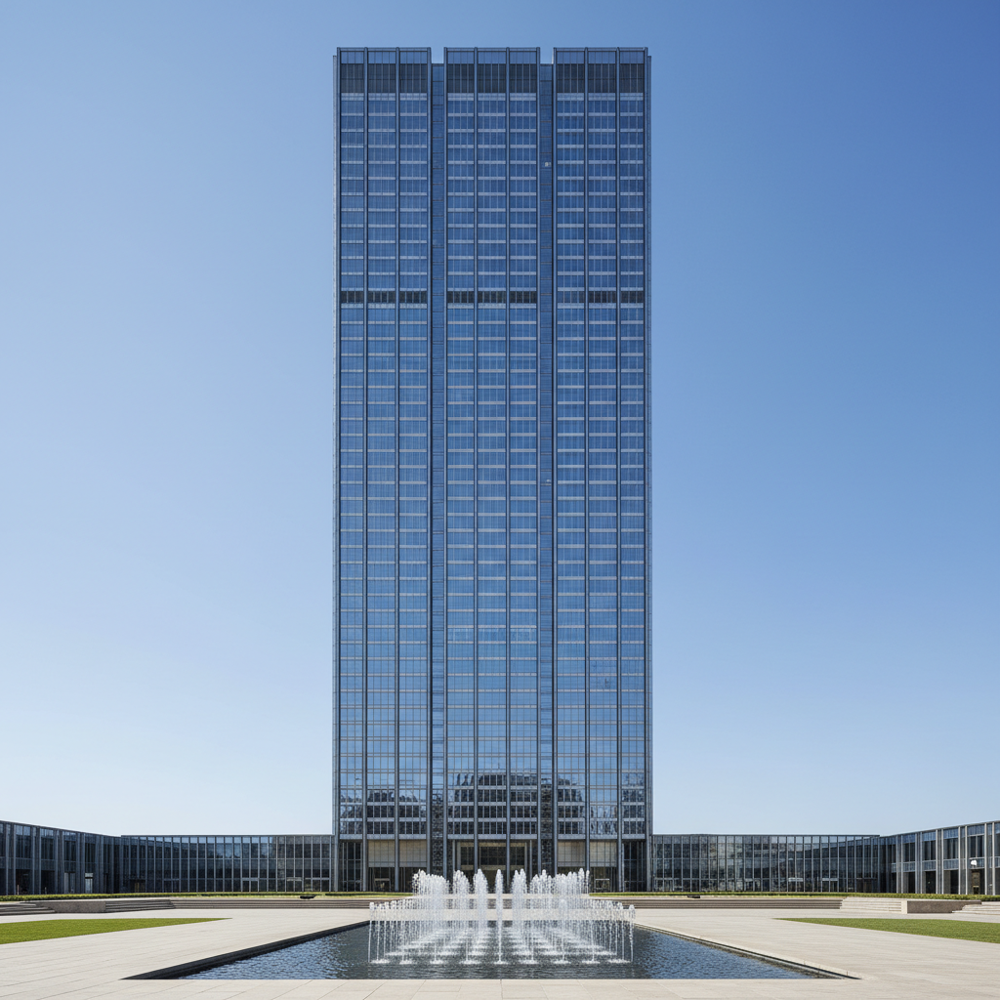

# International Style 国际风格

> "Less is more." — Ludwig Mies van der Rohe

## 概述

国际风格（International Style）是1920年代至1970年代主导全球建筑和设计的现代主义运动。它追求功能至上、去除装饰、使用工业材料（钢、玻璃、混凝土），创造出简洁、理性、可在任何地方复制的建筑形式——因此得名"国际"。

这一风格由包豪斯、勒·柯布西耶和密斯·凡·德·罗奠基，在二战后成为全球企业和政府建筑的标准语言——从纽约的摩天楼到巴西利亚的政府大楼。

## 核心特征

| 特征 | 描述 |
|------|------|
| 功能主义 | 形式追随功能，去除一切装饰 |
| 玻璃幕墙 | 透明的玻璃外皮取代承重墙 |
| 钢框架 | 钢结构使自由平面成为可能 |
| 平屋顶 | 拒绝传统坡屋顶 |
| 自由平面 | 内部空间不受承重墙限制 |
| 普世性 | 同一种建筑语言适用于全球 |

## 视觉特征

- **材料**：钢、玻璃、混凝土——工业化的三位一体
- **色彩**：白色、灰色、黑色——中性色调
- **形态**：方盒子、直角、网格
- **表面**：光滑、平整、无装饰
- **比例**：模数化的重复单元
- **空间**：开放式平面、流动空间

## 代表作品

| 作品 | 建筑师 | 年代 | 意义 |
|------|--------|------|------|
| *Villa Savoye* | Le Corbusier | 1931 | 现代建筑五原则的实现 |
| *Seagram Building* | Mies van der Rohe | 1958 | 玻璃摩天楼的典范 |
| *Lever House* | SOM | 1952 | 企业国际风格的开端 |
| *United Nations HQ* | Le Corbusier et al. | 1952 | 国际主义的象征 |
| *Farnsworth House* | Mies van der Rohe | 1951 | "少即是多"的极致 |
| *Lake Shore Drive Apartments* | Mies van der Rohe | 1951 | 住宅高层的国际风格 |

## 历史时间线

| 时期 | 事件 |
|------|------|
| 1920s | 包豪斯、柯布西耶奠定理论基础 |
| 1932 | MoMA"International Style"展览——正式命名 |
| 1937 | 包豪斯教师流亡美国 |
| 1950s | 战后重建，国际风格成为全球标准 |
| 1958 | Seagram Building——企业现代主义的巅峰 |
| 1960s | 全球扩散——从东京到巴西利亚 |
| 1966 | Robert Venturi发表批评——后现代主义的预兆 |
| 1970s | 后现代主义兴起，国际风格被批判为"无聊的盒子" |

## 子类型

| 子类型 | 特征 |
|--------|------|
| 欧洲先驱 | 柯布西耶、密斯——理论奠基 |
| 美国企业 | SOM、Bunshaft——玻璃摩天楼 |
| 巴西现代 | Niemeyer——曲线的国际风格 |
| 日本代谢 | 丹下健三——东方的国际风格变体 |
| 社会主义国际 | 东欧预制板建筑——大规模住宅 |

## 中国语境

国际风格对中国城市面貌的影响是压倒性的。改革开放后的中国城市化几乎完全采用了国际风格的玻璃幕墙高层建筑。从深圳到上海，中国的天际线是国际风格最大规模的当代实践。近年来，中国建筑界开始反思这种"千城一面"的问题，寻求在现代性和地方性之间找到平衡。

## 争议与遗产

- **争议**：被批评为"无聊的玻璃盒子"、"消灭了地方特色"
- **Venturi批评**："Less is a bore"（少即是无聊）
- **社会问题**：大规模社会住宅的失败（如Pruitt-Igoe）
- **遗产**：定义了现代城市的基本面貌
- **当代回响**：新极简主义建筑、苹果总部的玻璃美学

## AI生成概念图

## 与其他风格的关系

- **Bauhaus** → 包豪斯是国际风格的直接源头
- **De Stijl** → 风格派的几何纯粹性影响了国际风格
- **Brutalism** → 粗野主义是国际风格的混凝土变体
- **Postmodern Architecture** → 后现代建筑是对国际风格的反叛
- **Deconstructivism** → 解构主义打破了国际风格的理性秩序
- **Minimalism** → 极简主义继承了"少即是多"的精神

---

*浮光艺志 | Chronicle of Artistry*
