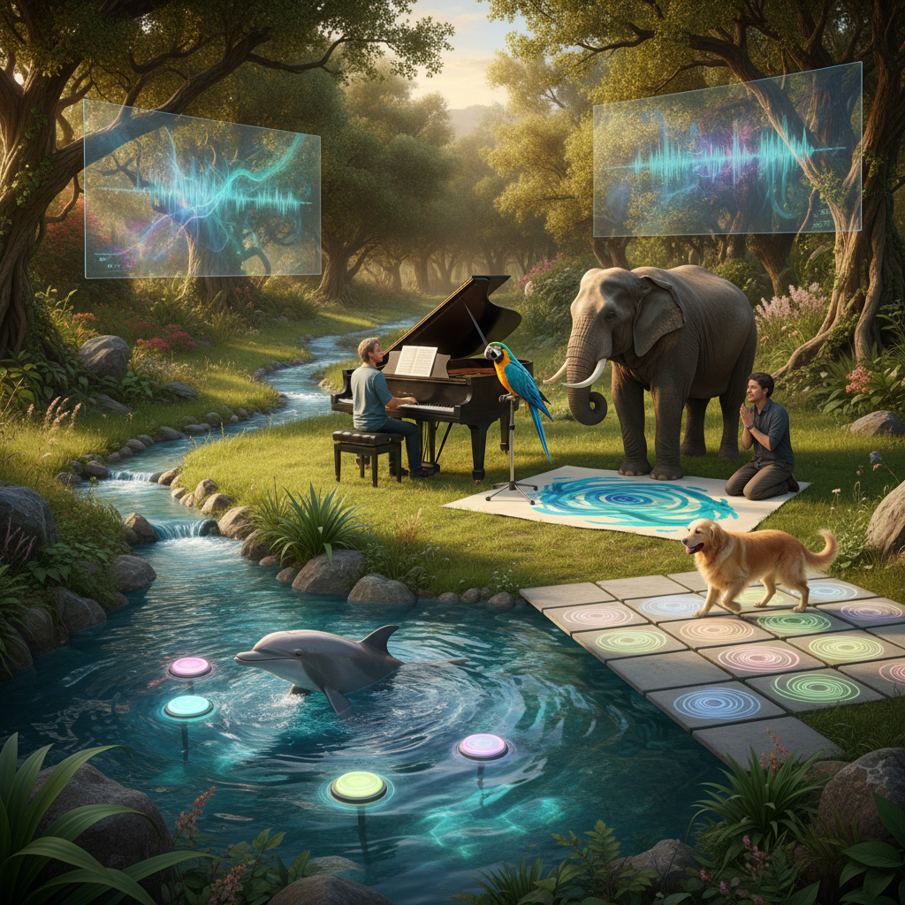

# Interspecies Art 跨物种艺术

> "Interspecies art is the practice of reaching across the abyss that separates species — of attempting genuine communication, collaboration, and co-creation with beings whose minds are radically different from our own, whose senses perceive different worlds, whose time moves at different speeds, and whose intelligence takes forms we are only beginning to recognize. It is art that humbles the human, that admits we are not the only creative beings on this planet, and that the most interesting art may happen in the space between species." — Unknown

## 概述

跨物种艺术（Interspecies Art）是尝试与非人类物种进行交流、合作和共同创作的艺术实践。跨物种艺术超越了简单地"描绘"或"利用"动物——它试图建立真正的跨物种对话，承认其他物种的主体性和创造力。

跨物种艺术的实践包括：1）跨物种交流——尝试与其他物种建立某种形式的交流（如与海豚的声音交流、与大象的绘画合作）；2）动物作为艺术家——让动物自主创作（如大象绘画、黑猩猩的抽象画）；3）跨物种感知——尝试理解和表达其他物种的感知世界；4）共栖艺术——创造人类和其他物种可以共同栖息和互动的艺术空间；5）跨物种伦理——通过艺术探索人类与其他物种的伦理关系。

## 核心特征

| 特征 | 描述 |
|------|------|
| 对话 | 跨物种对话 |
| 尊重 | 尊重非人类主体 |
| 合作 | 跨物种合作 |
| 感知 | 多元感知 |
| 伦理 | 跨物种伦理 |
| 谦逊 | 人类的谦逊 |

## 视觉特征

- **动物**：动物作为主体
- **互动**：人与动物的互动
- **痕迹**：动物留下的痕迹
- **空间**：共享的空间
- **设备**：交流设备和界面
- **自然**：自然环境

## 代表作品

| 作品 | 艺术家 | 年代 | 意义 |
|------|--------|------|------|
| *Elephant paintings* | Various | 1990年代 | 大象绘画 |
| *Dolphin communication* | Various | 2000年代 | 海豚交流 |
| *Bird song duets* | Various | 2010年代 | 鸟鸣二重奏 |
| *Octopus art* | Various | 2020年代 | 章鱼艺术 |
| *AI-animal communication* | Various | 当代 | AI辅助动物交流 |

## 历史时间线

| 时期 | 事件 |
|------|------|
| 1970年代 | 动物语言研究的高峰 |
| 1990年代 | 大象绘画的流行 |
| 2000年代 | 跨物种艺术的理论化 |
| 2020年代 | AI辅助的跨物种交流 |
| 当代 | 跨物种艺术的制度化 |

## 中国语境

跨物种艺术在中国有深厚的文化根基。中国传统文化中有丰富的人与动物交流的传统——从"庄周梦蝶"的物我合一，到"伯牙鼓琴"中马的音乐感知，到中国传统的驯鸟、养蟋蟀、训鸽等与动物建立深度关系的实践。中国传统绘画中的花鸟画不仅是"描绘"动物，更是试图捕捉动物的"神韵"——一种跨物种的精神共鸣。中国当代的一些艺术家在探索跨物种艺术：与中国特有物种（如大熊猫、金丝猴）建立艺术对话、利用AI技术尝试理解动物的交流方式、以及将中国传统的"天人合一"观念转化为当代的跨物种艺术实践。

## AI生成概念图

## 与其他风格的关系

- **Multispecies Art** → 多物种艺术
- **Bio Art** → 生物艺术
- **Animal Art** → 动物艺术
- **Eco-Art** → 生态艺术
- **Sound Art** → 声音艺术
- **Posthumanism** → 后人类主义

---

*浮光艺志 | Chronicle of Artistry*
