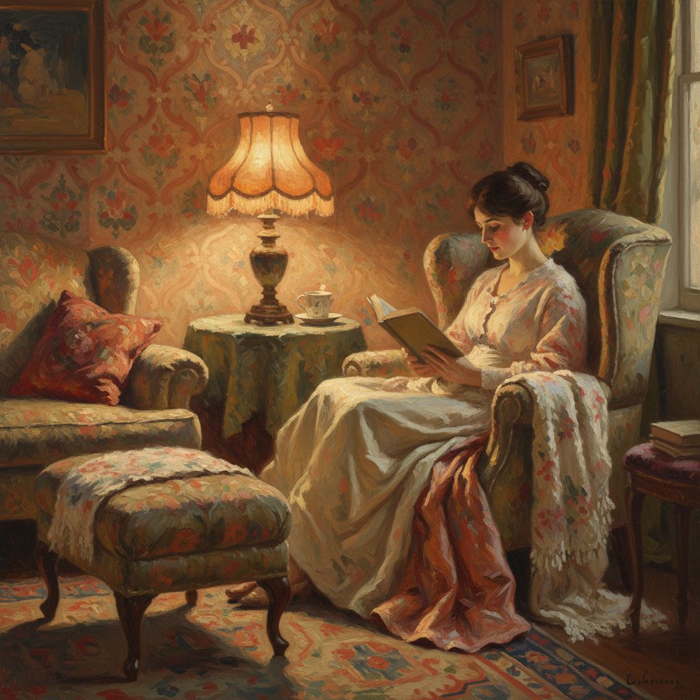

# Intimism 亲密主义

> **时期：** 1890年代–1910年代  
> **关键词：** 室内场景、私密空间、柔和光线、日常诗意、纳比派

## 概述

Intimism（亲密主义）是以描绘私密室内空间和日常家庭生活为特征的绘画风格，与纳比派密切相关。维亚尔和博纳尔用柔和的色彩和装饰性的图案，将普通的客厅、卧室和餐桌变为诗意的色彩交响——没有宏大叙事，只有一杯茶的温度、窗帘透过的光线、和母亲缝补时的安静侧影。

## 风格特征

- **室内空间**：客厅、卧室、餐厅的亲密场景
- **柔和光线**：灯光和窗光的温暖氛围
- **装饰图案**：壁纸、织物与人物的融合
- **日常题材**：阅读、缝补、用餐等平凡时刻
- **色彩和谐**：低对比度的温暖色调

## 代表人物与作品

- 爱德华·维亚尔 室内系列
- 皮埃尔·博纳尔《餐桌》系列
- 费利克斯·瓦洛东 室内场景
- 维尔赫姆·哈默肖伊 丹麦室内

## 概念图

