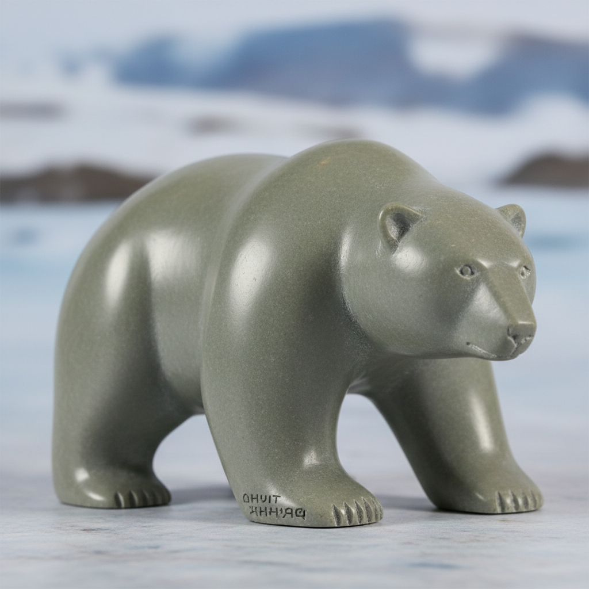

# Inuit Art 因纽特艺术 | ᐃᓄᐃᑦ ᓴᓇᙳᐊᖅ

> **"冰原上的石头会说话——因纽特雕刻家用滑石和鲸骨讲述北极的生存故事。"**

## 概述

因纽特艺术（Inuit Art / ᐃᓄᐃᑦ ᓴᓇᙳᐊᖅ）是加拿大北极地区因纽特人的传统和当代视觉艺术，以滑石雕刻（soapstone carving）、版画（printmaking）和纺织壁挂为主要形式。因纽特艺术在1950年代被"发现"后迅速获得国际认可，成为加拿大最具辨识度的艺术形式之一。作品主题围绕北极生活——狩猎、动物、萨满变形、神话和日常生存。Cape Dorset（Kinngait）和Baker Lake是最重要的艺术社区。

## 主要形式

| 形式 | 特征 |
|------|------|
| 滑石雕刻 | 最经典，圆润造型 |
| 石版画 | Cape Dorset传统 |
| 壁挂纺织 | Baker Lake传统 |
| 鲸骨雕刻 | 大型雕塑 |
| 鹿角雕刻 | 精细小品 |
| 当代混合媒介 | 新一代创作 |

## 核心特征

- **滑石材料**：灰绿色滑石的温润质感
- **圆润造型**：简洁流畅的体量
- **北极题材**：熊、海豹、猎人、萨满
- **变形主题**：人与动物的萨满变形
- **社区创作**：以社区为单位的艺术生产
- **当代性**：传统与当代的融合

## 常见题材

| 题材 | 特征 |
|------|------|
| 北极熊 | 最经典的雕刻题材 |
| 海豹猎人 | 生存的日常 |
| 萨满变形 | 人变动物的瞬间 |
| 猫头鹰 | 智慧和力量 |
| 母与子 | 家庭和延续 |
| Sedna海神 | 神话人物 |

## 视觉特征

- 灰绿色滑石的温润光泽
- 简洁圆润的体量感
- 动物的程式化造型
- 萨满变形的超现实
- 版画的大胆色彩和线条
- 北极风景的空旷感

## 与其他风格的关系

| 风格 | 关系 |
|------|------|
| Northwest Coast Art | 共享北美原住民传统 |
| 当代雕塑 | 因纽特雕刻的国际影响 |
| Aboriginal Art | 共享原住民当代艺术 |
| 北欧萨米艺术 | 共享北极文化 |
| 民间艺术 | 社区创作传统 |

## 概念图

---

*浮光艺志 | Chronicle of Artistry*
