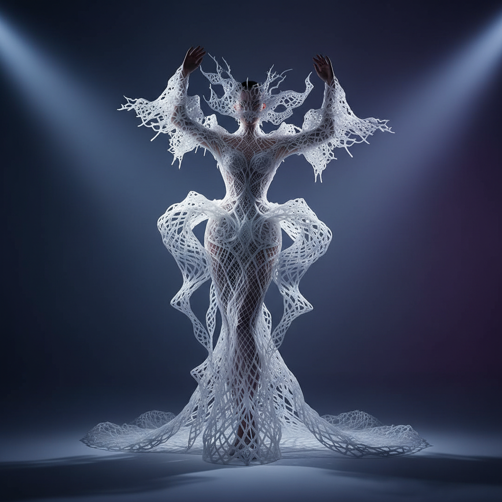

# Iris van Herpen 艾里斯·范·赫本

> **时期：** 1984–至今  
> **关键词：** 3D打印时装、科技高定、自然与数字、未来工艺

## 概述

Iris van Herpen 是荷兰时装设计师，以将3D打印、激光切割等数字制造技术引入高级定制时装而闻名。她的作品如同穿在身上的建筑或自然现象——水花凝固的瞬间、磁力线的可视化、细胞分裂的形态——将时尚推向了科学和艺术的交汇点。

## 风格特征

- **3D打印**：用增材制造技术创造不可能的形态
- **自然启发**：水、骨骼、神经网络等自然结构的抽象
- **材料创新**：与科学家合作开发全新材料
- **建筑感**：服装具有建筑般的结构和空间感
- **动态形态**：服装随身体运动产生变化

## 代表作品

- *Crystallization*（2010，首件3D打印高定）
- *Magnetic Motion*（2015）
- *Sensory Seas*（2020）
- *Earthrise*（2021）

## 概念图

