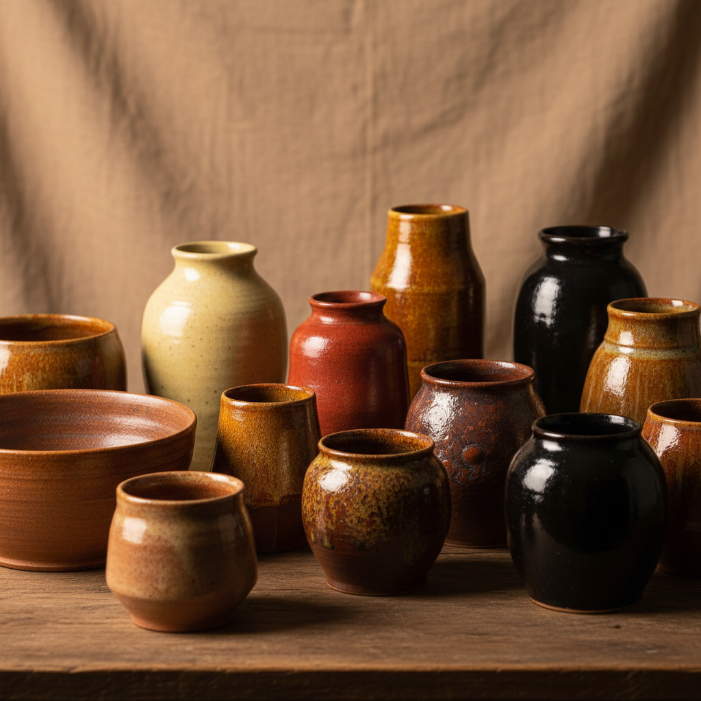

# Iron Glaze Art 铁釉艺术

> "Iron glaze is earth's own palette — the most abundant coloring oxide in the potter's world, capable of producing every color from pale straw yellow through amber, rust, chocolate, and tenmoku black, depending only on how much iron is present and whether the fire breathes or holds its breath, a single element painting the entire spectrum of the earth's own skin." — Unknown

## 概述

铁釉艺术（Iron Glaze Art）是一种以氧化铁为主要着色剂的陶瓷釉料艺术。铁是陶瓷中最常见、最多变的着色元素——根据含铁量的多少和烧成气氛的不同，铁釉可以呈现从淡黄、琥珀、褐色到黑色的广泛色谱。在还原气氛中铁呈现青绿色（青瓷），在氧化气氛中呈现黄褐色。铁釉贯穿了整个陶瓷史，是最基础也最丰富的釉料类型。

铁釉艺术的核心要素包括：1）氧化铁——作为主要着色剂；2）含量变化——不同含铁量产生不同颜色；3）气氛影响——氧化/还原气氛决定色调；4）温度效果——不同温度下的色彩变化；5）结晶——高铁含量可产生结晶效果；6）流动性——铁釉在高温下的流动特性；7）多样性——从青瓷到天目的广泛应用。

## 核心特征

| 特征 | 描述 |
|------|------|
| 铁着色 | 氧化铁的多变着色能力 |
| 色谱广泛 | 从黄到褐到黑的完整色谱 |
| 气氛敏感 | 氧化还原产生不同效果 |
| 普遍性 | 最常见的陶瓷着色剂 |
| 结晶能力 | 高铁含量可形成结晶 |
| 历史悠久 | 贯穿整个陶瓷史 |

## 视觉特征

- **淡黄色**：低铁含量的淡黄色调
- **琥珀色**：温暖的琥珀褐色
- **铁锈色**：如铁锈般的红褐色
- **巧克力色**：深沉的巧克力褐色
- **黑色**：高铁含量的深黑色
- **青绿色**：还原气氛中的青绿色调

## 代表作品

| 作品 | 艺术家/窑口 | 年代 | 意义 |
|------|-------------|------|------|
| *建窑黑釉* | 建窑 | 宋代 | 高铁黑釉代表 |
| *耀州窑青瓷* | 耀州窑 | 宋代 | 铁还原青瓷 |
| *磁州窑铁绘* | 磁州窑 | 宋-金 | 铁料装饰 |
| *濑户铁釉* | 日本濑户 | 中世纪 | 日本铁釉传统 |
| *当代铁釉* | 各地陶艺家 | 当代 | 铁釉的现代探索 |

## 历史时间线

| 时期 | 事件 |
|------|------|
| 新石器时代 | 最早的含铁陶器 |
| 商代 | 铁釉（原始青瓷）的出现 |
| 汉代 | 铁釉的成熟应用 |
| 宋代 | 铁釉的多样化巅峰 |
| 当代 | 铁釉的科学研究与艺术创作 |

## 中国语境

铁釉是中国陶瓷的基石。中国最早的釉——商代原始青瓷的灰釉——就是以铁为着色剂的。中国陶瓷史上最重要的品类几乎都与铁釉相关：青瓷（低铁还原）、黑瓷（高铁）、酱釉（中铁氧化）、天目（高铁结晶）。宋代是铁釉的黄金时代——从汝窑的天青到建窑的黑釉，从耀州窑的橄榄绿到吉州窑的玳瑁，铁釉展现了无穷的可能性。中国陶瓷教育中，铁釉是釉料学的核心内容。当代中国陶艺家继续在铁釉领域进行深入探索。

## AI生成概念图

## 与其他风格的关系

- **Celadon** → 青瓷（低铁还原）
- **Tenmoku** → 天目（高铁）
- **Ash Glaze** → 灰釉
- **Copper Red** → 铜红釉
- **Cobalt Glaze** → 钴蓝釉
- **Reduction Firing** → 还原烧成

---

*浮光艺志 | Chronicle of Artistry*
