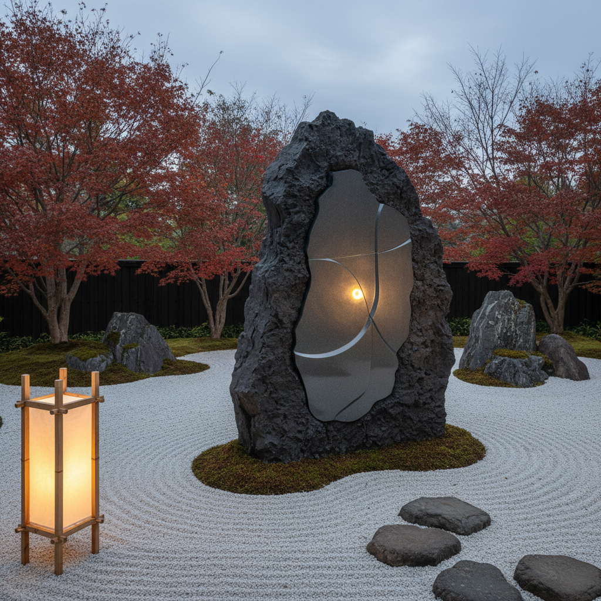

# Isamu Noguchi 野口勇

> **流派**: 现代主义雕塑 · 景观设计  
> **时期**: 1904–1988 美国/日本  
> **关键词**: 石庭园、Akari灯具、雕塑游乐场、东西融合

## 概述

野口勇是20世纪最具跨界精神的艺术家之一。他跨越雕塑、景观设计、家具设计和舞台美术，将日本禅宗美学与西方现代主义融为一体。他的作品从博物馆雕塑到公共花园，从纸灯笼到咖啡桌，模糊了艺术与生活的界限。

## 视觉特征

- **石材对话**: 保留石头天然形态，仅做最少干预
- **东西融合**: 日本枯山水与西方抽象的结合
- **有机曲线**: 流畅的生物形态曲面
- **光与纸**: Akari系列用和纸与竹骨创造柔和光线
- **大地尺度**: 景观雕塑与地形融为一体

## 代表作品

- Akari 光雕塑系列 (1951–)
- 《加州情景》(1980) 哥斯达黎加广场
- 野口勇花园博物馆 (1985)
- 《黑太阳》(1969)

## 历史影响

野口勇打破了雕塑、设计和景观之间的界限，证明了艺术可以渗透到日常生活的每个角落。他的跨文化实践为后来的环境艺术和设计思维提供了范本。

## 相关风格

- [Barbara Hepworth 芭芭拉·赫普沃斯](barbara-hepworth.md)
- [Constantin Brancusi 康斯坦丁·布朗库西](constantin-brancusi.md)
- [Wabi-Sabi 侘寂](wabi-sabi.md)
