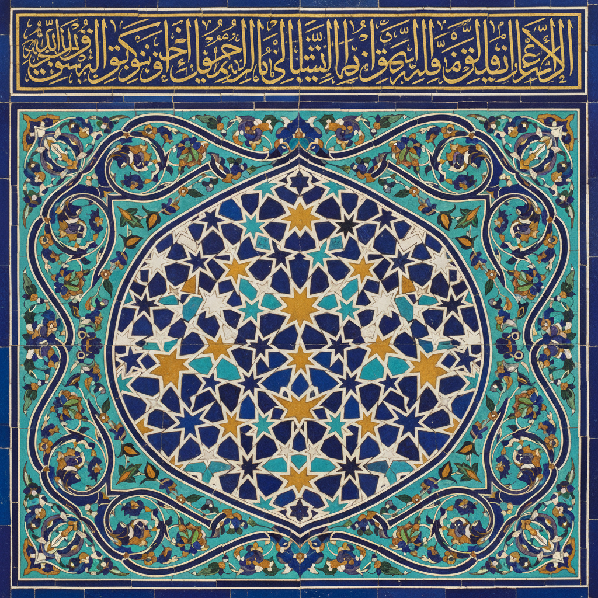

# Islamic Geometric Art & Arabic Calligraphy 伊斯兰几何艺术与阿拉伯书法

> **"在有限的空间内创造出无限的图案。"** —— 伊斯兰装饰艺术哲学

## 概述

伊斯兰几何艺术与阿拉伯书法（Islamic Geometric Art & Arabic Calligraphy）是伊斯兰文明中最具代表性的视觉艺术传统，起源于7世纪伊斯兰教兴起之后。由于正统伊斯兰教禁止偶像崇拜，工匠们将创造力倾注于几何图案、植物纹样（Arabesque）和书法艺术，发展出一套独特的、以抽象为核心的装饰美学体系。阿拉伯书法于2021年被联合国教科文组织列入人类非物质文化遗产。

## 三大纹饰体系

### 1. 几何纹（Geometric Patterns）
- 以圆形和方形为根本，衍生出星形、十字形、万字形等
- 星形图案蕴含天地融合的宇宙观
- 通过重复、对称、旋转产生无限延展的视觉效果
- 象征安拉创造力的无限性

### 2. 植物纹（Arabesque）
- 波状曲线的抽象化蔓藤花纹
- 源自地中海东部的叶形和葡萄藤蔓装饰
- 互相重叠交织，在平面中创造深度感
- 越来越远离自然具象，趋向纯粹抽象

### 3. 书法纹（Calligraphic Art）
- 被视为伊斯兰艺术的最高形式
- 主要字体：库法体（Kufic）、纳斯赫体（Naskh）、三分体（Thuluth）、迪瓦尼体（Diwani）
- 文字本身即装饰——线条的曲线变化与植物纹同工异曲
- 常见于清真寺墙壁、拱顶、券门和凹壁

## 核心理念

- **禁止偶像**：不描绘人物和动物，转向抽象表达
- **无限性**：图案可无限延展，象征安拉的无始无终
- **数学之美**：几何学知识与美学的完美结合
- **精神性**：通过抽象图案引导冥想与敬畏
- **统一性**：所有元素源于"独一"（安拉），归于"独一"

## 历史发展

| 时期 | 特征 |
|------|------|
| 7–8世纪 | 早期库法体书法，简洁几何纹 |
| 8–13世纪 | 伊斯兰黄金时代，数学与艺术高度融合 |
| 12世纪 | 埃及发展出极复杂的星形几何图案 |
| 13世纪 | 植物纹饰登峰造极 |
| 14–16世纪 | 奥斯曼、萨法维、莫卧儿三大帝国的装饰艺术巅峰 |
| 当代 | 伊斯兰几何美学影响现代设计与数字艺术 |

## 视觉特征

- 严格的数学对称与重复
- 无缝连续的图案铺满整个表面（horror vacui）
- 金色、蓝色、绿色、白色为主的色彩体系
- 彩釉瓷砖（Zellige）的马赛克效果
- 书法线条的韵律感与装饰性
- 光影在几何镂空中的戏剧效果

## 与其他风格的关系

| 风格 | 关系 |
|------|------|
| Art Nouveau | 受Arabesque曲线影响 |
| Op Art | 共享几何视错觉原理 |
| 极简主义 | 共享对纯粹形式的追求 |
| 生成艺术 | 伊斯兰图案的算法本质是其先驱 |
| M.C. Escher | 直接受阿尔罕布拉宫瓷砖启发 |

## 概念图

---

*浮光艺志 | Chronicle of Artistry*
