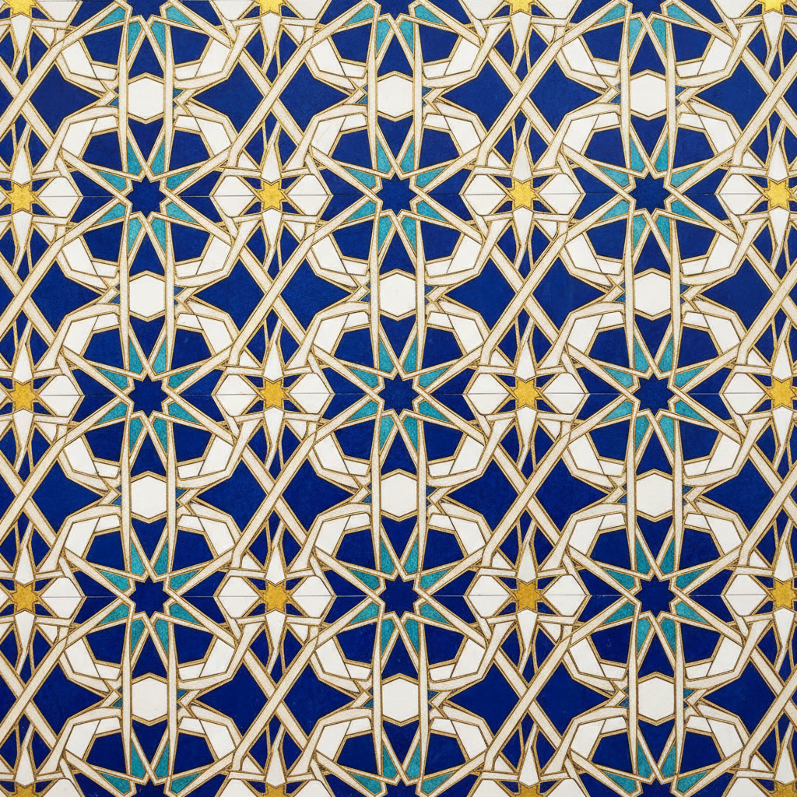

# Islamic Geometric Art 伊斯兰几何艺术

> "Geometry is the language of God." — 伊斯兰艺术传统

## 概述

伊斯兰几何艺术（Islamic Geometric Art）是伊斯兰文明中最独特、最精密的视觉传统——通过纯粹的几何图案（girih）创造无限延伸的、令人眩晕的装饰表面。由于伊斯兰传统中对偶像崇拜的禁忌，艺术家将创造力集中在抽象的几何、植物纹样（arabesque）和书法上，发展出了人类历史上最复杂的数学装饰体系。

从阿尔罕布拉宫到伊斯法罕的清真寺，从摩洛哥的马赛克到中亚的砖雕，伊斯兰几何艺术跨越了从西班牙到印度的广大地域，持续了超过一千年。

## 核心特征

| 特征 | 描述 |
|------|------|
| 无限重复 | 图案可以无限延伸——暗示神的无限 |
| 数学精密 | 基于严格的几何构造——圆规和直尺 |
| 对称性 | 多重旋转对称和镜像对称 |
| 无偶像 | 避免人物和动物形象 |
| 三大元素 | 几何图案 + 植物纹样 + 书法 |
| 精神意义 | 几何秩序反映神圣的宇宙秩序 |

## 视觉特征

- **图案**：星形、多边形的无限镶嵌
- **对称**：5重、6重、8重、10重、12重旋转对称
- **交织**：线条的上下交织（interlace）
- **色彩**：蓝、绿、金、白的伊斯兰色彩
- **材料**：马赛克（zellij）、砖雕、石膏、木雕
- **书法**：阿拉伯书法作为装饰元素

## 主要类型

| 类型 | 描述 | 代表 |
|------|------|------|
| Girih（几何） | 星形和多边形的镶嵌 | 伊斯法罕清真寺 |
| Arabesque（蔓藤） | 无限延伸的植物卷须 | 阿尔罕布拉宫 |
| Zellij（马赛克） | 切割瓷砖的几何拼贴 | 摩洛哥建筑 |
| Muqarnas（蜂窝） | 三维的蜂窝状穹顶装饰 | 伊朗清真寺 |
| Calligraphy（书法） | 阿拉伯文字的装饰化 | 古兰经装饰 |

## 代表建筑

| 建筑 | 地点 | 特点 |
|------|------|------|
| Alhambra 阿尔罕布拉宫 | 西班牙格拉纳达 | 最精美的伊斯兰几何装饰 |
| Shah Mosque 沙阿清真寺 | 伊朗伊斯法罕 | 蓝色瓷砖的极致 |
| Topkapi Palace 托普卡帕宫 | 土耳其伊斯坦布尔 | 奥斯曼装饰 |
| Taj Mahal 泰姬陵 | 印度阿格拉 | 莫卧儿几何装饰 |

## 与其他风格的关系

- **M.C. Escher** → 埃舍尔直接受阿尔罕布拉启发
- **Op Art** → 伊斯兰几何的视觉振动效果
- **Art Nouveau** → 蔓藤纹样影响了新艺术运动
- **Penrose Tiling** → 伊斯兰 girih 预示了准晶体数学
- **Generative Art** → 算法生成的几何图案
- **Minimalism** → 纯粹几何的精神性

## 概念图

---

*浮光艺志 | Chronicle of Artistry*
