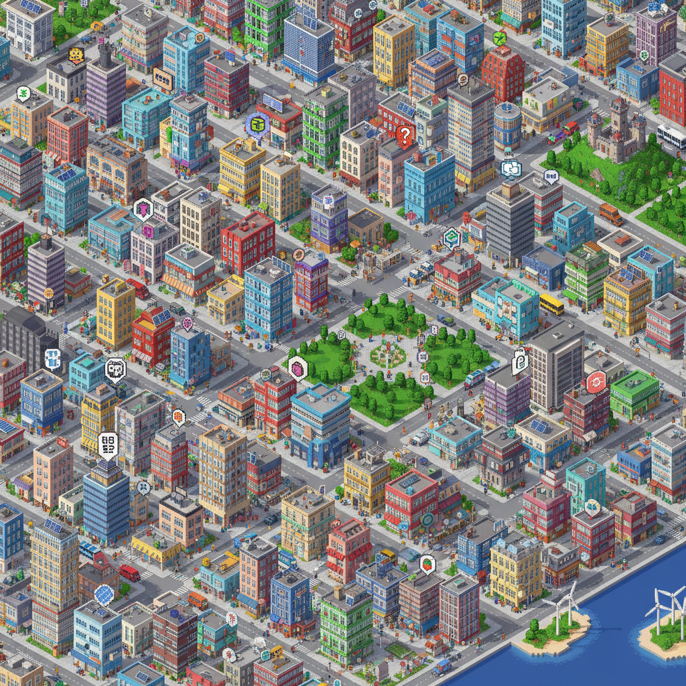

# Isometric Art 等轴测艺术

> **时期：** 1980年代–至今  
> **关键词：** 等角投影、无透视变形、像素等轴、微缩世界、信息可视化

## 概述

Isometric Art（等轴测艺术）使用等轴测投影（30度角）创造三维空间的幻觉，但不使用透视缩短——远处的物体与近处一样大。这种"不可能的视角"最初在1980年代电子游戏中流行（如《模拟城市》），后来发展为插画、信息图表和建筑可视化的重要风格，以其清晰、可读、充满细节的微缩世界感著称。

## 风格特征

- **等角投影**：30度角的平行投影，无透视
- **网格系统**：严格的菱形网格构建空间
- **细节密度**：在有限空间内填充大量信息
- **平面光影**：简化的光照和阴影处理
- **可读性**：所有元素同等清晰可辨

## 代表人物与作品

- 《模拟城市》系列游戏
- 《纪念碑谷》（等轴测+不可能几何）
- Sachin Teng（等轴测插画）
- 信息图表和数据可视化领域

## 概念图

