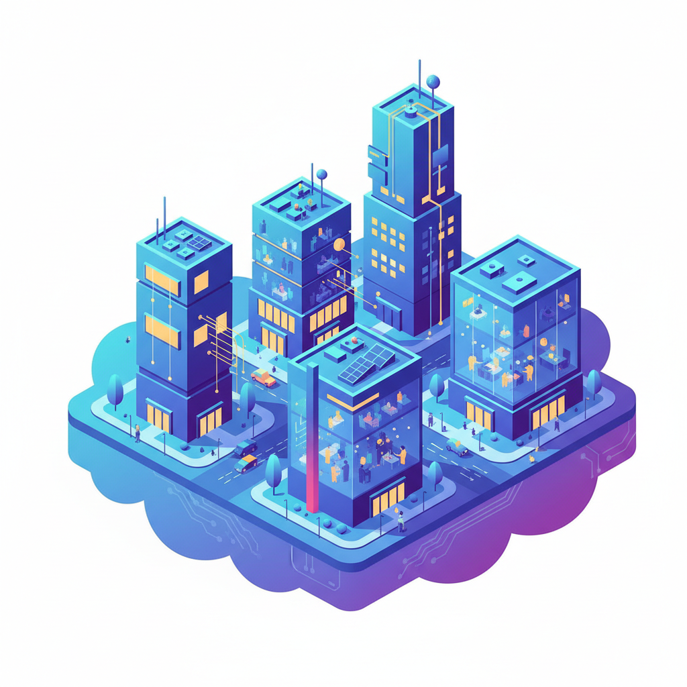

# Isometric Design 等距设计



> **"30度角的平行世界——没有透视消失点，每个细节都同等重要。"**

## 概述

| 维度 | 描述 |
|------|------|
| 时期 | 1980s（游戏）/2015–至今（设计趋势） |
| 别名 | Isometric, 2.5D, Axonometric, 等距投影 |
| 核心色彩 | 明亮渐变、蓝紫系、科技感配色 |
| 关键元素 | 30度角投影、无透视、精确几何、微缩世界 |
| 代表人物 | Monument Valley (游戏), Kurzgesagt, 科技公司品牌 |
| 关联风格 | Flat Design, Low Poly, Pixel Art, Technical Illustration |

---

## 历史脉络

| 年份 | 事件 |
|------|------|
| 1982 | Q*bert——早期等距游戏 |
| 1989 | SimCity——等距城市建设 |
| 1997 | 暗黑破坏神——等距RPG |
| 2014 | Monument Valley——等距美学巅峰 |
| 2015 | 科技公司开始大量使用等距插画 |
| 2018 | 等距设计成为主流品牌视觉语言 |
| 2020s | 等距+动画+3D的融合 |

### 核心哲学

等距设计的精神是**"用数学的精确创造诗意的世界"**：
- 平等 = 视角（"没有消失点——每个元素同等重要"）
- 精确 = 美感（"30度角不是限制——是韵律"）
- 微缩 = 上帝视角（"俯瞰一个完整的小世界"）
- 系统 = 叙事（"每个模块都是故事的一部分"）
- "等距是最'民主'的透视——没有主角和配角"

---

## 视觉语法

### 色彩系统

```
主色：
  科技蓝 (#4A90D9) — 专业、信任
  渐变紫 (#7B68EE) — 创新、未来
  明亮绿 (#00D084) — 增长、活力
  暖橙 (#FF6B35) — 能量、创意

辅色：
  浅灰 (#F5F5F5) — 背景
  深灰 (#333333) — 阴影
  白色 (#FFFFFF) — 高光

规则：
  - 明亮、饱和
  - 渐变增加深度
  - 阴影统一方向
  - 色块清晰分明

质感：
  平面 — 无纹理
  渐变 — 柔和过渡
  阴影 — 统一光源
  几何 — 精确边缘
```

### 标志性元素

| 类别 | 元素 |
|------|------|
| 角度 | 严格30度等距投影 |
| 物体 | 建筑、设备、城市、工作场景 |
| 人物 | 简化、几何化、无面部细节 |
| 场景 | 微缩世界、系统图解、流程可视化 |
| 动画 | 循环、模块化、可交互 |
| 态度 | 精确、系统、清晰、专业、现代 |

---

## 与千禧怀旧的关系

### 科技品牌的视觉语言
- 2015-2020: 几乎所有科技公司都用等距插画
- "等距 = 我们是科技公司"的视觉暗号
- Slack, Dropbox, Shopify——等距品牌插画
- "等距插画是2010s科技品牌的'制服'"

### 游戏美学的设计化
- 等距游戏 (SimCity, Monument Valley) → 品牌设计
- "游戏的视觉语言变成了商业的视觉语言"
- 等距 = 复杂系统的最佳可视化方式

---

## 中国语境

- 中国科技公司的等距品牌插画
- 中国设计师的等距作品（站酷、Dribbble）
- 等距在中国数据可视化中的应用
- 中国游戏中的等距传统

---

## 设计应用

| 场景 | 应用方式 |
|------|----------|
| 品牌 | 科技公司+产品说明+系统图解 |
| 游戏 | 城市建设+策略+解谜+模拟 |
| 数据 | 信息图+流程图+系统架构 |
| 动画 | 循环动画+产品演示+品牌视频 |

---

## 相关风格

← [Flat Design 扁平设计](flat-design.md) | [Low Poly 低多边形](low-poly.md) →

↑ [返回千禧怀旧目录](README.md) | [返回总目录](../README.md)
