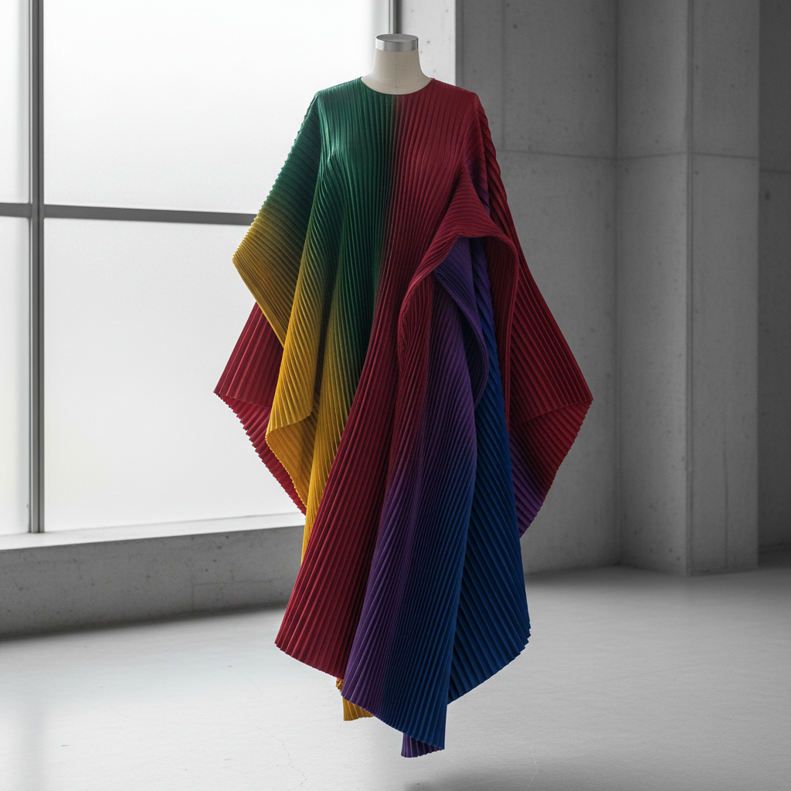

# Issey Miyake 三宅一生

> **时期：** 1938–2022  
> **关键词：** 褶皱技术、一块布、身体与布的关系、技术与诗意

## 概述

Issey Miyake 是日本时装设计师，以革命性的褶皱技术（Pleats Please）闻名。他从"一块布"的概念出发，探索布料与身体之间的关系——用热压褶皱、3D蒸汽成型等技术创造出既实用又如雕塑般美丽的服装，模糊了时尚、设计和艺术的边界。

## 风格特征

- **褶皱技术**：永久性热压褶皱，不需熨烫
- **一块布**：从单一布料出发的整体设计思维
- **身体自由**：服装不限制身体，随动作变化形态
- **技术创新**：与工程师合作开发新材料和新工艺
- **几何折叠**：受折纸启发的三维结构

## 代表作品

- *Pleats Please*系列（1993–至今）
- *A-POC (A Piece of Cloth)*（1998）
- *132 5. ISSEY MIYAKE*（2010）
- *BAO BAO 包*系列

## 概念图

