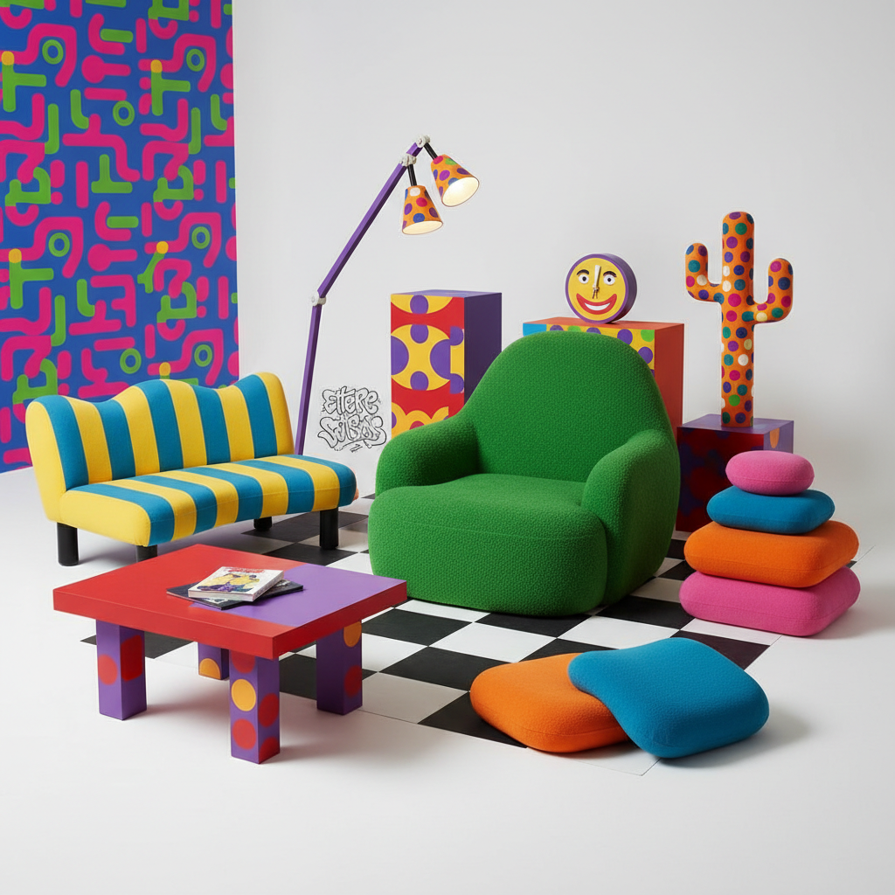

# Italian Radical Design 意大利激进设计



> **"密斯椅的讽刺、仙人掌衣帽架的荒诞——用设计的叛逆颠覆'好品味'的霸权。"**

## 概述

意大利激进设计（Radical Design / Design Radicale）是1960–70年代意大利青年建筑师和设计师发起的反现代主义运动。他们反对"优雅设计"（Bel Design）的精英主义，用荒诞、讽刺、波普化的作品挑战"少即是多"的正统教条，最终催生了后现代设计的全面爆发。

## 时代背景

| 维度 | 内容 |
|------|------|
| 萌发 | 1960年代中期，意大利 |
| 成熟 | 1970年代（阿基米亚工作室） |
| 高潮 | 1972年MoMA"家居新景观"展 |
| 延续 | 1981年Memphis设计小组成立 |
| 社会背景 | 1968学生运动、消费主义批判、婴儿潮 |

## 关键组织与人物

| 组织/人物 | 时间 | 特征 |
|------|------|------|
| Archizoom | 1966–1974 | "密斯椅"讽刺、无终结城市 |
| Superstudio | 1966–1978 | 连续纪念碑、反乌托邦 |
| Gruppo Strum | 1963–1975 | Pratone草皮椅 |
| Studio Alchimia | 1976– | "再设计"、门迪尼"康定斯基椅" |
| Ettore Sottsass | 1917–2007 | 从Alchimia到Memphis的桥梁 |
| Alessandro Mendini | 1931–2019 | 讽刺性表面装饰、Proust椅 |

## 视觉特征

- **荒诞造型**：家具像玩具、像雕塑、像讽刺画
- **鲜艳色彩**：波普式的高饱和度用色
- **讽刺引用**：对经典设计的戏仿与颠覆
- **表面装饰**：在经典产品上叠加抽象/波普图案
- **超大尺度**：夸张比例打破功能逻辑
- **混合材料**：塑料、聚氨酯、层压板等非传统材料

## 核心理念

### 反设计（Anti-Design）

不是"不设计"，而是用设计本身来质疑设计的权力结构——谁定义了"好品味"？为谁设计？

### 从Alchimia到Memphis

阿基米亚（Alchimia = 炼金术）试图把普通日用品"点石成金"——通过装饰和讽刺赋予新意义。1981年索特萨斯离开Alchimia创办Memphis，将激进设计推向商业化和全球影响。

## 里程碑事件

| 年份 | 事件 |
|------|------|
| 1966 | Archizoom + Superstudio "超建筑"展 |
| 1969 | "密斯椅"在米兰家具展亮相 |
| 1972 | MoMA "Italy: The New Domestic Landscape" |
| 1976 | Studio Alchimia 成立 |
| 1979 | Alchimia "包豪斯"展 |
| 1981 | Memphis 设计小组成立 |

## 与其他运动的关系

```
包豪斯/国际主义 ──→ [反叛] ──→ 意大利激进设计(1960s)
                                        ↓
波普艺术 ──→ [影响] ──→ 激进设计 ──→ Alchimia(1976)
                                        ↓
                                  Memphis(1981)
                                        ↓
                              后现代主义设计全球化
```

## 当代影响

- 直接催生了Memphis和后现代设计运动
- 启发了当代"批判性设计"（Critical Design）方法论
- Droog Design、Front Design等当代实验设计的精神源头
- 推动设计从"解决问题"扩展为"提出问题"
- 当代设计展览和收藏市场对激进设计作品的持续关注

## 多语言名称

| 语言 | 名称 |
|------|------|
| 意大利语 | Design Radicale / Architettura Radicale |
| 英语 | Italian Radical Design / Anti-Design |
| 中文 | 意大利激进设计 / 反设计 |
| 法语 | Design Radical Italien |
| 德语 | Radikales Design |

## 延伸阅读

- MoMA "Italy: The New Domestic Landscape" (1972) 展览图录
- Andrea Branzi《The Hot House: Italian New Wave Design》
- Penny Sparke《Italian Design: 1870 to the Present》

---

*最后更新：2026-07-26*
