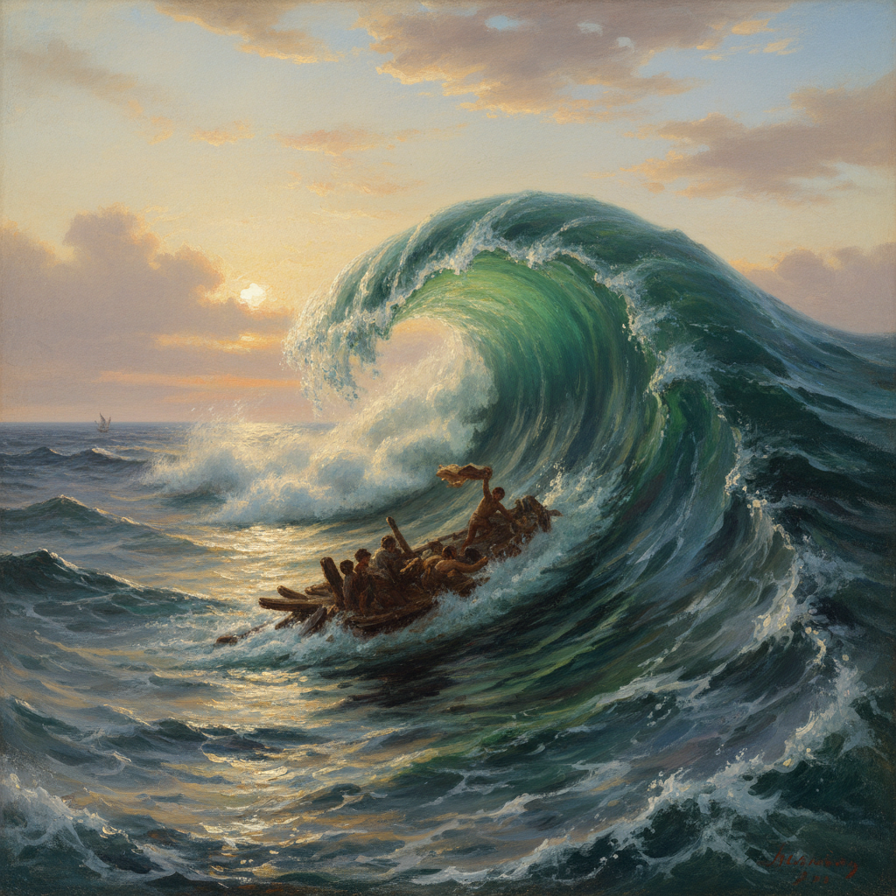

# Ivan Aivazovsky 艾瓦佐夫斯基

> "The movement of living elements is unattainable for the brush." — Ivan Aivazovsky

## 概述

伊万·艾瓦佐夫斯基（Ivan Aivazovsky，1817–1900）是俄国/亚美尼亚裔海景画家，被誉为有史以来最伟大的海洋画家之一。他以描绘大海的各种状态闻名——从暴风雨中翻涌的巨浪到月光下宁静的港湾，用惊人的记忆力和透明的光线效果捕捉水的运动和光的折射。一生创作超过6000幅画作。

## 核心特征

| 特征 | 描述 |
|------|------|
| 海浪透明 | 阳光穿透浪尖的翡翠绿 |
| 暴风雨 | 大海愤怒时的恐怖崇高 |
| 月光海面 | 银色月光在水面的反射 |
| 记忆作画 | 在画室中凭记忆完成 |
| 多产天才 | 一生超过6000幅作品 |
| 光的魔术 | 日出、日落、月光的极致 |

## 代表作品

| 作品 | 年代 | 意义 |
|------|------|------|
| *The Ninth Wave* | 1850 | 海洋画的最高杰作 |
| *The Black Sea* | 1881 | 大海力量的极简表达 |
| *Moonlit Night on the Bosphorus* | 1894 | 月光海面的诗意 |
| *Among the Waves* | 1898 | 81岁时的巅峰之作 |

## AI生成概念图

## 与其他风格的关系

- **Romanticism** → 俄国浪漫主义的海洋代表
- **Turner** → 受透纳光线效果影响
- **Marine Painting** → 海景画传统的巅峰
- **Luminism** → 与美国光辉主义共享光线追求
