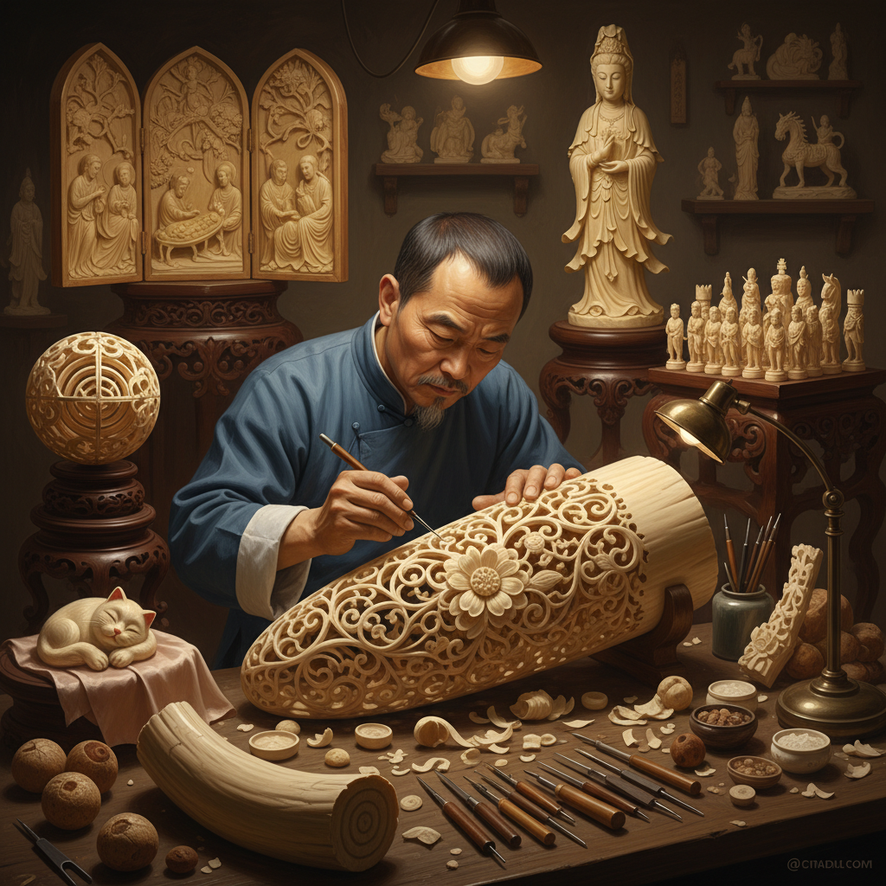

# Ivory Carving Art 牙雕艺术

> "Ivory carving represents one of humanity's oldest artistic traditions — the transformation of dense, smooth organic material into objects of extraordinary delicacy and detail. For millennia, carvers worked this material into religious icons, portrait miniatures, and decorative objects of breathtaking intricacy. Today, as we rightfully protect elephants and other species, the legacy of ivory carving lives on through ethical alternatives — mammoth ivory, bone, tagua nut, and synthetic materials that honor the tradition while respecting life." — Unknown

## 概述

牙雕艺术（Ivory Carving Art）是以象牙或其他动物牙齿/骨骼为材料，通过雕刻、镂空和打磨等技法创造各种艺术品的传统工艺——历史上是世界各文化中最精美的雕刻艺术之一。由于野生动物保护的需要，当代牙雕艺术已转向使用猛犸象牙（化石）、骨雕和植物象牙（椰棕果）等替代材料。

牙雕艺术的实践包括：1）圆雕——完全立体的牙雕作品；2）浮雕——平面上的浮雕雕刻；3）镂空雕——多层镂空的精细雕刻；4）微雕——极其微小的精细雕刻；5）象牙球——多层可转动的镂空球；6）当代骨雕——使用骨骼材料的雕刻；7）替代材料雕刻——使用猛犸牙、椰棕果等的雕刻。

## 核心特征

| 特征 | 描述 |
|------|------|
| 精细 | 极其精细的雕刻 |
| 温润 | 材料温润的质感 |
| 密度 | 高密度允许精细加工 |
| 古老 | 人类最古老的雕刻传统 |
| 伦理 | 当代面临伦理转型 |
| 替代 | 转向替代材料 |

## 视觉特征

- **白色**：象牙白的经典色调
- **温润**：温润如玉的质感
- **精细**：极其精细的雕刻细节
- **镂空**：精美的镂空效果
- **光泽**：抛光后的柔和光泽
- **纹理**：材料天然的纹理

## 代表作品

| 作品 | 艺术家/文化 | 年代 | 意义 |
|------|-------------|------|------|
| *广州象牙球* | 中国广州 | 清代 | 多层镂空象牙球 |
| *Dieppe ivory* | 法国迪耶普 | 17-18世纪 | 法国牙雕 |
| *Japanese netsuke* | 日本传统 | 江户时代 | 日本根付 |
| *Benin ivory masks* | 贝宁王国 | 16世纪 | 非洲牙雕 |
| *Mammoth ivory carvings* | 当代 | 当代 | 猛犸牙雕刻 |

## 历史时间线

| 时期 | 事件 |
|------|------|
| 旧石器时代 | 最早的牙骨雕刻 |
| 古代 | 各文明的牙雕传统 |
| 中世纪 | 宗教牙雕的繁荣 |
| 明清 | 中国牙雕的巅峰 |
| 1989至今 | 国际象牙贸易禁令，转向替代材料 |

## 中国语境

牙雕艺术是中国传统工艺美术的重要门类——中国的牙雕有两千多年的历史。中国的牙雕以广州牙雕和北京牙雕最为著名——广州牙雕以镂空雕刻见长（如多层象牙球），北京牙雕以人物造像著称。中国的象牙球（鬼工球）是世界牙雕工艺的奇迹——从一整块象牙中雕出多达数十层可自由转动的镂空球体。随着1989年国际象牙贸易禁令和2017年中国全面禁止商业性象牙加工销售，中国的牙雕艺术面临重大转型——传承人转向使用猛犸象牙（合法的化石材料）、牛骨和其他替代材料。中国的牙雕技艺已被列入国家级非物质文化遗产——保护的是雕刻技艺本身而非象牙材料。中国当代的一些雕刻大师使用猛犸象牙继续创作——在保护野生动物的前提下传承这一古老技艺。

## AI生成概念图

## 与其他风格的关系

- **Bone Carving** → 骨雕艺术
- **Jade Carving** → 玉雕艺术
- **Wood Carving** → 木雕艺术
- **Netsuke** → 根付艺术
- **Miniature Art** → 微型艺术
- **Sculpture** → 雕塑

---

*浮光艺志 | Chronicle of Artistry*
