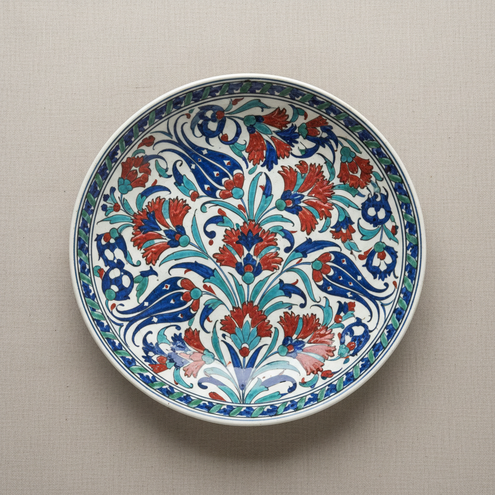

# Iznik Art 伊兹尼克艺术

> "Iznik is the Ottoman Empire's ceramic crown jewel — tiles and vessels painted in cobalt blue, turquoise, emerald green, and a unique raised red called Armenian bole, depicting tulips, carnations, and arabesques with a boldness that transformed mosques into gardens of eternal spring, the highest achievement of Islamic ceramic art where every surface becomes a prayer written in flowers." — Unknown

## 概述

伊兹尼克艺术（Iznik Art）是奥斯曼帝国时期（15-17世纪）在土耳其伊兹尼克（Iznik）城生产的一种精美的彩绘陶瓷艺术。伊兹尼克陶瓷以其鲜艳的色彩和精美的花卉装饰著称——特别是其独特的"亚美尼亚红"（一种凸起的珊瑚红色）和钴蓝、翠绿、松石绿的组合，创造了伊斯兰陶瓷艺术的最高成就。伊兹尼克瓷砖装饰了伊斯坦布尔最伟大的清真寺——包括苏莱曼清真寺和蓝色清真寺。

伊兹尼克艺术的核心要素包括：1）亚美尼亚红——独特的凸起红色；2）钴蓝翠绿——鲜艳的蓝绿色彩；3）花卉纹样——郁金香、康乃馨等；4）阿拉伯纹饰——几何和植物纹饰；5）建筑装饰——清真寺的瓷砖装饰；6）奥斯曼宫廷——宫廷赞助的艺术；7）釉下彩——釉下彩绘技法。

## 核心特征

| 特征 | 描述 |
|------|------|
| 亚美尼亚红 | 独特凸起红色 |
| 钴蓝翠绿 | 鲜艳蓝绿色彩 |
| 花卉纹样 | 郁金香康乃馨等 |
| 阿拉伯纹饰 | 几何和植物纹饰 |
| 建筑装饰 | 清真寺瓷砖装饰 |
| 奥斯曼宫廷 | 宫廷赞助艺术 |

## 视觉特征

- **鲜艳色彩**：蓝、绿、红的鲜艳组合
- **凸起红色**：独特的凸起珊瑚红
- **花卉图案**：郁金香、石榴、康乃馨
- **白色底色**：纯白的底色
- **流畅线条**：流畅的装饰线条
- **对称构图**：对称的装饰构图

## 代表作品

| 作品 | 艺术家/文化 | 年代 | 意义 |
|------|-------------|------|------|
| *苏莱曼清真寺瓷砖* | 伊兹尼克 | 1557年 | 建筑装饰巅峰 |
| *蓝色清真寺瓷砖* | 伊兹尼克 | 1616年 | 最大规模应用 |
| *伊兹尼克花卉盘* | 伊兹尼克 | 16世纪 | 经典器物 |
| *托普卡帕宫瓷砖* | 伊兹尼克 | 16世纪 | 宫廷装饰 |
| *伊兹尼克灯* | 伊兹尼克 | 16世纪 | 清真寺灯具 |

## 历史时间线

| 时期 | 事件 |
|------|------|
| 15世纪 | 伊兹尼克陶瓷的起源 |
| 1480-1520年 | 蓝白期 |
| 1520-1555年 | 大马士革期 |
| 1555-1620年 | 经典期（亚美尼亚红） |
| 17世纪末 | 伊兹尼克的衰落 |

## 中国语境

伊兹尼克陶瓷与中国青花瓷有深厚的历史渊源。伊兹尼克早期的蓝白陶瓷明显受到中国元代和明代青花瓷的影响——奥斯曼宫廷收藏了大量中国青花瓷，伊兹尼克工匠模仿并发展了这种蓝白装饰风格。但伊兹尼克很快发展出了自己独特的风格——特别是亚美尼亚红的发明和花卉纹样的本土化，使伊兹尼克陶瓷成为了独立于中国传统的伟大艺术。中国青花瓷通过丝绸之路和海上贸易大量输入奥斯曼帝国——托普卡帕宫至今仍收藏着世界上最大的中国瓷器收藏之一。伊兹尼克与中国陶瓷的关系证明了文化交流如何催生新的艺术创造——中国的技术种子在伊斯兰世界开出了完全不同的花朵。

## AI生成概念图

## 与其他风格的关系

- **Blue and White** → 青花瓷
- **Persian Tile** → 波斯瓷砖
- **Islamic Art** → 伊斯兰艺术
- **Ottoman Art** → 奥斯曼艺术
- **Architectural Ceramics** → 建筑陶瓷
- **Delftware** → 代尔夫特陶

---

*浮光艺志 | Chronicle of Artistry*
