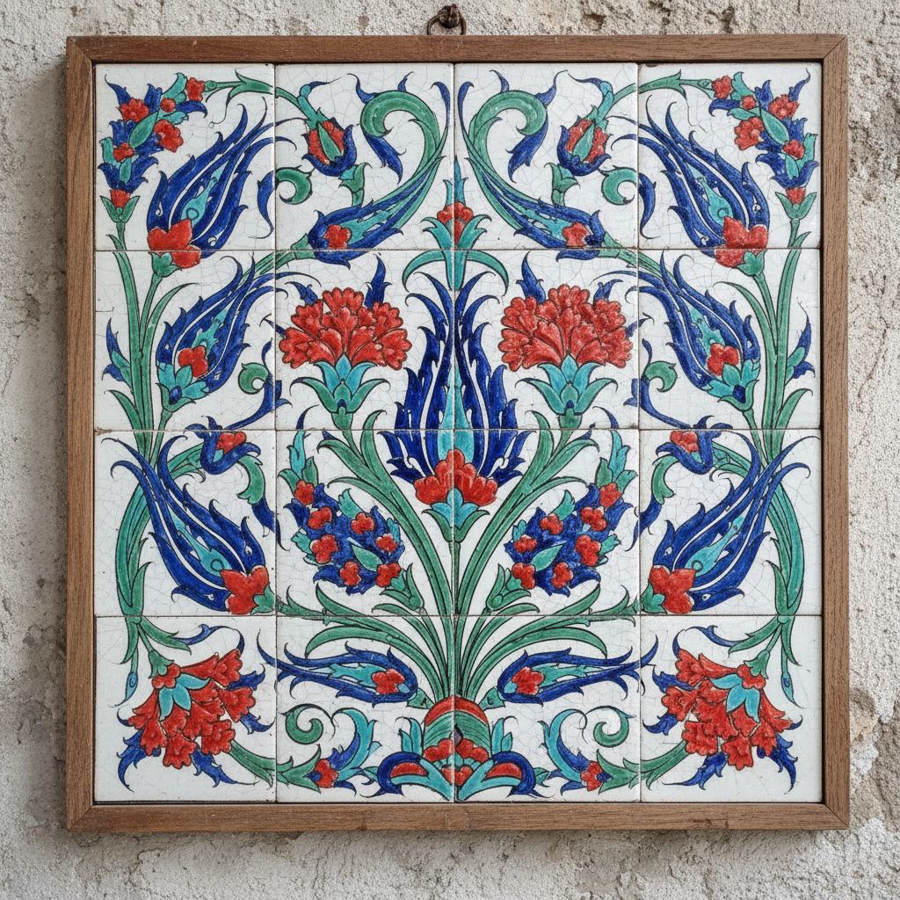

# İznik Ceramics 伊兹尼克陶瓷 | İznik Çinileri

> **"奥斯曼帝国的色彩密码——郁金香、石榴和阿拉伯花纹在釉下绽放。"**

## 概述

伊兹尼克陶瓷（İznik Çinileri / İznik Ceramics）是奥斯曼帝国最辉煌的装饰艺术成就之一，产自土耳其伊兹尼克（İznik，古称尼西亚）。15至17世纪，伊兹尼克的窑场生产出世界上最精美的釉下彩陶瓷——以其独特的"伊兹尼克红"（Armenian bole）、钴蓝、翠绿和白色底釉著称。这些陶瓷装饰了伊斯坦布尔的苏丹艾哈迈德清真寺（蓝色清真寺）、托普卡帕宫等帝国建筑的内壁。

## 历史发展

| 时期 | 特征 |
|------|------|
| 早期 (1480–1520) | 蓝白风格，受中国青花瓷影响 |
| 大马士革风格 (1520–1550) | 加入绿松石和紫色 |
| 经典期 (1550–1600) | "伊兹尼克红"出现，巅峰时期 |
| 衰落期 (1600–1700) | 质量下降，最终停产 |
| 复兴 (20世纪–至今) | 传统技法的学术研究和复兴 |

## 核心特征

- **伊兹尼克红**：独特的凸起珊瑚红色（Armenian bole）
- **釉下彩**：颜料在透明釉层下，永不褪色
- **白色底釉**：纯净的锡白釉底色
- **花卉主题**：郁金香、康乃馨、风信子、玫瑰
- **阿拉伯花纹**：无限延伸的植物蔓藤
- **Rumi纹**：分裂叶片的程式化植物纹

## 经典图案

| 图案 | 含义 |
|------|------|
| 郁金香 Lale | 奥斯曼帝国的象征花卉 |
| 石榴 Nar | 丰饶、天堂 |
| 康乃馨 Karanfil | 爱情、幸福 |
| 风信子 Sümbül | 春天、重生 |
| Saz叶 | 长而弯曲的锯齿叶 |
| Çintamani | 三圆点+双波浪线 |

## 视觉特征

- 纯净白底上的鲜艳色彩
- 凸起的珊瑚红色（触感可辨）
- 钴蓝和翠绿的精确配色
- 流畅优雅的花卉线条
- 对称的植物蔓藤构图
- 建筑尺度的瓷砖面板

## 与其他风格的关系

| 风格 | 关系 |
|------|------|
| 中国青花瓷 | 早期直接影响，后独立发展 |
| 波斯陶瓷 | 共享伊斯兰装饰传统 |
| 葡萄牙Azulejo | 共享伊斯兰瓷砖传统 |
| 伊斯兰几何艺术 | 共享伊斯兰装饰语言 |
| William Morris | 受伊兹尼克花卉启发 |
| 当代土耳其设计 | 伊兹尼克图案的现代应用 |

## 概念图

---

*浮光艺志 | Chronicle of Artistry*
