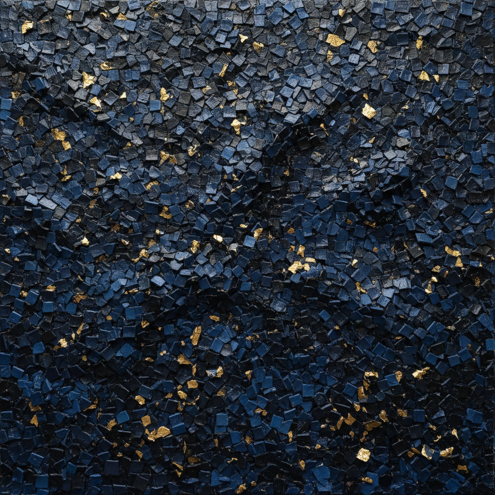

# Jack Whitten 杰克·惠滕

> **时期：** 1939–2018  
> **关键词：** 材料实验、马赛克拼贴、丙烯铸造、非裔美国抽象

## 概述

Jack Whitten 是美国画家和雕塑家，以对绘画材料的极端实验闻名。他发明了用自制工具拖拽颜料的"开发者"技法，后期将干燥的丙烯颜料切割成小块如同马赛克瓷砖重新拼贴于画面，创造出介于绘画、雕塑和建筑之间的独特表面。

## 风格特征

- **丙烯铸造**：将厚层丙烯颜料干燥后切割成小方块，如同制造瓷砖
- **马赛克表面**：将切割的颜料块重新排列粘贴，画面如同拜占庭马赛克
- **工具发明**：使用自制的巨型刮刀、梳子和滚筒创造独特纹理
- **物质性**：画面具有强烈的三维质感，颜料不再是再现工具而是建筑材料
- **纪念性**：后期作品常以"纪念碑"命名，致敬非裔美国文化英雄

## 代表作品

- *Greek Alphabet*（1975–76，系列）
- *Black Monolith*（1994–2016，系列）
- *Atopolis: For Édouard Glissant*（2014）
- *9.11.01*（2006）

## 历史意义

Whitten 证明了抽象绘画可以同时是材料实验和文化纪念——他的"黑色纪念碑"系列将非裔美国历史编码进纯粹的物质形式中，超越了再现与抽象的二元对立。

## 概念图

