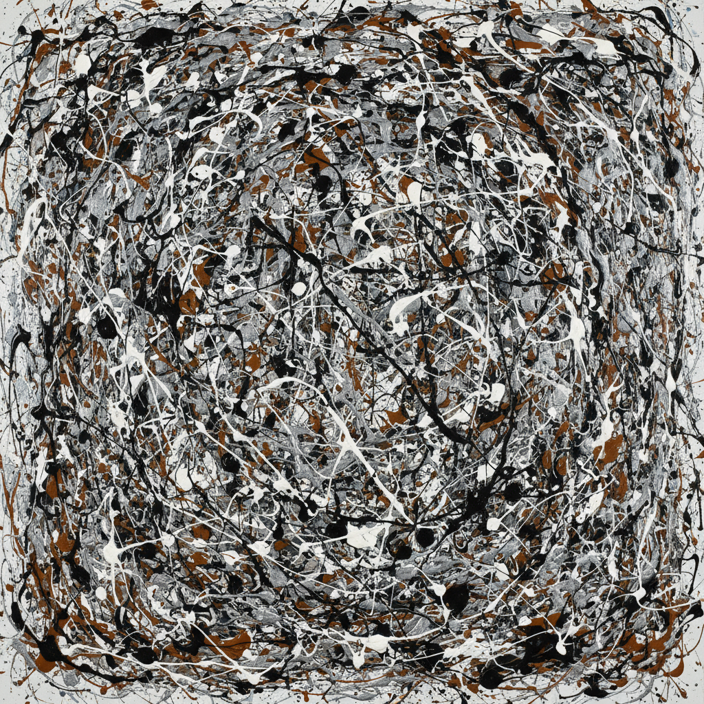

# Jackson Pollock 杰克逊·波洛克

> **流派**: 抽象表现主义 · 行动绘画  
> **时期**: 1912–1956 美国  
> **关键词**: 滴画法、全面绘画、身体动作、混沌秩序

## 概述

杰克逊·波洛克是抽象表现主义最具标志性的人物。他将画布铺在地上，用棍子和硬化的画笔将颜料滴洒、甩溅到画面上，创造出一种前所未有的"全面绘画"——没有中心、没有层次、没有传统构图，只有纯粹的能量痕迹。

## 视觉特征

- **滴洒痕迹**: 颜料以重力和手势的轨迹落在画布上
- **全面构图**: 画面没有焦点，每个区域同等重要
- **多层交织**: 不同颜色的线条层层叠加形成复杂网络
- **节奏感**: 线条的粗细、密疏形成音乐般的韵律
- **身体尺度**: 巨大的画面记录了艺术家围绕画布的运动

## 代表作品

- 《秋韵：第30号》(1950)
- 《第1号, 1950 (薰衣草迷雾)》(1950)
- 《汇聚》(1952)
- 《蓝色柱子：第11号》(1952)

## 历史影响

波洛克彻底改变了"绘画"的定义——它不再是描绘什么，而是做什么。他的行动绘画影响了行为艺术、偶发艺术和后来所有强调过程的艺术实践。

## 相关风格

- [Abstract Expressionism 抽象表现主义](abstract-expressionism.md)
- [Willem de Kooning 威廉·德·库宁](willem-de-kooning.md)
- [Franz Kline 弗朗茨·克莱因](franz-kline.md)
