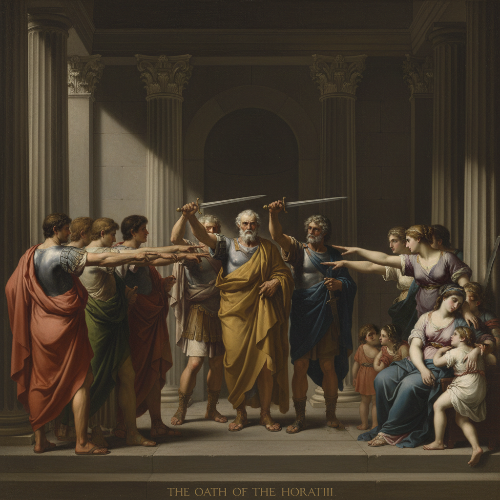

# Jacques-Louis David 雅克-路易·大卫

> "In the arts the way in which an idea is rendered, and the manner in which it is expressed, is much more important than the idea itself." — Jacques-Louis David

## 概述

雅克-路易·大卫（Jacques-Louis David，1748–1825）是法国新古典主义绑画的奠基人，拿破仑的首席画家。他以严肃的古典题材、精确的构图和道德教化的目的闻名，将绘画变成革命的武器和帝国的宣传工具。

## 核心特征

| 特征 | 描述 |
|------|------|
| 古典题材 | 希腊罗马的英雄与美德 |
| 严格构图 | 舞台式的水平排列 |
| 雕塑感 | 人物如同古典雕像 |
| 道德教化 | 艺术服务于公民美德 |
| 光滑表面 | 完美无瑕的技术执行 |
| 政治性 | 从革命到帝国的视觉宣传 |

## 代表作品

| 作品 | 年代 | 意义 |
|------|------|------|
| *Oath of the Horatii* | 1784 | 新古典主义的宣言 |
| *The Death of Marat* | 1793 | 革命殉道者的圣像 |
| *Napoleon Crossing the Alps* | 1801 | 帝国宣传的巅峰 |
| *The Coronation of Napoleon* | 1805–07 | 历史画的最大尺幅 |

## AI生成概念图

## 与其他风格的关系

- **Neoclassicism** → 新古典主义绑画的创始人
- **Ingres** → 最重要的学生和继承者
- **Rococo** → 对洛可可"堕落"的反叛
- **French Revolution** → 革命的官方画家
