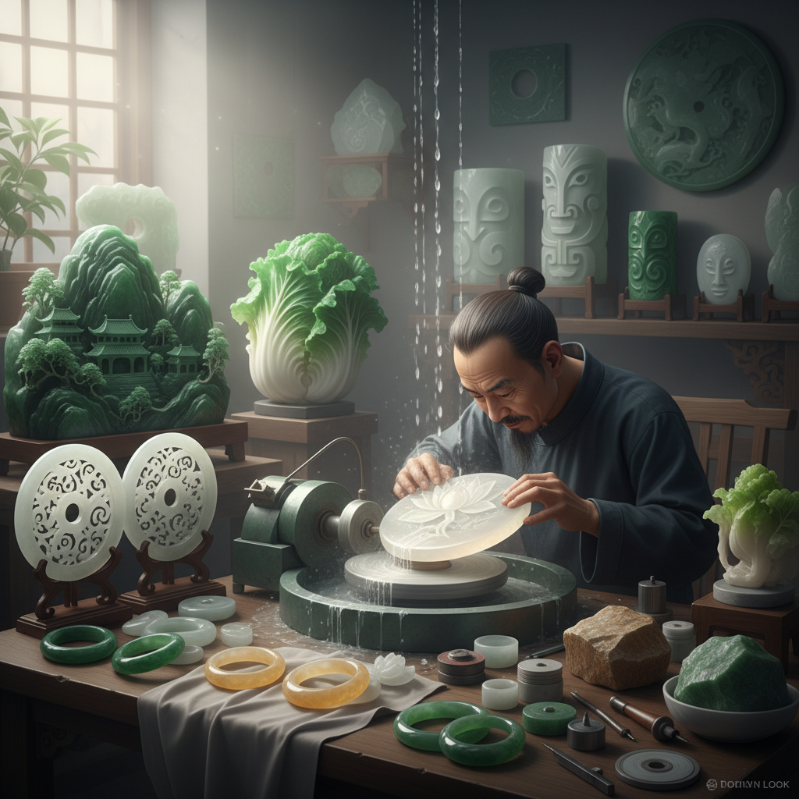

# Jade Carving Art 玉雕艺术

> "Jade cannot be carved — it can only be worn away, grain by grain, with patience measured in months and years. The jade carver does not impose form upon the stone; rather, they discover the form that the stone has been waiting to reveal. In Chinese culture, jade is not merely a mineral but a moral substance: its warmth represents benevolence, its translucency represents honesty, its hardness represents wisdom, and its smooth edges represent justice." — Unknown

## 概述

玉雕艺术（Jade Carving Art）是以玉石（主要包括软玉/和田玉和硬玉/翡翠）为材料，通过切割、琢磨、雕刻和抛光等技法创造各种艺术品和装饰品的宝石工艺——是中国最古老、最崇高的工艺艺术之一，在中华文明中有着无与伦比的文化地位。

玉雕艺术的实践包括：1）器皿雕刻——玉制的杯、碗、瓶等器皿；2）人物雕刻——玉制的人物造像；3）动物雕刻——玉制的动物造型；4）山子雕——大型玉石的山水场景雕刻；5）薄意雕——浅浮雕的精细技法；6）链雕——从整块玉石中雕出活动链环；7）巧雕——利用玉石天然色彩进行俏色雕刻。

## 核心特征

| 特征 | 描述 |
|------|------|
| 温润 | 玉石温润的质感 |
| 通透 | 半透明的光学效果 |
| 坚硬 | 极高的硬度 |
| 耐久 | 永不褪色变质 |
| 珍贵 | 极其珍贵的材料 |
| 文化 | 深厚的文化象征 |

## 视觉特征

- **温润**：玉石温润如脂的质感
- **通透**：光线透过玉石的效果
- **色彩**：白、青、碧、黄、墨等色
- **光泽**：抛光后的油脂光泽
- **线条**：流畅的雕刻线条
- **层次**：俏色雕刻的色彩层次

## 代表作品

| 作品 | 艺术家/文化 | 年代 | 意义 |
|------|-------------|------|------|
| *大禹治水图玉山* | 清代宫廷 | 1787 | 世界最大玉雕 |
| *翠玉白菜* | 清代 | 19世纪 | 台北故宫镇馆之宝 |
| *红山文化玉龙* | 红山文化 | 公元前4000年 | 中华第一龙 |
| *良渚玉琮* | 良渚文化 | 公元前3000年 | 礼器之王 |
| *Maori jade pendants* | 毛利文化 | 传统 | 新西兰玉器 |

## 历史时间线

| 时期 | 事件 |
|------|------|
| 新石器时代 | 中国最早的玉器制作 |
| 商周 | 礼玉制度的建立 |
| 汉代 | 玉衣和大型玉器 |
| 明清 | 玉雕工艺的巅峰 |
| 当代 | 玉雕的现代传承与创新 |

## 中国语境

玉雕艺术是中国文化中最核心的工艺传统——中国人对玉的崇拜已有八千年以上的历史。中国有"玉石之国"的美誉——从红山文化的玉龙到良渚文化的玉琮，从商周的礼玉到明清的玉器，玉贯穿了整个中华文明史。中国的和田玉（软玉）被认为是世界上最好的玉石——"羊脂白玉"是玉中极品。中国的翡翠（硬玉）雕刻也有极高的艺术水平——特别是在云南和广东地区。中国的玉雕有"北派"和"南派"之分——北派以北京、扬州为代表，风格大气庄重；南派以苏州、上海为代表，风格精巧细腻。中国当代的玉雕大师将传统技法与现代审美相结合——创造出既有传统韵味又具时代感的作品。中国的玉器收藏和投资市场极其活跃——高品质的古代玉器和当代玉雕大师作品价值连城。

## AI生成概念图

## 与其他风格的关系

- **Stone Carving** → 石雕艺术
- **Gem Cutting** → 宝石切割
- **Chinese Art** → 中国艺术
- **Sculpture** → 雕塑
- **Jewelry Art** → 珠宝艺术
- **Sacred Art** → 礼器艺术

---

*浮光艺志 | Chronicle of Artistry*
