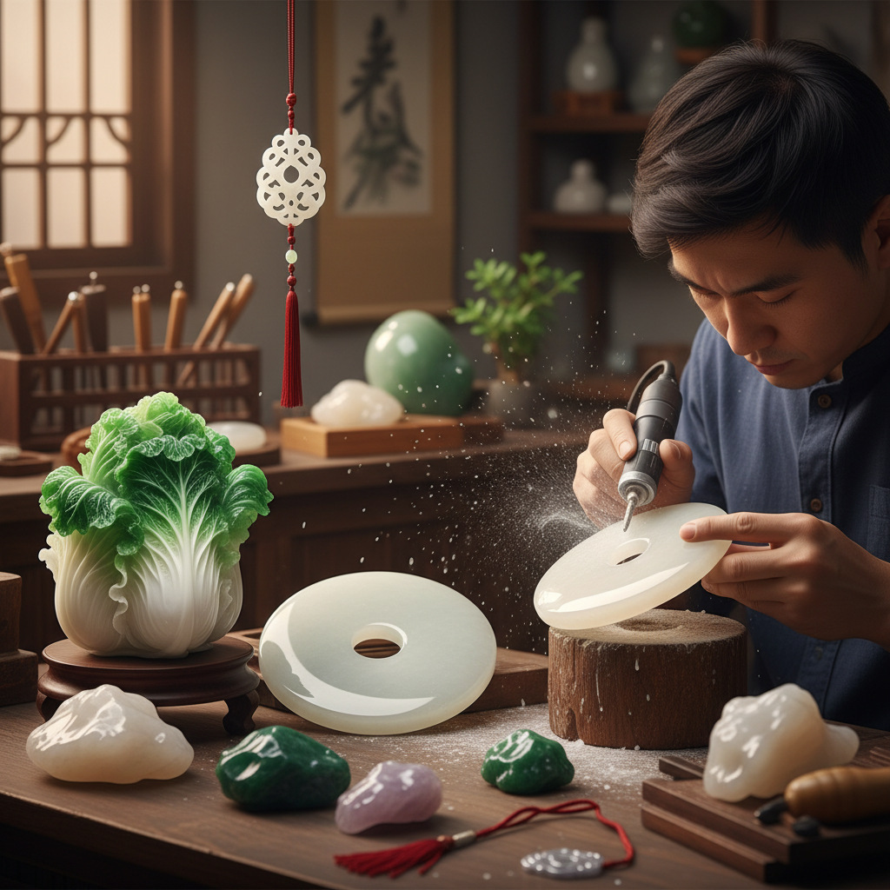

# Jade Carving 玉雕

> "Jade carving is not cutting stone — it is a dialogue with eternity, coaxing beauty from a material harder than steel." — Unknown

## 概述

玉雕（Jade Carving）是使用研磨工具（而非切割）在玉石上雕琢形态和图案的精细工艺。玉石（主要是软玉/和田玉和硬玉/翡翠）的硬度极高（莫氏6-7），不能像大理石那样用凿子直接雕刻，必须使用金刚砂等磨料配合旋转工具缓慢研磨。玉雕是中国文明最核心的工艺传统之一——中国人对玉的崇拜已有8000年历史，玉在中国文化中象征着美德、高贵和永恒。

玉雕的哲学在于：因材施艺——每块玉石都有独特的色彩、纹理和瑕疵，优秀的玉雕师能够"读懂"石头，将瑕疵转化为设计的一部分。

## 核心特征

| 特征 | 描述 |
|------|------|
| 研磨 | 使用研磨而非切割 |
| 硬度 | 材料硬度极高 |
| 缓慢 | 极其缓慢的过程 |
| 因材 | 因材施艺的设计 |
| 温润 | 玉的温润质感 |
| 文化 | 深厚的文化内涵 |

## 视觉特征

- **温润**：玉石的温润光泽
- **半透明**：玉的半透明质感
- **色彩**：白、青、碧、黄、墨等
- **光滑**：极其光滑的表面
- **精细**：精细的雕刻细节
- **含蓄**：含蓄内敛的美

## 代表作品

| 作品 | 艺术家 | 年代 | 意义 |
|------|--------|------|------|
| *红山文化玉龙* | 匿名 | 公元前4000年 | 中华第一龙 |
| *良渚文化玉琮* | 匿名 | 公元前3000年 | 良渚玉器 |
| *翡翠白菜* | 匿名 | 清代 | 台北故宫镇馆 |
| *大禹治水玉山* | 匿名 | 清代 | 世界最大玉雕 |
| *Contemporary jade art* | Various | 当代 | 当代玉雕艺术 |

## 历史时间线

| 时期 | 事件 |
|------|------|
| 公元前6000年 | 中国最早的玉器 |
| 红山/良渚 | 新石器时代玉文化高峰 |
| 商周 | 礼玉制度的确立 |
| 汉代 | 玉衣等丧葬玉器 |
| 明清 | 宫廷玉雕的巅峰 |
| 当代 | 当代玉雕艺术 |

## 中国语境

玉雕是中国最核心的工艺传统——没有之一。中国人对玉的崇拜可以追溯到8000年前，"君子比德于玉"的观念深入中国文化骨髓。中国玉雕的主要流派包括：苏州工（精细秀丽）、扬州工（大件山子）、北京工（宫廷风格）、上海工（海派创新）等。和田玉和翡翠是最重要的玉雕材料。当代中国玉雕既有传承传统的大师，也有探索当代表达的新锐艺术家。玉雕被列为国家级非物质文化遗产。

## AI生成概念图

## 与其他风格的关系

- **Stone Carving** → 石雕
- **Lapidary** → 宝石切割
- **Chinese Art** → 中国艺术核心
- **Sculpture** → 雕塑
- **Cold Working** → 冷加工（类似研磨原理）
- **Netsuke** → 根付（微型雕刻）

---

*浮光艺志 | Chronicle of Artistry*
