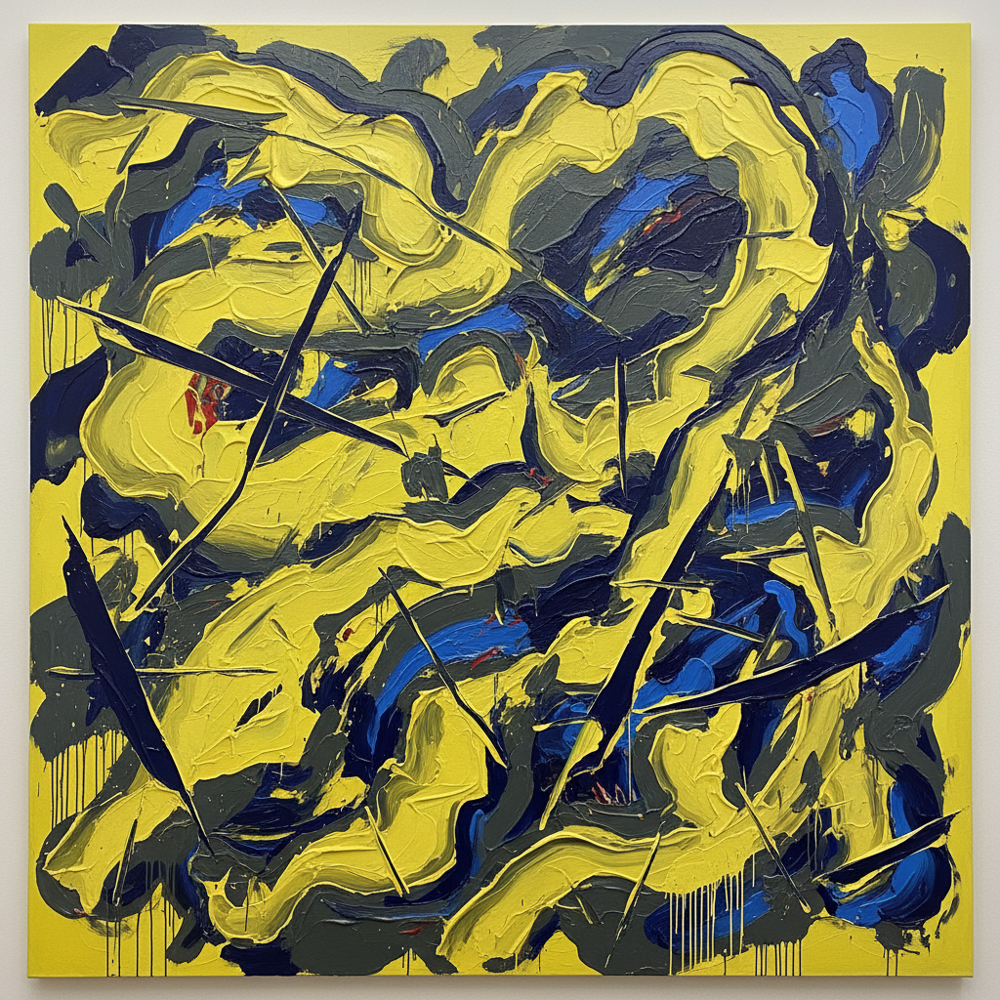

# Jadé Fadojutimi 贾德·法多朱蒂米

> **时期：** 1993–至今  
> **关键词：** 抽象风景、情感色彩、织物般层次、英国新生代

## 概述

Jadé Fadojutimi 是英国当代画家，以大尺幅的抽象绘画闻名。她的作品融合了风景、身体和情感状态，用密集的色彩层次和流动的线条创造出介于内在心理和外在自然之间的视觉空间。她是英国泰特美术馆收藏的最年轻艺术家之一。

## 风格特征

- **密集层次**：多层颜料相互叠加、透出，画面具有考古般的深度
- **流动线条**：有机的曲线和锐利的角度并存，如同风中的织物
- **情感色彩**：色彩选择基于情绪而非再现——从明亮的柠檬黄到深沉的靛蓝
- **大尺幅沉浸**：作品通常超过两米，要求观者被画面包围
- **半抽象形态**：偶尔可辨认的形状（叶片、身体轮廓）浮现于抽象之中

## 代表作品

- *Myths of Pleasure*（2020）
- *Self-Portrait as a Swinging Wardrobe*（2018）
- *The Watcher*（2021）

## 历史意义

Fadojutimi 代表了英国绘画最年轻一代的力量，她证明了抽象绘画在Z世代手中仍然具有情感表达的紧迫性，而非仅仅是形式游戏。

## 概念图

