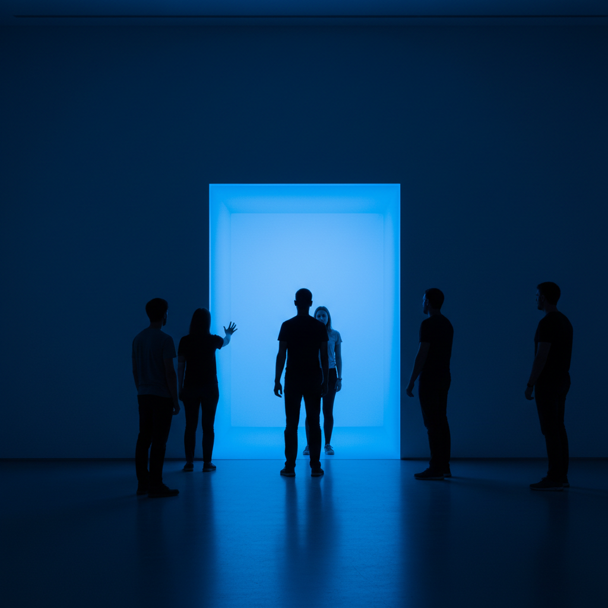

# James Turrell 詹姆斯·特瑞尔

> **流派**: 光与空间运动 · 大地艺术  
> **时期**: 1943–至今 美国  
> **关键词**: 光即媒介、罗登火山口、天空空间、感知体验

## 概述

詹姆斯·特瑞尔以光本身作为唯一的艺术媒介。他不使用光来照亮物体，而是让光成为可以被"触摸"和"居住"的物质存在。他最宏大的项目是将亚利桑那州的罗登火山口改造为一座用肉眼观测天体的裸眼天文台。

## 视觉特征

- **纯粹光线**: 没有物体，只有光的颜色和形状
- **空间消融**: 光让墙壁和边界消失，空间变得无限
- **天空框架**: 在天花板开口，将天空变为一幅画
- **渐变色彩**: 极其缓慢的光色变化，需要长时间观看
- **感知欺骗**: 平面的光看起来像实体，实体消失在光中

## 代表作品

- 罗登火山口 (1977–进行中)
- 《天空空间》系列 (全球多处)
- 《甘兹费尔德》系列
- 《Aten Reign》(2013) 古根海姆

## 历史影响

特瑞尔将艺术从"看什么"转变为"如何看"——他的作品改变的不是世界，而是观者的感知本身。他影响了沉浸式艺术、建筑照明和冥想空间设计。

## 相关风格

- [Dan Flavin 丹·弗莱文](dan-flavin.md)
- [Olafur Eliasson 奥拉维尔·埃利亚松](olafur-eliasson.md)
- [Minimalism 极简主义](minimalism.md)
