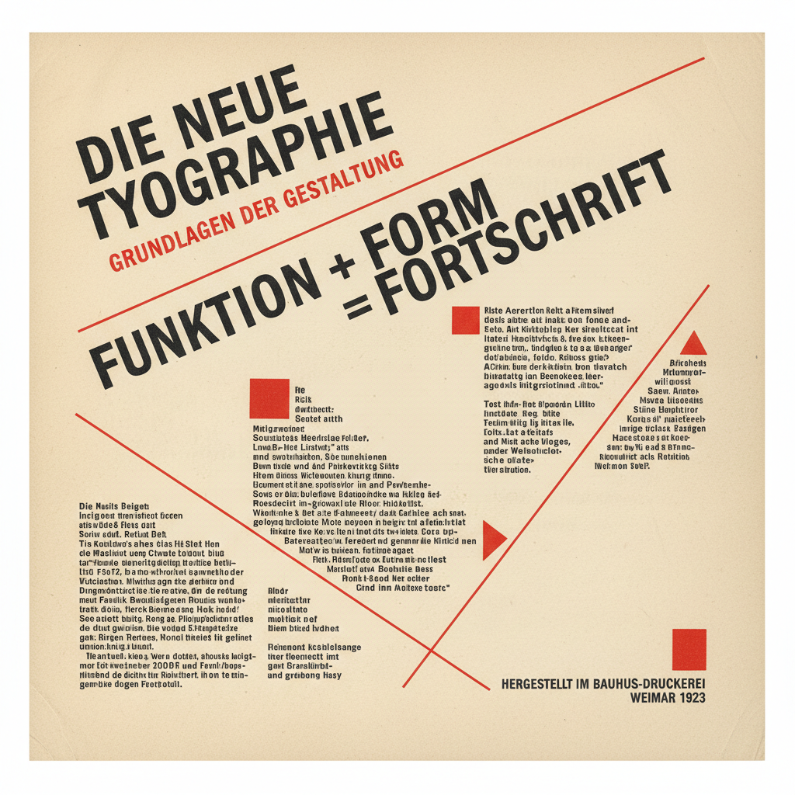

# Jan Tschichold 扬·奇肖尔德

> **时期：** 1902–1974  
> **关键词：** 新排版、不对称布局、企鹅书籍、古典与现代

## 概述

Jan Tschichold 是德国-瑞士排版设计师，现代排版运动的先驱。他1928年的《新排版》宣言推动了不对称布局和无衬线字体的革命，后来又转向古典排版——为企鹅出版社重新设计了整套书籍版式，证明了传统与现代可以共存。

## 风格特征

- **不对称布局**：打破传统的居中对称排版
- **无衬线字体**：早期倡导无衬线字体的现代性
- **功能主义**：排版服务于阅读功能
- **古典回归**：后期回归衬线字体和传统比例
- **书籍设计**：将书籍视为完整的排版系统

## 代表作品

- *Die neue Typographie*（1928，著作）
- *企鹅出版社书籍设计规范*（1947–1949）
- *Sabon 字体*（1967）
- *Typographische Gestaltung*（1935）

## 概念图

