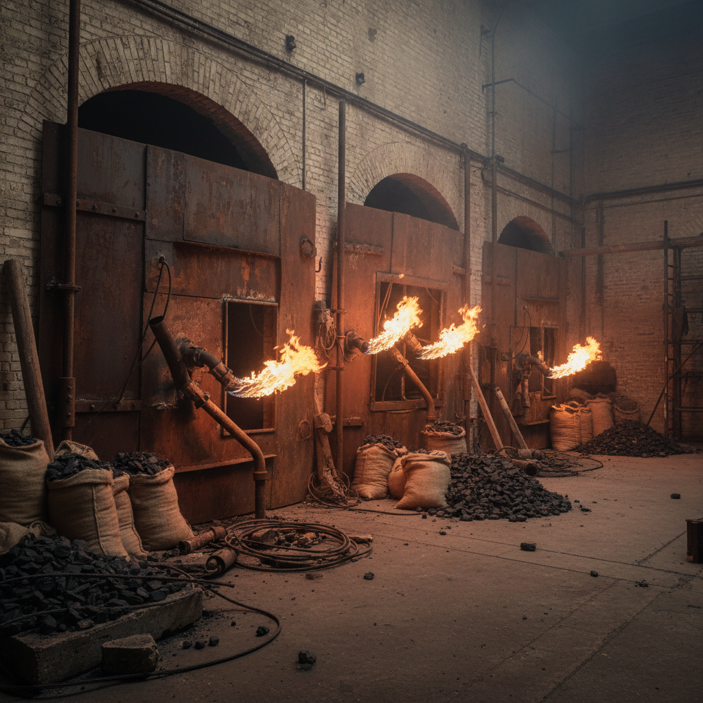

# Jannis Kounellis 扬尼斯·库奈里斯

> **时期：** 1936–2017  
> **关键词：** 贫穷艺术、工业材料、活体元素、戏剧性装置

## 概述

Jannis Kounellis 是希腊裔意大利艺术家，贫穷艺术运动的重要代表。他以将工业材料（钢板、煤炭、麻袋）与活体元素（火焰、活马、鹦鹉）结合的戏剧性装置闻名。他的作品具有强烈的物质在场感和历史重量。

## 风格特征

- **工业材料**：钢铁、煤炭、铅板、麻袋布
- **活体元素**：真实的火焰、活的动物、新鲜的咖啡
- **戏剧性**：作品具有舞台般的张力和仪式感
- **历史重量**：材料承载着劳动、贸易和工业的记忆
- **对抗性**：钢板封堵门窗，创造阻隔和压迫感

## 代表作品

- *Untitled (12 Horses)*（1969）
- *Carboniera*（1967）
- *Untitled (Tragedia Civile)*（1975）
- *Untitled*（钢板与火焰系列）

## 概念图

