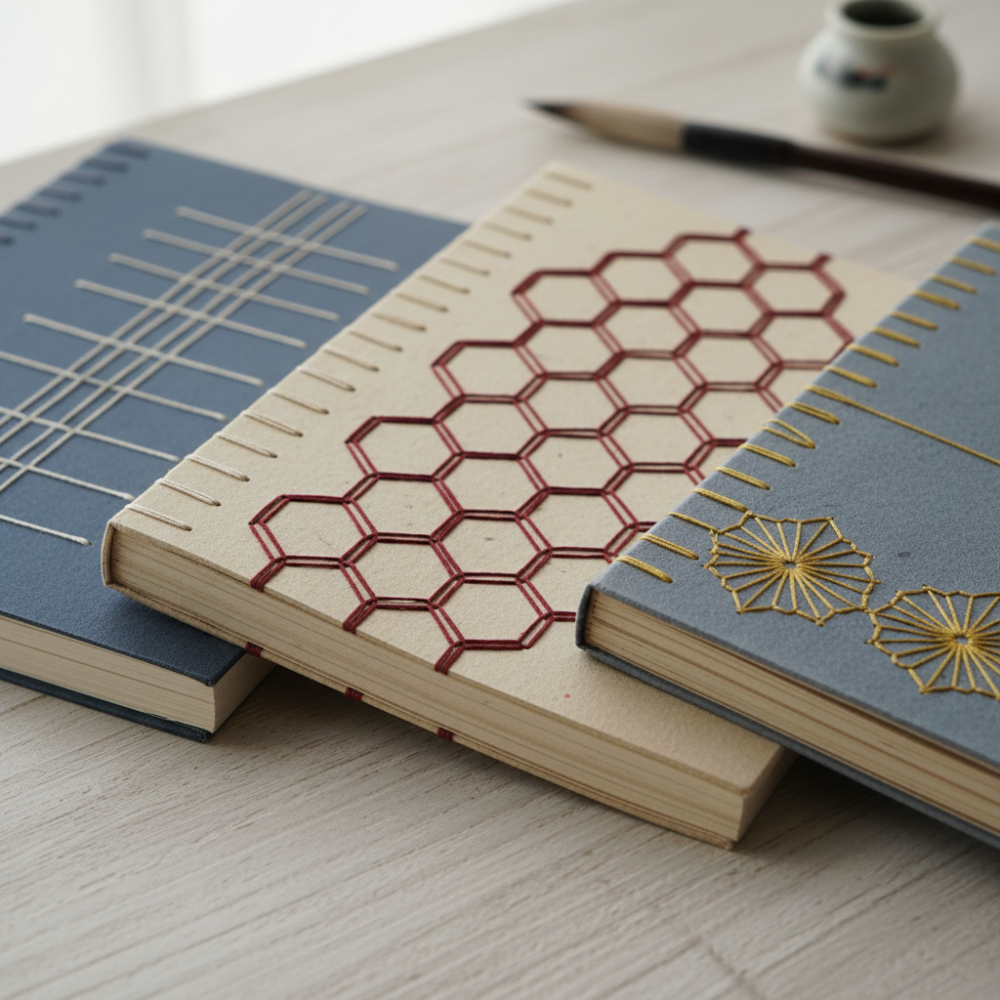

# Japanese Stab Binding Art 日本线装艺术

> "Japanese stab binding is sewing as calligraphy — a needle and thread pass through holes punched along the spine edge, creating patterns that are both structural and decorative. The binding holds single sheets rather than folded signatures, making it ideal for heavy papers, photographs, and mixed media. Each stitch pattern has a name and a history, from the simple four-hole binding to the elaborate tortoiseshell and hemp-leaf patterns." — Unknown

## 概述

日本线装艺术（Japanese Stab Binding Art）是一种通过在书页边缘打孔并用线缝合的传统书籍装帧技法——将单张纸页叠放后用装饰性的缝线固定在一起。日本线装（和綴じ/Watoji）以其优美的缝线图案和简洁的结构著称，是东亚书籍装帧的重要传统，包括四目缝、龟甲缝、麻叶缝等多种经典缝法。

日本线装艺术的实践包括：1）四目缝（Yotsume Toji）——最基本的四孔缝法；2）龟甲缝（Kikko Toji）——六角形龟甲图案；3）麻叶缝（Asanoha Toji）——麻叶图案缝法；4）康熙缝——复杂的交叉缝法；5）封面制作——制作布面或纸面封面；6）角布——用布或纸保护书角；7）当代日本线装——将传统技法与现代设计结合的创作。

## 核心特征

| 特征 | 描述 |
|------|------|
| 侧缝 | 从侧面缝合 |
| 图案 | 装饰性的缝线图案 |
| 单页 | 适合单张纸页 |
| 简洁 | 简洁优雅的结构 |
| 东亚 | 东亚的装帧传统 |
| 多样 | 多种缝法变化 |

## 视觉特征

- **缝线**：优美的缝线图案
- **规律**：规律重复的针脚
- **简洁**：简洁优雅的外观
- **色彩**：缝线与封面的色彩搭配
- **质朴**：质朴自然的美感
- **东方**：东方美学的气质

## 代表作品

| 作品 | 艺术家/文化 | 年代 | 意义 |
|------|-------------|------|------|
| *Chinese thread-bound books* | 中国 | 宋代起 | 中国线装书传统 |
| *Japanese watoji* | 日本 | 传统 | 日本和綴じ |
| *Korean thread binding* | 韩国 | 传统 | 韩国线装传统 |
| *Contemporary stab binding* | 国际 | 当代 | 当代线装设计 |
| *Artist stab-bound books* | 国际 | 当代 | 艺术家线装书 |

## 历史时间线

| 时期 | 事件 |
|------|------|
| 宋代 | 中国线装书的起源 |
| 室町时代 | 日本线装的发展 |
| 江户时代 | 日本线装的成熟和多样化 |
| 20世纪 | 西方手工书运动的引入 |
| 当代 | 线装的全球化和艺术化 |

## 中国语境

日本线装与中国线装书有直接的历史渊源。中国是线装书的发源地——宋代开始出现的线装是中国传统书籍装帧的重要形式。中国的线装书传统影响了日本和韩国——东亚三国共享这一装帧传统。中国传统的四眼装和六眼装是线装的基本形式——与日本的四目缝和龟甲缝对应。中国当代的手工书创作者将传统线装与现代设计结合——创造出具有当代感的线装作品。中国的古籍修复中，线装技法是核心技能——用于修复和重新装帧古代线装书。中国的设计教育中，线装作为书籍设计的重要传统——在各大设计院校教授。

## AI生成概念图

## 与其他风格的关系

- **Coptic Binding** → 科普特装帧
- **Bookbinding** → 书籍装帧
- **Chinese Thread Binding** → 中国线装
- **Paper Art** → 纸艺
- **Textile Art** → 纺织艺术
- **Calligraphy** → 书法

---

*浮光艺志 | Chronicle of Artistry*
