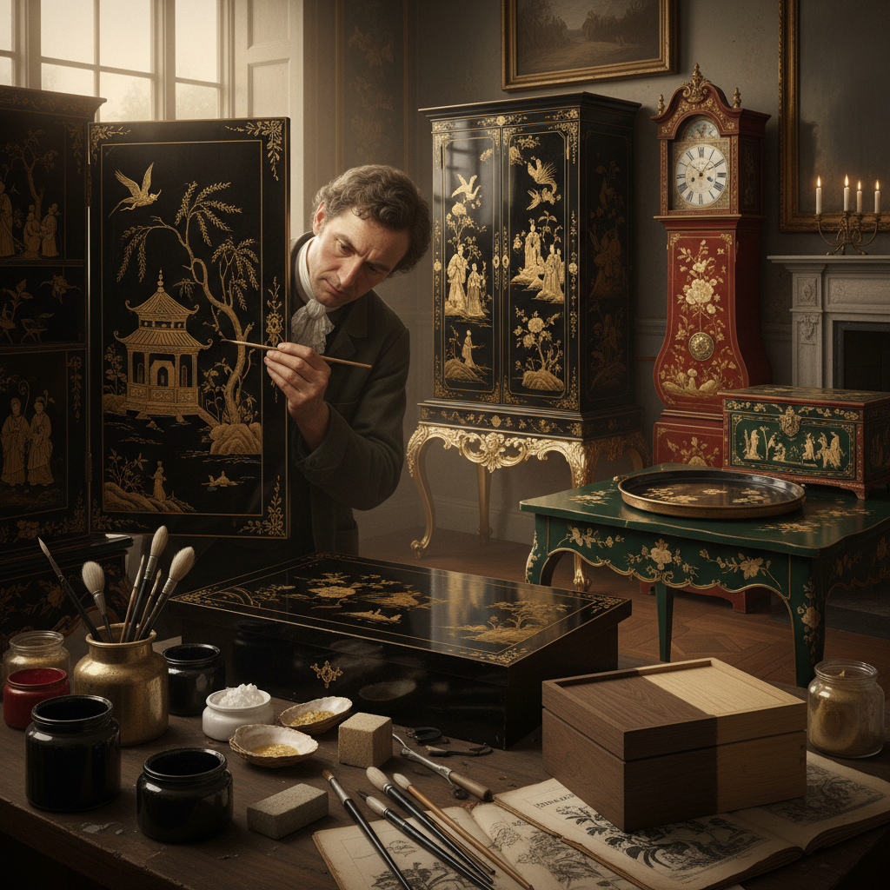

# Japanning Art 仿漆装饰艺术

> "Japanning is Europe's answer to Asian lacquer — an imitation born of admiration so intense that it became an art form in its own right. Unable to obtain the true lacquer tree sap of East Asia, European craftsmen developed their own recipes of shellac, copal varnish, and oil paints, building up dozens of coats on wood or metal, each polished to mirror smoothness, then decorated with raised chinoiserie scenes in gold and colors against glossy black, red, or green grounds." — Unknown

## 概述

仿漆装饰艺术（Japanning Art）是17-18世纪欧洲模仿东亚漆器而发展出的装饰技法——使用虫胶、树脂清漆和油漆代替真正的大漆，在木材或金属表面涂覆多层漆料并抛光，然后用金粉和彩色颜料绘制中国风或日本风的装饰图案。虽然是"仿制"，但japanning发展出了自己独特的美学风格。

仿漆装饰艺术的实践包括：1）黑底仿漆——最经典的黑色底漆配金色装饰；2）红底仿漆——朱红色底漆的仿漆；3）绿底仿漆——深绿色底漆的仿漆；4）金属仿漆——在锡板或铁板上的仿漆（如Pontypool ware）；5）家具仿漆——大型家具的仿漆装饰；6）当代仿漆——将传统技法与现代设计结合的创作。

## 核心特征

| 特征 | 描述 |
|------|------|
| 模仿 | 模仿东亚漆器 |
| 多层 | 多层漆料的涂覆 |
| 光泽 | 镜面般的光泽 |
| 中国风 | 中国风装饰题材 |
| 金色 | 大量使用金粉装饰 |
| 欧洲 | 欧洲的独特发展 |

## 视觉特征

- **光泽**：镜面般的漆面光泽
- **深度**：多层漆料的深度感
- **金色**：金粉装饰的华丽
- **黑底**：经典的黑色底漆
- **浮雕**：凸起的装饰图案
- **异域**：东方风情的装饰

## 代表作品

| 作品 | 艺术家/文化 | 年代 | 意义 |
|------|-------------|------|------|
| *Stalker & Parker treatise* | 英国 | 1688 | 仿漆技法手册 |
| *Pontypool ware* | 威尔士 | 18世纪 | 金属仿漆 |
| *Dutch japanned furniture* | 荷兰 | 17-18世纪 | 荷兰仿漆家具 |
| *Venetian lacca povera* | 意大利 | 18世纪 | 意大利仿漆 |
| *Chippendale japanned* | 英国 | 18世纪 | 齐彭代尔仿漆 |

## 历史时间线

| 时期 | 事件 |
|------|------|
| 17世纪初 | 东亚漆器大量进入欧洲 |
| 1688年 | 第一本仿漆技法手册出版 |
| 18世纪 | 仿漆装饰的黄金时代 |
| 19世纪 | 仿漆的工业化和衰落 |
| 当代 | 仿漆作为历史工艺的研究和复兴 |

## 中国语境

仿漆装饰艺术与中国有直接而深刻的文化联系——它本身就是欧洲对中国漆器的模仿和致敬。中国的大漆工艺是japanning的灵感源头——17世纪大量中国漆器通过东印度公司进入欧洲，引发了"中国热"。中国漆器的技术远超欧洲仿制品——真正的大漆（生漆）需要漆树汁液，这在欧洲无法获得。中国的外销漆器（为欧洲市场定制的漆器）与japanning形成了有趣的对话——中国工匠为欧洲市场制作漆器，而欧洲工匠则模仿中国漆器。中国当代的漆艺研究者关注japanning的历史——将其作为中西文化交流的重要案例。中国的一些博物馆展示japanning与真正中国漆器的对比——帮助观众理解两者的技术和美学差异。

## AI生成概念图

## 与其他风格的关系

- **Lacquerware** → 漆器艺术
- **Chinoiserie** → 中国风
- **Penwork** → 笔绘装饰
- **Gilding** → 鎏金艺术
- **Furniture Design** → 家具设计
- **Decorative Art** → 装饰艺术

---

*浮光艺志 | Chronicle of Artistry*
