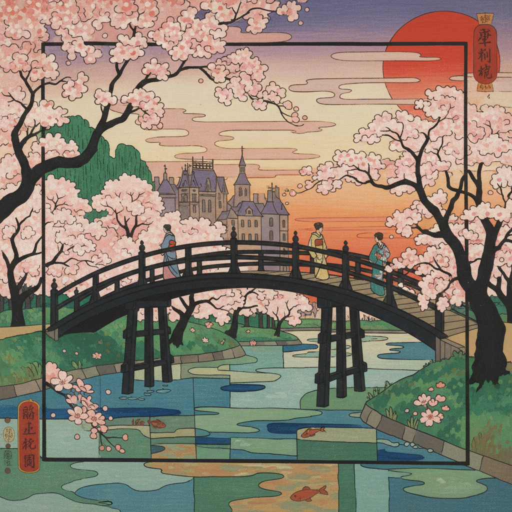

# Japonisme Painting 日本主义绘画

> **时期：** 1860年代–1910年代  
> **关键词：** 浮世绘影响、平面化、不对称构图、印象派、新艺术运动

## 概述

Japonisme（日本主义）是19世纪中后期日本艺术对欧洲绑画的深刻影响——当浮世绘版画随贸易涌入巴黎时，印象派和后印象派画家被其平面化构图、大胆裁切和装饰性线条所震撼。莫奈收藏浮世绘、梵高临摹歌川广重、图卢兹-劳特雷克的海报——日本美学彻底改变了西方绘画对空间、色彩和构图的理解。

## 风格特征

- **平面化**：减少透视深度，强调表面
- **不对称构图**：打破古典对称法则
- **大胆裁切**：物体被画框切断
- **轮廓线**：清晰的装饰性边界
- **自然主题**：花鸟、波浪、季节变化

## 代表人物与作品

- 克劳德·莫奈 日本桥系列
- 文森特·梵高 临摹浮世绘
- 玛丽·卡萨特 母子图
- 图卢兹-劳特雷克 海报设计

## 概念图

