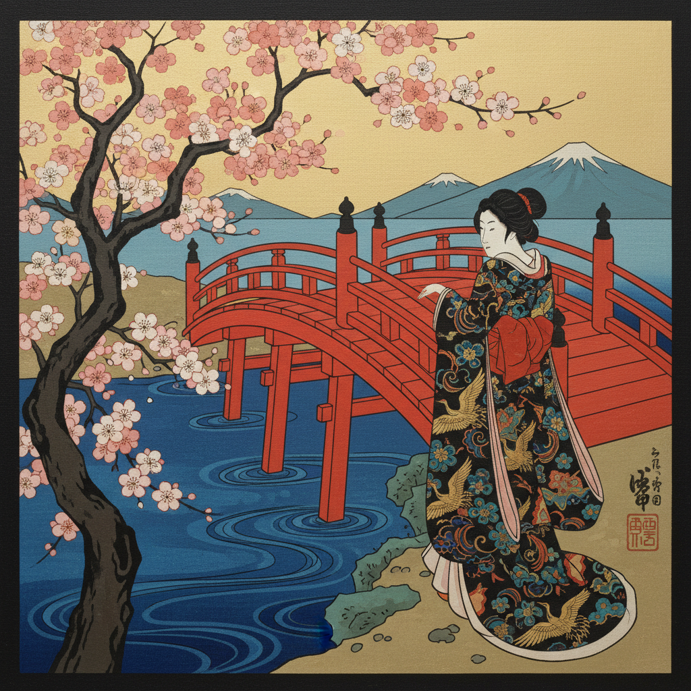

# Japonisme 日本主义

> "Look at the Japanese, who draw admirably. Life itself is their inspiration." — Vincent van Gogh

## 概述

日本主义（Japonisme / Japonism）是19世纪中后期（约1860–1910）西方艺术界受日本美术影响而产生的广泛文化现象。1853年日本被迫开国后，浮世绘版画、漆器、陶瓷、和服等大量涌入欧洲，深刻改变了西方艺术家对构图、色彩和空间的理解。

这不仅是一种风格模仿，更是一场视觉革命——日本艺术的平面性、不对称构图和大胆裁切直接催生了印象派、后印象派和新艺术运动。

## 核心特征

| 特征 | 描述 |
|------|------|
| 平面化 | 减少透视深度，强调二维装饰性 |
| 不对称构图 | 打破西方对称传统，偏心布局 |
| 大胆裁切 | 物体被画框边缘截断，暗示画外空间 |
| 轮廓线 | 清晰的黑色轮廓线勾勒形体 |
| 平涂色块 | 大面积纯色填充，减少明暗渐变 |
| 自然主题 | 花鸟、波浪、山岳等自然元素 |

## 视觉特征

- **构图**：高视角俯瞰、对角线构图、留白
- **色彩**：靛蓝、朱红、金色、黑白对比
- **线条**：流畅的曲线，书法般的笔触
- **图案**：樱花、鹤、波浪、松竹梅
- **空间**：平面叠加而非透视纵深
- **装饰性**：图案与画面融为一体

## 代表人物与作品

| 艺术家 | 日本主义体现 | 领域 |
|--------|-------------|------|
| Claude Monet | 日本桥系列、收藏浮世绘 | 绘画 |
| Vincent van Gogh | 临摹歌川广重、《花魁》 | 绘画 |
| James Whistler | 《瓷国公主》、夜曲系列 | 绘画 |
| Edgar Degas | 不对称构图、高视角 | 绘画 |
| Henri de Toulouse-Lautrec | 平面色块海报 | 版画/海报 |
| Alphonse Mucha | 装饰性曲线 | 新艺术运动 |
| Louis Comfort Tiffany | 自然主题玻璃 | 工艺美术 |

## 日本源头

- **葛饰北斋** — 《富岳三十六景》《神奈川冲浪里》
- **歌川广重** — 《东海道五十三次》《名所江户百景》
- **喜多川歌麿** — 美人画
- **�的斋英泉** — 花鸟画

## 历史背景

1. **1853年**：佩里黑船来航，日本被迫开国
2. **1862年**：伦敦万国博览会首次大规模展示日本工艺
3. **1867年**：巴黎万国博览会，日本馆引发轰动
4. **1870-90年代**：印象派和后印象派画家大量收藏浮世绘
5. **1900年前后**：新艺术运动将日本主义推向装饰艺术高峰

## 与其他风格的关系

- **浮世绘** → 直接灵感来源
- **印象派** → 受其构图和光线处理影响
- **后印象派** → 梵高、高更深受影响
- **新艺术运动 Art Nouveau** → 继承其曲线和自然装饰
- **Cloisonnism** → 直接借鉴浮世绘的轮廓线和平涂

## 概念图

---

*浮光艺志 | Chronicle of Artistry*
